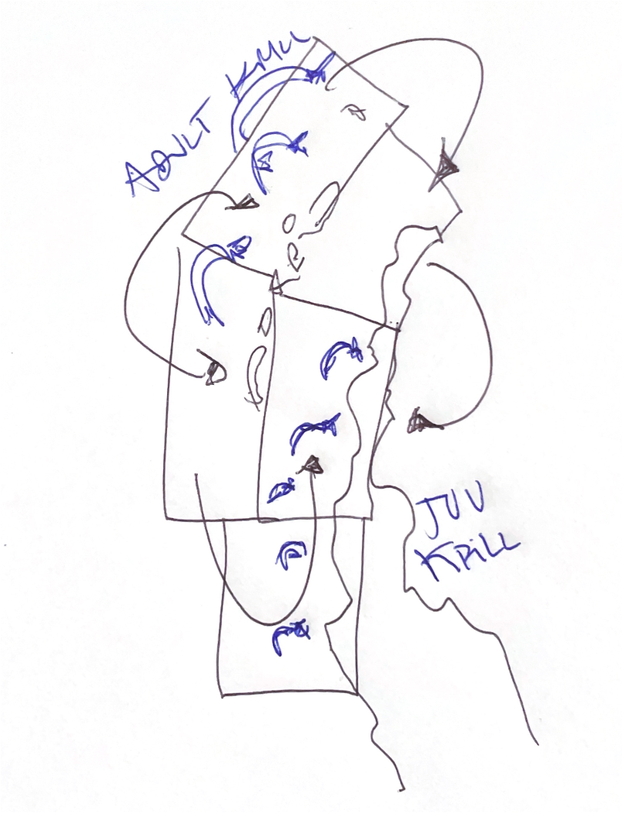

```{r setup1, echo=FALSE}
rm(list = ls())
knitr::opts_chunk$set(eval=FALSE,
                      echo = FALSE,
                      message = FALSE,
                      warning = FALSE,
                      fig.align = 'center',
                      fig.pos = "H",
                      fig.show='hold',
                      dev = 'jpeg',
                      dpi = 300,
                      tidy.opts=list(width.cutoff=50), 
                      tidy=TRUE)
```

```{r message=FALSE, eval=TRUE}
library(here)
library(kableExtra)
library(ggpubr)
library(tibble)
library(readxl)
library(openxlsx)
library(r4ss)
library(readr)
library(flextable)
library(officer)
library(r4ss)
```

\newpage

# ABSTRACT

Understanding the drivers of krill (*Euphausia superba*) population dynamics is crucial for sustainable management. This study evaluates the impact of environmental variables and predation components on krill productivity and other population parameters, in the Western Antarctic Peninsula (WAP). Using an integrated Catch-at-Length model, we assess how ecosystem factors influence recruitment, biomass trends, and stock status. Our results indicate that krill population variables, as well as productivity estimates, tend to be more optimistic in terms of stock status when environmental and predators variables are not considered. Our findings emphasize the necessity of incorporating ecosystem variables into population stock assessments process, as neglecting these factors may lead to biased estimations of krill population dynamics. This highlights a critical challenge in developing management recommendations and harvest control rules, as ignoring ecosystem influences may lead to overly optimistic assessments of krill stock health. We consider that the use of integrated models, which leverage the extensive population, fisheries, and ecosystem data available through various scientific programs, can provide valuable insights for management aligned with CCAMLR conservation and harvesting objectives.

*Keywords: Antarctic krill, population dynamics, stock-recruitment, ecosystem variables, SS3, Catch-to-Length model, environmental factors, predation components, fisheries management.*

\newpage

# INTRODUCTION

Antarctic krill (*Euphausia superba*) is a keystone species in the Antarctic ecosystem and one of the largest populations on the planet in terms of biomass (REF). Currently, its population is predominantly concentrated in the Western Antarctic Peninsula (WAP), a critical feeding ground for predators and the primary area for krill harvesting over the past four decades (REF). At the same time, the WAP is one of the most vulnerable regions to climate change (CC) and has already undergone rapid environmental shifts [@Turner2005; @Lima2013; @McBride2021; @Morley2020; @Atkinson2019a]. These overlapping pressures have intensified scientific interest in understanding krill population dynamics from both an ecological and fisheries perspective. Given its ecological significance and commercial value, effective management of krill stocks is essential to maintaining the balance of the Antarctic ecosystem while supporting sustainable fisheries.

Recognizing this, the Commission for the Conservation of Antarctic Marine Living Resources (CCAMLR) has adopted a new management strategy (CCAMLR 2019) that follows an ecosystem-based approach. This strategy seeks to balance commercial harvesting with a precautionary framework that safeguards krill-dependent species. It includes three key components: (i) stock assessments to determine precautionary harvest rates, (ii) periodic updates of krill biomass estimates at multiple spatial scales, and (iii) a risk assessment framework, now referred to as spatial overlap analysis, to guide the spatial allocation of catches and mitigate ecosystem-wide risks.

As part of this strategy, CCAMLR has tested various modeling approaches to assess krill stock status and support fisheries management decisions [@Hill2016]. While model-based stock assessments have been widely used (REF), many struggle to align with management objectives or accurately represent krill population dynamics due to their spatial variability and ecosystem complexity. One widely applied approach is the General Yield Model (GRYM) (REF), which provides global catch limits based on predefined harvest thresholds. Traditionally, stock assessments have relied on single-source data, either from fisheries catches [@Kindzey; @Wang] or population monitoring surveys [@Green2023; @Watters2013]. However, these approaches often overlook critical factors such as spatial heterogeneity in krill abundance, environmental drivers, and predator-prey interactions. Given the influence of environmental variables on krill recruitment and the role of predators in adding an additional component of natural mortality, any stock assessment framework must integrate these ecosystem factors to better represent population dynamics.

There is now broad scientific consensus on the need for stock assessment models that incorporate multiple data sources, capture temporal and spatial variability, and account for ecosystem interactions. However, integrating these complexities presents several challenges. Long-term data consistency is often lacking due to variations in monitoring programs and sampling methodologies. Additionally, some areas have sparse or incomplete datasets on krill dynamics. Furthermore, indirect drivers, such as environmental variability and predator abundance, introduce another layer of complexity. Despite these gaps, a substantial amount of data exists on krill populations and their ecosystem, making it crucial to identify knowledge gaps and integrate available information into comprehensive models that support management recommendations. This requires not only refining existing datasets but also adopting a fully ecosystem-based management approach.

To address this need, we propose a conceptual framework for developing a statistical model that integrates multiple data sources to assess the population dynamics of Antarctic krill in the Western Antarctic Peninsula (WAP) over the past decades. This approach incorporates biological, fishery, survey, and ecosystem-related information to provide a more comprehensive understanding of krill stock fluctuations. Specifically, we employ an integrated catch-at-length implemented in Stock Synthesis model [@Methot2013] that allows us to evaluate the effects of environmental drivers on recruitment and productivity, as well as the impact of predator components into krill population dynamics. The primary objective of this study was to assess the statistical performance of different management metrics, population variables and parameters based on alternative approaches to incorporating both environmental and predator data into a typical krill stock assessment model. By analyzing differences in estimated biomass, recruitment patterns, and overall krill productivity across these scenarios, we aim to quantify the extent to which ecosystem factors drive krill population trends. This comparative approach enables us to assess the relative importance of environmental conditions and predator dynamics in shaping krill stocks, providing critical insights for both fisheries management and conservation efforts.

By integrating ecosystem drivers into the stock assessment process, this study aims to demonstrate how incorporating environmental and ecological factors enhances the accuracy of Antarctic krill population estimates and improves the ability to predict future stock trends under changing climate conditions. This broader ecological perspective seeks to strengthen the scientific foundation for sustainable management recommendations, ensuring that krill harvesting strategies align with CCAMLR’s ecosystem-based management approach. Ultimately, the insights gained from this integrated modeling effort contribute to CCAMLR’s ongoing strategy to balance the sustainability of the krill fishery with the conservation of the broader Antarctic marine ecosystem, supporting both the species that depend on krill as a primary food source and the long-term resilience of the Southern Ocean.

\newpage

# METHODOLOGY

## Study Area

The study area for the assessment of krill populations in the Antarctic Peninsula is Subarea 48.1 and strata subdivision to account for spatial heterogeneity [@Dornam2021; REF] (Figure \@ref(fig:mapa)). The Antarctic Peninsula region is vast and encompasses a variety of habitats and environmental conditions that can influence the distribution and abundance of krill. Therefore, dividing the study area into strata allows to compartmentalize information related to fishing and surveys to model krill populations by considering local variations in structure population.

## Conceptual Model

In this approach we include spatial structure how an implicit approach where different areas are treated as separate fleets [REF]. Differences among strata have been identified from various perspectives of krill population dynamics [REF], as well as from the influence of environmental variability within Subarea 48.1 [REF]. This approach allows integrate spatial heterogeneity into the stock assessment model to ensure that spatially structured processes are adequately represented. Although strata are treated as separate fleets, recruitment and growth processes remain unified, ensuring that the overall krill stock is modeled as a single population while accounting for spatially structured impacts at the Subarea 48.1 level. Each stratum is assigned a unique catch and survey history, reflecting differences in harvesting intensity and spatial exploitation patterns. Selectivity is modeled separately for each strata to account for potential variations in size composition due to fishing gear, depth distribution, or environmental conditions. Survey indices and length composition data are fleet-specific, allowing for variations in data collection methods and regional abundance estimates. The model considers interannual fluctuations of growth dynamics, maturity and reproduction, with a spawning pulse per year ocurring in January [@REF]. This method allows for spatial variability in exploitation patterns without explicitly modeling movement between areas. This approach enables a more realistic assessment of krill stock productivity under varying environmental conditions and harvesting scenarios, aligning with CCAMLR’s ecosystem-based management framework.

## Data Sources

Multiple sources of data to inform the population dynamics model are included in this analysis. These data sources include data from the monitoring program of the krill fishery were used, as CPUE and length compositions, which have been systematically collected on board fishing vessels by scientific observers as part of the CCAMLR Scheme of International Scientific Observation (SISO) program. This database has information about vessel, nationality, georeferenced, among others. Data collected from scientific AMLR research cruises and monitoring programs specifically designed to assess krill populations, including biomass index by strata, and biological characteristics of krill collected through net sampling. All this data was processed in @Dornam2021. Krill length compositions from AMLR survey (provided by Ecosystem Science Division, NOAA) was handled according to the evaluation template requirements (Suppl. Mat. 2). For this analysis, Chlorophyll-a concentration (Chl) was assessed as a primary environmental driver. Chl data was downloaded from Bio-Geo-Chemical, L4 (monthly and interpolated) satellite observations, obtained through the E.U. Copernicus Marine Service Information (doi.org/10.48670/moi-00021; doi.org/10.48670/moi-00148). This data provides a detailed understanding of primary productivity levels, which are critical for evaluating ecosystem health and krill dynamics in the WAP. We applied a Generalized Linear Mixed Model (GLMM) to identify the environmental variable with main influence on krill population dynamics in the Antarctic Peninsula. Krill *Length* was used as a proxy for growth, incorporating both fixed and random effects to account for environmental and spatial variability. The icon model was formulated as:

$$
\text{Length}_i = \beta_0 + \beta_1 \text{ID}_i + \beta_2 \text{SIC}_i + \beta_3 \text{SST}_i + \beta_4 \text{Chla}_i + \beta_5 (\text{SST} \times \text{Chla})_i + (1 | \text{Year}_i) + \epsilon_i
$$

where $\beta_0$ is the intercept, and the fixed effects include *ID* (management unit or stratum), sea ice concentration (SIC), sea surface temperature (SST), and chlorophyll-a concentration (Chl). An interaction term between SST and Chl was included to capture potential synergistic effects on krill growth. A random effect for *Year* was added to account for interannual variability, mitigating biases from year-specific influences and data scarcity across strata. The residual error, $\epsilon_i$, was assumed to follow a normal distribution. The estimated coefficients and their 95% confidence intervals (CIs) were evaluated to determine the significance of each predictor, where coefficients overlapping zero indicated no significant relationship with krill length. Variance components were used to assess the proportion of variability explained by the random factors. Model selection was based on performance, with six different models tested, including one using the 75th percentile of lengths as an alternative response variable. The GLMM analysis was conducted using the *lme4* and *easystats* packages [@REF], while spatial data processing and stratification were performed with the *sf* and *CCAMLRGIS* packages [@REF]. Data handling for modeling purposes was carried out using the *tidyverse* library and its dependencies [@REF]. A full description of the models used is provided in Supplementary Material 2.

```{r eval=TRUE}
data <- data.frame(
  Source = c("Krill Fishery Monitoring Program",
                 "Krill Fishery Monitoring Program, collected by scientific observers under CCAMLR SISO program (vessel, nationality, georeferenced)",
                 "Krill Fishery Monitoring Program",
                 "AMLR Research Cruises Program", 
                  "Satellite data",
                 "Predator Abundance",
                 "AMLR Research Cruises Program"),
  Description = c("Catches",
                  "CPUE (standarized by vessel, area and deep)", 
                  "Krill Length compositions (grouped by 0.2 cm)",
                  "Biomass index from scientific AMLR cruises",
                  "Satellite-based chlorophyll-a concentration (monthly, interpolated) from the EU Copernicus Marine Service (doi.org/10.48670/moi-00021; doi.org/10.48670/moi-00148).",
                  "Data on penguin colonies, sourced from 'MAPPPD'",
                  "Predator Length composition krill diet"),
    TimeSeries = c("1997-2020",
                 "1997-2020",
                 "2000-2020",
                 "1991-2011 (based on the research cruise periods).",
                 "Monthly data from 1997 to present (based on satellite data availability).",
                 "Data from 2000s-present.",
                 "1977-2020 (from 2000 used in this analysis)"),
   Scale = c("by Strata",
                           "by Strata",
                           "by Strata",
                           "by Strata",
                           "48.1",
                           "by colony",
                           "by colony"))
ft <- flextable(data) %>%  
  set_caption("Comparison of Model Parameters") %>%  
  autofit() %>%  
  theme_vanilla() %>%  
  fontsize(size = 10, 
           part = "all") %>%  
  font(fontname = "Arial", 
       part = "all") %>%  
  set_table_properties(layout = "autofit", width = .75)
ft
```

## Catch-to-Length Model Implementation


Like most invertebrates, krill is a species for which aging is complex [@Punt2013]. Therefore, a Catch-to-Length model with age dynamics was used, which is transformed through a transition matrix based on the probabilities of age groups relative to the detailed structure. Integrated models have the capacity to reproduce the age dynamics of these populations and simultaneously transform them into population variables. Regarding this, we consider a length-based model as an alternative to the age-based approach, especially given the scarcity (or null) of direct age data in krill monitoring. Aging techniques for krill have not been available historically, although some recent progress has been made [@Kilada2017]. In this sense, reading hard parts is difficult like in krill, catch-at-length data are more plentiful, as the collection of length information is relatively cheap. Length offers insights into the age structure of the population, as there is a correlation between age and length. So far, all integrated models for krill have been of the Catch-at-Length type [@Kinzey2015a; @Kinzey2019a; @Wang2021]. This means they are approaches that internally model age through growth parameters and the Age-length-key (ALK). To perform this conversion, various methods have been used, but the AKL matrix is perhaps the most important one [@ICCA2003]. ALK are generated by aging a sub-sample of a population and used to estimate the age distribution from larger length samples. ALKs assume both aged and measured fish are random samples from the same population and should be applied within the same time period to avoid biases. Seasonal or multi-annual applications require careful justification, as using an ALK from a single period can introduce significant bias. Length-stratified sampling is essential, and the process of developing ALKs is labor-intensive, requiring optimal data collection to ensure accuracy  [@ICCA2003]. Formulae exist to estimate the number of age determinations and length measurements is calculated as;


$$
\frac{\text{Number at age for a length group}}{\text{Number of fish aged in that length group}}
$$

The ALK for the time period is raised to the length distribution for that time period:

$$
\text{Raised numbers at age by length group} = \text{Numbers at length} \times \text{Proportion at age for that length}
$$

If the ALK lacks data for certain length groups, data from those groups may be assigned to adjacent ones in the ALK. This process generates an age-length distribution by gear and time period, but caution is needed to avoid significant biases, especially for larger lengths with a broad age range. The numbers at age are summed across length groups, combining variances from ageing and length sampling to produce the age composition for the specified period. Numbers at age for all gears can then be calculated. Numbers at age for all gears can be calculated as:

$$
\sum N_a \times \left(\frac{W_{ct}}{W_{cs}}\right)
$$

where $\sum N_a$ is the sum of sampled numbers at age, W~ct~ is the total commercial catch weight, and W~cs~ is the
sampled commercial catch weight. Variance due to ageing of numbers at age for all gears can be calculated as:
  
$$
\sum \text{Var}_a
$$
where $\sum Var_a$  is the sum of variances due to ageing. Variance due to length sampling of numbers at age can be calculated as:

$$
\sum \text{Var}_l
$$
where $\sum Var_a$  is the sum of variances due to length sampling. The variances should be raised by:

$$
\frac{W_{ct}}{W_{cs}}
$$
where W~ct~ is the total commercial catch weight, and W~cs~ is the sampled commercial catch weight.

The proportions-at-age are then adjusted to find the best fit between the observed size frequency data and that predicted by the proportion-at-age and the ALK. The majority of ALKs are based on growth parameters according to the most suitable formula for the species. In the case of krill, these parameters are derived from the von Bertalanffy growth curve. In @Mardones2023, using `SS3` stock assessment catch-at-lenght model, we use a von Bertalanffy growth relationship with estimated parameters L~inf~, k, and CV. This length-at-age relationship, mediated by survey catchability and selectivity, was used to compare survey biomasses with model estimates of vulnerable biomass.  Weight-at-length was assumed known and calculated using @Maschette2020 parametres. in krill, a AKL is exposed in Figure \@ref(fig:AKL)).


```{r AKL, eval=TRUE, out.width='60%',  fig.cap="Representation of ALK Matrix to krill in SUbarea 48.1"}
knitr::include_graphics('Figs/AKL.png')
```


The stock assessment model to krill was configured using Stock Synthesis (SS3 hereafter) [@Methot2013] with the updated version 3.30.21. SS3 is a widely used software tool for assessing fish and invertebrate populations widely used in the main regional fishing organizations to have approximations of the population dynamics of the exploited resource as well as to support management decisions. SS3 is a structured stock evaluation model, in the class of models called *"Integrated stock evaluation analysis model"* and has a set of sub-model that simulates growth, maturity, fecundity, recruitment, and mortality processes, and observation, with expected values for different types of data. The model is coded in Automatic Differentiation Model Builder (ADMB) [@Fournier2012; @Methot2013: @methot2020stock] with estimation parameters. The methodology employed by Stock Synthesis involves a comprehensive and integrated approach, utilizing various data sources and modeling techniques to estimate the main population variables of krill in WAP, and unlike other integrated models, it has features that allow the integration of information related to the ecosystem, such as predators and environmental variables that have proven influence on the analyzed population. All analysis were executed in R-CRAN [@R-base]and the graphical interface of the SS3 through *r4ss* [@Taylor2019] and *ss3diags* packages [@Winker2023]. Life history parameters, like growth, weight-length relation, natural mortality and maturity was used as priors to model initial condition was taken from @Smith2023a, @Maschette2020 and @Kinzey2011 and can be found in Table \@ref(tab:parainit1). Source data and temporal scale used in this stock assessment is showed in Figure \@ref(fig:datas2).


\newpage 

```{r parainit1, eval=TRUE}
dir1.1<-here("s1.1") 
start1 <- SS_readstarter(file = file.path(dir1.1,
                                          "starter.ss"),
                              verbose = FALSE)
dat1 <- SS_readdat(file = file.path(dir1.1, start1$datfile),
                        verbose = FALSE)
ctl1 <-  r4ss::SS_readctl(file = file.path(dir1.1,
                                    start1$ctlfil),
                        verbose = FALSE,
                        use_datlist = TRUE, 
                   datlist = dat1)
fore1 <- r4ss::SS_readforecast(file = file.path(dir1.1, 
                                                "forecast.ss"),
                              verbose = FALSE)
parbio<-ctl1$MG_parms[1:10,c(1:4,7)]
 row.names( parbio)<-c("Nat M",
                       "Lmin", 
                       "Lmax",
                       "VonBert K",
                       "CV young",
                       "CV old", 
                       "Wt a", 
                       "Wt b",
                       "L50%", 
                       "Mat slope")
 SRpar<-ctl1$SR_parms[1:5,c(1:4,7)]
 Qpar<-ctl1$Q_parms[1:2,c(1:4,7)]
 Selpar<-ctl1$size_selex_parms[1:22,c(1:4,7)]
 
 parInit<-as.data.frame(rbind(parbio,SRpar,Qpar,Selpar))
parInit %>% 
  kable(format = "latex",
        booktabs = TRUE, 
        caption = "Input parameters for the initial SS3 model of krill. Each parameter line contains a minimum value (LO), maximum value (HI), and initial value (INIT). If the phase (PHASE) for the parameter is negative, the parameter is fixed as input") %>%
  kable_styling(latex_options = c("striped"), 
                full_width = FALSE, 
                font_size = 9) %>%
  pack_rows(index = c("Natural Mortality" = 1,
                      "Growth" = 5,
                      "Length-Weight Relation" = 2,
                      "Maturity" = 2,
                      "Stock-Recruit Relation" = 5,
                      "Catchability" = 2,
                      "Selectivity" = 4))
```


### Growth conditioning

Growth was modeled following a von Bertalanffy growth function with size-at-age parameterization. The model assumed linear growth below a predefined settlement age of 1.5 years. The asymptotic length ($L_{\infty}$) was determined by the estimated length-at-age, indicating that the model used $L_{\infty}$ as an upper growth boundary. Exponential decay of growth beyond maximum age was disabled, ensuring that growth patterns followed the von Bertalanffy assumption without artificial constraints. Growth variability was not explicitly modeled, and the coefficient of variation (CV) was assumed to be a function of length-at-age.

### Maturity and Reproduction

Maturity was modeled as an age-based logistic function, with the first age of maturity set at 3 years. Fecundity was estimated as a power function of body weight, where fecundity was computed as $Eggs = Wt \times (a + b \times Wt)$. The model did not account for hermaphroditism, assuming that all individuals maintained a fixed sex throughout their lifespan. The model used a direct parameterization without additional offsets between sexes. Under this assumption, male parameters with a value of 0 and a negative estimation phase were set equal to their corresponding female parameters.

### Selectivity Parameterization

Selectivity functions were modeled using a length-based logistic formulation for the fishery, survey, and predator fleets. The selectivity curve was defined by two key parameters: the size at 50% selectivity (inflection point) and the width of the selection range (95% width). The fishery was characterized by multiple selectivity patterns, each defined by an inflection point and a selection range width. The estimated inflection points varied between 2.0 and 3.5 cm, while the selection range widths spanned between 2.0 and 4.0 cm. Parameter estimation phases were assigned, with negative values indicating fixed parameters. The survey selectivity was also modeled using a length-based logistic function. Inflection points ranged from 2.0 to 3.0 cm, with selection range widths consistently set at 1.0 cm. The phase assignment dictated whether parameters were freely estimated (positive phase values) or fixed (negative phase values). These differences in selectivity parameters are crucial for interpreting and modeling spatial heterogeneity among strata, as they reflect variability in size-dependent catchability across different regions and fleets. The predator fleet followed a similar selectivity function, with a size-at-inflection point of 0.2 cm and a corresponding selection range width of 0.2 cm. assuming that the predator can capture a wider range of krill sizes. These parameters were estimated in later phases (positive phase values), allowing flexibility in their estimation. Across all selectivity functions, parameters with negative phase values were held fixed during the estimation process, ensuring model stability and preventing overparameterization.

### Spawner-Recruitment Relationship Parameterization

The stock-recruitment (SR) relationship was modeled using a standard Beverton-Holt formulation, with the steepness parameter fixed at 0.85 in phase -4 to ensure consistency with previous studies. This reflects a weak stock-recruitment relationship, as krill recruitment largely depends on environmental conditions rather than spawning biomass [@REF]. The unfished recruitment ($R_0$) was estimated with a log-transformed mean recruitment value of 23, with a prior of 10. The parameter was freely estimated in phase 1.  The standard deviation of recruitment deviations ($SR\_sigmaR$) was set at 1.2 and fixed in phase -4 to constrain model variability. The regime shift parameter ($SR\_regime$) was set at 0 and fixed, implying no consideration of long-term recruitment regime shifts. Recruitment deviations were estimated to account for interannual variability in recruitment dynamics. The model used the deviation vector approach ($do\_recdev = 1$), where recruitment was modeled as a function of spawning stock biomass plus a deviation term. The main recruitment deviation period spanned from 1998 to 2020, with forecast deviations applied in subsequent years. Early recruitment deviations prior to 1998 were included, with an early deviation phase of -4 to ensure these values remained fixed. Bias adjustment was implemented, with key adjustment years defined as 1995.7 as the last early year with no bias adjustment, 2000.0 as the first year of full bias adjustment, 2015.7 as the last year of full bias adjustment, and 2022.3 as the first recent year with no bias adjustment. The maximum bias adjustment factor was 0.8274. To prevent overparameterization, recruitment deviations were constrained between -5 and 5. Cyclic patterns in recruitment were assumed each tree and five years [@REF], and advanced recruitment options were enabled for model flexibility.

### Environmental variable modelling in `SS3`

One of the key challenges in this stock assessment framework is integrating ecosystem variables and drivers into the primary process of krill population dynamics and SS3 addresses these approaches [@methot2020stock]. The estimated level of krill recruitment depends on the spawning biomass from the previous season, an environmental time series—specifically, the 2000-2022 Chlorophyll-a time series—and a log-bias adjustment in this way;

$$
E(\text{Recruitment}) = f(\text{SpBio}) \times \exp(B \times \text{envdata}) \times \exp\left(-0.5 \times \pi_R^2\right)
$$

$R$ represents the variability of deviations, adding to the variance caused by environmental factors. $SpBio$ represent spawning biomass, $envdata$ is vector of time series of environmental variable. Consequently, as the environmental effect accounts for more of the total recruitment variability, the residual $R$ should be reduced. However, the model does not automatically adjust for this. Furthermore, this integrated model took into account environmental variables, as chlorophyll-a, known to influence krill abundance and reproductive outputs. These environmental factors play a critical role in shaping krill habitat suitability and productivity, thereby affecting their population dynamics. Figure \@ref(fig:mapachl) presents a time series of chlorophyll-a (Chl-a) concentration (mg/m-3) in the waters around the Antarctic Peninsula from 2000 to 2020. Each panel represents a different year, showing spatial variations in Chl-a levels, which indicate phytoplankton biomass. The highest concentrations are observed along the coastal regions, while offshore areas exhibit lower Chl-a levels. This visualization helps assess interannual variability in primary productivity, which is a key driver of the Antarctic krill population dynamics.

```{r mapachl, eval=TRUE, fig.cap="Time series (2000-2020) to Chlorophyll in 48.1 area"}
knitr::include_graphics('Figs/chla_grilled.png')
```


### Predator components modelling 

This stock assessment approach consider predator-prey interactions as a key driver of krill population dynamics. By incorporating information on predator abundance and feeding ecology, our model provide a more comprehensive understanding of the tropic interactions shaping krill dynamics. In this analysis we incorporated penguin population index as predator *"fleets"* as we describe previously. This overall natural morality (M) to include explicit mortality (M2) caused by each major predator as M = M1 + sum(M2) [@methot2020stock], and in this way transfer to total mortality in form Z = M1 + M2+ F.

In SS3, natural mortality (*M*) can be estimated using different methods, depending on the data available and the model structure. Since a penguin population index is being incorporated as an ecosystem variable, natural mortality can be modeled to reflect predator-driven mortality effects on Antarctic krill. Generally, natural mortality can be fixed or estimated. If *M* is assumed constant, it is set as a fixed input parameter based on literature values or prior studies. In this case, in referencee model, we use *M* described by @Tanasekos and @Maschete. In this case, SS applies a penalized likelihood estimation, with constraints set through priors or data-informed boundaries. Since *M* is influenced by the **penguin population index**, it can be modeled as a function of this ecosystem variable. Stock Synthesis allows *M* to be linked to parameters covariates, meaning that predator abundance (penguins) can influence krill mortality as follows:

$$
M_t = M_0 + \beta \cdot X_t
$$

where $M_t$ is the time-varying natural mortality, $M_0$ is the baseline mortality, $X_t$ is the standardized penguin index, and $\beta$ is the estimated effect of the predator index on mortality. If predator abundance is highly variable, process error can be incorporated to allow *M* to fluctuate over time, rather than being purely deterministic. This introduces stochasticity, improving realism in the predator-prey interaction. The equation with process error is:

$$
M_t = M_0 + \beta \cdot X_t + \epsilon_t, \quad \epsilon_t \sim N(0, \sigma^2)
$$

where $\epsilon_t$ represents the process error term, normally distributed with mean zero and variance $\sigma^2$.

Using a time-varying mortality function linked to penguin abundance improves realism in krill stock assessments by incorporating predator-driven mortality as a key ecosystem variable. Figure \@ref(fig:mapapre) presents a temporal and spatial overview of penguin prey length data from 2001 to 2020. The maps focus on the Antarctic Peninsula region, showing how spatial patterns of prey collection have changed over time.

```{r mapapre, eval=TRUE, fig.cap="predator temporal and spatial variables. The top panel shows boxplots of prey lengths (in cm) across years, with different colors representing prey consumed by three penguin species: Adélie (red), chinstrap (orange), and gentoo (black). A red horizontal line marks the 3.6 cm as recruit size, likely for comparison purposes. The bottom panel consists of small maps for each year, displaying the geographic distribution of prey data. Colored circles indicate locations and intensity of sampling by species, with circle size suggesting sampling effort or frequency."}
knitr::include_graphics('Figs/Predator_fleet.png')
```

For stock assessment purposes, we integrated all penguin colony abundances into a standardized index, which represents a comprehensive measure of population trends over time. This index accounts for variations in colony sizes and survey efforts, providing a robust metric that reflects the overall status of the penguin population. By using this standardized index, we ensure comparability across different time periods and regions, facilitating a more accurate assessment of the relationship between penguin population dynamics and ecosystem variability. Figure \@ref(fig:mapapre2) shows a time series of a standardized abundance index for penguin colonies, spanning from approximately 1990 to 2020. The index appears to exhibit fluctuations over time, with a general decline from the early 1990s to the mid-2000s, followed by a period of relative stabilization and another decline toward the end of the time series. The wide error bars suggest substantial variability in abundance estimates, likely reflecting natural population fluctuations, survey effort differences, or environmental influences.

```{r mapapre2, eval=TRUE, out.width="60%", fig.cap="Standardized abundance index of penguin colonies (1990–2020). Open circles represent annual estimates, with error bars indicating uncertainty"}
knitr::include_graphics('s1.4/plots/index1_cpuedata_PREDATOR.png')
```

\newpage

## Scenarios

To account for the uncertainty associated with ecosystem influence in krill dynamic popupation, we evaluated a set of model configurations that incorporate variations in predator "fleet" and environmental effects, and the relationship between spawning biomass and recruitment. Spatial heterogeneity implicity is considering in all scenarios. The methodology involves assessing the statistical performance of the model under these configurations. Specifically, `s1.1` serves as the reference model, incorporating only fishery and survey data while accounting for spatial heterogeneity. The subsequent scenarios build upon this configuration to evaluate the effects of additional ecological components. `s1.2` extends `s1.1` by incorporating predator influences, allowing the model to assess the impact of predation on krill population dynamics. `s1.3` modifies `s1.1` by introducing an environmental variable, capturing potential environmental drivers affecting krill recruitment and biomass. Finally, `s1.4` integrates both predator and environmental influences into the `s1.1` framework, providing a more comprehensive assessment of ecosystem interactions and their role in krill population dynamics (Table 1).

| Scenario | Description                                                |
|:--------:|:-----------------------------------------------------------|
|   s1.1   | Spatial data without environmental and predator components |
|   s1.2   | "s1.1" with predator components                            |
|   s1.3   | "s1.1" with environmental variable                         |
|   s1.4   | "s1.1" w/ both, predator fleet and environmental variable  |

: Scenarios to modelling dynamics in krill

## Diagnosis

Carvalho et al. (2021) propose a structured approach for diagnosing stock assessment models to ensure their reliability and robustness. The diagnostic process involves several key steps.First, convergence analysis is conducted to assess whether the estimation algorithm has reached a stable solution. This includes checking for model convergence by examining parameter trace plots, gradients, and the Hessian matrix to confirm that all parameters are well-estimated.  Next, the fit to data is evaluated by comparing observed and predicted values for key data sources, such as catch, survey indices, and length composition. Residual plots are used to detect systematic patterns, which may indicate model misspecification.  A retrospective analysis is then performed to assess the consistency by scenario estimates over time. This is done by sequentially removing recent years of data (peeling) and re-estimating the model. The retrospective bias (*Rho*) is calculated for key population metrics, such as Spawning Stock Biomass (SSB) and Fishing Mortality (F). The model’s forecasting ability is tested through one-step-ahead forecasts, comparing predicted and observed values for recent years. This step helps identify potential overfitting or biases in recruitment or abundance estimates.  Sensitivity analysis is conducted by varying key parameters, in this case, ecosystem variables. Likelihood profiling is performed to explore parameter uncertainty and identify influential priors.  Prediction skill testing involves using hindcasting methods to evaluate model performance in predicting past stock trends. Alternative models are compared to determine the most reliable configuration. 

Four estimation models were developed depending on how the ecosystem components was integrated where it was included as an additional covariate within the stock-recruitment (S-R) relationship. To evaluate the differences in model performance, we analyzed the Root Mean Squared Error (RMSE) values across four scenario configurations (`s1.1`, `s1.2`, `s1.3`, and `s1.4`). The RMSE values were extracted from the variance tuning checks of each scenario and compiled into a data frame for statistical analysis. To test for overall differences among scenarios, a one-way ANOVA [@REF] was conducted, treating RMSE values as the dependent variable and scenario configurations as the categorical factor. If the ANOVA indicated significant differences, a post-hoc Tukey test would be performed to determine which scenario comparisons were driving the differences. By systematically applying these diagnostic steps, stock assessment models can be rigorously evaluated, ensuring they provide robust and unbiased estimates for fisheries management.

# RESULTS

### Tablas a incluir

1.  Comparación de parámetros clave entre escenarios:

    -   Biomasa desovante (SSB, Spawning Stock Biomass) en años clave.
    -   Tasa de explotación (F).
    -   Reclutamiento medio.
    -   Relación B/B0 (biomasa actual respecto a la virgen).
    -   Relación F/FMSY.

    | Parámetro           | Base | Con variables ecosistémicas |
    |---------------------|------|-----------------------------|
    | SSB (2020)          | X    | Y                           |
    | SSB (2025)          | X    | Y                           |
    | F (2020)            | X    | Y                           |
    | Reclutamiento medio | X    | Y                           |
    | B/B0 (2020)         | X    | Y                           |
    | F/FMSY (2020)       | X    | Y                           |

2.  Resumen del ajuste del modelo:

    -   Log-verosimilitud total.
    -   Verosimilitud de los datos de captura, índices de abundancia y composición de tallas/edades.
    -   Número de parámetros estimados.
    -   Error estándar de las estimaciones clave.

```{r eval=TRUE}
parameter_comparison_table <- read_csv("parameter_comparison_table.csv")
parameter_comparison_table %>%  
  mutate(across(where(is.numeric), ~ format(., decimal.mark = "."))) %>%  
  flextable() %>%  
  set_caption("Comparison of Model Parameters") %>%  
  autofit() %>%  
  theme_vanilla() %>%  
  fontsize(size = 10, part = "all") %>%  
  font(fontname = "Arial", part = "all") %>%  
  set_table_properties(layout = "autofit", width = .75)

```

3.  Comparación de reclutamiento por año:
    -   Media y desviación estándar del reclutamiento en periodos clave (por ejemplo, 1990-2000, 2000-2010, 2010-2020).
    -   Probabilidad de años de reclutamiento bajo.

### Gráficos recomendados

1.  Evolución de la biomasa desovante (SSB) en el tiempo
    -   Líneas para cada escenario mostrando tendencias divergentes.
    -   Inclusión de intervalos de confianza.
2.  Reclutamiento anual estimado por escenario
    -   Barras para cada año con comparación entre escenarios.
    -   Promedio móvil para suavizar tendencias.
3.  Relación stock-reclutamiento con diferentes ajustes
    -   Ajustes de la curva con y sin variables ecosistémicas.
    -   Comparación de la fuerza del reclutamiento en diferentes condiciones ambientales.
4.  Proyecciones de biomasa y F bajo diferentes escenarios de explotación
    -   Predicciones de la biomasa y la explotación para los próximos 5-10 años.
    -   Comparación entre políticas de manejo con y sin ecosistema.
5.  Distribución de longitudes o edades en el tiempo
    -   Para ver si el escenario con variables ecosistémicas predice cambios en la estructura de la población.
6.  Curvas de Kobe plot (B/BMSY vs. F/FMSY)
    -   Comparar el estado del stock en cada escenario respecto a puntos de referencia de manejo.

(Imagen Verosimilitud)

The comparison of likelihood components across the three scenarios revealed notable differences in their fit to the data. Scenario S1.1 had the lowest total likelihood, suggesting a better overall fit compared to S1.2 and S1.3. The catch and equilibrium catch components showed minor variations among scenarios, indicating that these data had a limited influence on the overall likelihood differences. In terms of survey likelihood, S1.1 exhibited a slightly better fit to survey abundance data, while S1.2 and S1.3 showed higher likelihood values, suggesting a reduced agreement with observed biomass trends. The length composition component differed significantly, with S1.2 and S1.3 having higher likelihood values than S1.1, implying a poorer fit to observed length distributions. Recruitment likelihood was highest in S1.1, indicating stronger consistency with recruitment estimates compared to S1.2 and S1.3. Additionally, parameter deviations were more constrained in S1.1, whereas S1.2 and S1.3 exhibited greater variability. These results suggest that S1.1 provides a better overall fit, particularly in survey abundance and length composition components, while S1.2 and S1.3 show greater discrepancies in these aspects.


## Diagnosis Base Model

All scenarios converged within the tolerance criteria and the final gradient using maximum likelihood is achieve and was relatively small (\< 1.00e-04), and the Hessian matrix for the parameter estimates was positive, which shows that the performance is within what was expected for this type of analysis. About goodness-of-fit, Figure \@ref(fig:res1) and Figure \@ref(fig:res1a) display the residuals of length of krill captured by fleets over the years in `s1`. In the first graph, we observe multiple fishing fleets (FISHERYBS, FISHERYEI, FISHERYGS, FISHERYJOIN, FISHERYSSIW) and a survey (SURVEYBS). The second graph shows surveys (SURVEYEI, SURVEYGS, SURVEYJOIN) and predator data (PREDATOR) for `s1`. For many fleets and surveys, greater consistency in krill sizes is observed after the year 2000. However, there was variability in the width of the distributions over time, which may reflect changes in abundance or sampling selectivity. For instance, in FISHERYBS and FISHERYEI, the distributions widen and slightly shift towards larger sizes in recent years, indicating a possible change in the krill population or fishing practices. The residuals from the model fit suggest that the model captures the inter annual and inter-fleet lengths variability well, although some deviations indicate that additional unmodeled factors might be influencing the observed sizes (Figure \@ref(fig:resall), \@ref(fig:fitcom)).

## Retrospective analysis

Retrospective analysis shows the pattern of bias that exists in the models and is one of the ways in which we have identified that in all the tested scenarios there is a pattern, however, model S1 is the one that performs better. @Carvalho2021b indicate that values of rho parameter that fall outside (-0.15 to 0.20) for SSB for longer-lived species, or outside (-0.22 to 0.30) for shorter-lived species indicates an undesirable retrospective pattern (Figure \@(fig:retros1)). To evaluate the overall model fit of the relative abundance indices and composition data in `s1`, we used the joint-index residual. Overall, `s1` had a good performance when evaluating the lengths compositions (14.2%), however RMSE showed a low predictive power with respect to the indices (71.3%). A loess-smoother indicated there appeared to be increased variability in the residuals of model fit to CPUE over time (Figure \@ref(fig:rmses1)).

## Likelihood profile in spatial Model `s1`

For `s1` scenario, the gradient of the likelihood profile for the penalty on the index deviations was greater than other data sources. The second strongest gradient in the log-likelihood profile was observed for the length compositions Figure \@ref(fig:likepro). The gradient of the likelihood profile supported by the length-composition data is higher than those supported by the penalty for the recruitment deviates and CPUE indices.

Once the performance of the model was corroborated, it was possible to have an estimate and forecasting of the main population variables over the years in absolute terms, which can be seen in the Table \@ref(tab:mainvar)

## Comparision outputs between scenarios

In comparative terms with all the tested scenarios, we check the consistency through recruitment diversions (Figure \@(fig:recdev)). We do this through spatial autocorrelation analysis, checking the fluctuation of recruitment through the time series analyzed, that is, between 1979 and 2020 and which has consistency as described by other authors regarding pulses between three and five years [@Perry2020; \@ @McBride2021].

Autocorrelation in krill recruitment in time series analyzed by scenarios, models `s01`, `s1`, `s2`, and `s5` exhibit significant autocorrelations at various lags, indicating dependencies and potential cyclical patterns in recruitment. Models `s3` and `s4` show minimal to no significant autocorrelations, suggesting more random recruitment patterns. Model `s6` shows moderate autocorrelations, indicating some predictability based on recent past values, In summary, `s01`, `s4`, and `s6` exhibit no significant autocorrelation, suggesting randomness (Figure \@ref(fig:acf)).

To evaluate consistency of the source of information used in each of the tested scenarios, we verify its influence on the estimate of R0 through likelihood components and, like scenario 1, we verify that all scenarios show a high dependence on the composition lengths of lengths with respect to the estimate of the variable (as show the (Figure \@ref(fig:likeall)).

We identify differences in the different scenarios related with population variables with respect to the long-term estimates where the implicit model `s1` and the models without stock recruit relation or with a low density-dependence on the stock-recruit relation (`s2`and `s3`) show higher predictions than the rest of the tested scenarios. This is relevant given that these scenarios consider low spatial dependence, density-dependence spawning biomass with respect to recruitment, which is plausible for resources such as krill where environmental dynamics shape population dynamics (Figure \@ref(fig:longterm)).

We carried out a specific comparison between the most divergent scenarios that we tested in this case, `s1`, `s01` and `s7` which according to the description are the aggregated spatial scenario, disaggregate spatial scenario and scenario with new set of parameters, respectively. All with ecosystem components such as predators and an environmental variable.In this sense, the impacts and difference on the estimates of recruitment, R0, virginal biomass and relative biomass are high (Figure \@ref(fig:comparision)), demonstrating the impact of initial considerations and assumptions on population variables estimation.

Statistical diferences. The *t-test* assumes normality and equal variance and resulted in a *statistically significant difference* between the two models (*t = 4.2682, df = 72, p \< 0.001*). The 95% confidence interval for the mean difference ranged from *1,387,011 to 3,818,074*, with *mean spawning biomass estimates of 4,600,304 t for Model 1.1 and 1,997,762 t for Model 1.4*.

The *Wilcoxon rank sum test*, a non-parametric alternative that does not assume normality, also indicated a significant difference (*W = 1256, p \< 0.001*), confirming the robustness of the result. The warning regarding ties suggests some repeated values in the dataset, but this does not invalidate the conclusion.

These findings indicate that incorporating environmental and predator effects into the model (Model 1.4) leads to significantly lower estimates of spawning biomass compared to the reference model (Model 1.1). This suggests that ecosystem variables play a crucial role in the assessment of krill population dynamics and should be considered in stock evaluation frameworks. \newpage

# DISCUSION

The analysis presented here represents a modern approach for stock assessment of complex dynamics such as krill and the integration of ecosystem components as environmental variables and ecological aspects such as predators. The development of an integrated stock assessment model like could provide support to adaptive management, wherein management procedures resulting, like status or quota, are adjusted based on ecosystem monitoring indices [@Wang2021]. However, integrated models are not new to krill in SO. For several years, CCAMLR has been developing and applying integrated assessment methodologies that incorporate diverse data sources, such as acoustic and trawl surveys, to improve the accuracy of their stock assessments. In 2016, through an external review process,@Thomson2016 explicitly recommended *"the use of an Integrated Analysis model for assessment of Antarctic krill in FAO Subarea 48.1 is appropriate and would constitute an improvement over the modeling strategies currently in use to manage krill"* and he stated that the an integrated modeling framework *"has the potential to substantially improve the scientific basis for future krill management"*.

@Kinzey2015a and @Kinzey2019a used integrated models with survey data to test the impacts of selectivity and recruitment estimation in certain areas of Subarea 48.1. @Kinzey2011 implemented a model to test spawning biomass, recruitment and movement between areas associated with the northern Antarctic Peninsula. Although these models had convergence issues, they represented significant advances in this type of framework. Additionally, @Wang2021 made contributions to integrated statistical models with survey and fishery data for the northern sector of the Western Antarctic Peninsula, focusing on the Bransfield Strait, testing different data weightings. Furthermore, examined correlations between recruitment and climatic variables such as the Southern Annular Mode (SAM) El Niño Oscillation Southern (ENSO). In absolute values and with respect to biomass levels, although the estimates of our model were lower than the previously described models, there is a coincidence with respect to recruitment pulses as well as mortality levels.

Spatial heterogeneity is a fundamental aspect of krill ecology, driven by a myriad of factors including oceanographic conditions and predator foraging behavior. By incorporating spatial heterogeneity into our model considering the strata as part of the analysis, we aim to capture the complex spatial patterns of krill distribution. This spatially implicit approach will allow us to identify krill hotspots, areas of high productivity, and potential ecological corridors, providing valuable insights for conservation planning and management strategies [@Watters2013] and transfer those signals of differences in krill population structure into the model to generate its estimates.

From an ecological point of view, the study area encompasses the primary spawning, breeding, and wintering regions of Antarctic krill in the southwest Atlantic Ocean. There are many studies that confirm the influence of predation on krill populations within the Antarctic Peninsula [@Silvestro2023; @Reisinger2022]. For this, we consider the penguin population as one of the most powerful elements of natural predation on krill because they have direct correlations between this type of taxonomic group and krill [@Kruger2021]. The intention to incorporate elements of predation in a stock is necessary to improve the modeling, because it did not account for uncertainty in natural mortality underestimated uncertainty in current stock biomass by as much as 20% [@Hollowed2000].

In a scientifically rigorous stock assessment, this analysis included comparisons between various natural scenarios and assumptions used to model krill population dynamics. It is important to note that the models presented here can be refined in terms of initial conditioning to improve fits on length compositions of predators and indices that were initially low. However, a primary objective was to evaluate the impact on key population variables, considering factors such as spatial heterogeneity and life history parameters. This impact was verified in this stock assessment approach, identifying aspects that must be considered when making recommendations for krill management by CCAMLR using models.

By comparing model outputs under scenarios where spatial heterogeneity is assumed versus not assumed, the significance of incorporating spatial variation into the model can be assessed. This methodology enables researchers to make informed decisions about the necessity of accounting for spatial heterogeneity in understanding krill distribution and abundance, thereby enhancing the accuracy and reliability of ecological modeling efforts.

Nowadays, one of the frontiers of stock assessment is the incorporation of ecosystem and spatial considerations into modeling. In this context, the features of the SS3 platform allow us to advance in this direction and contribute to the discussion, both in understanding the population dynamics of krill and providing advice for sustainable management. In summary, our proposed stock assessment scheme represents a pivotal approach to understanding the complex population dynamics of Antarctic krill in Subarea 48.1.

Predator indesx

A simple predation pressure index for modeling changes in naturalmortality: Application to Gulf of Maine northern shrimp stockassessment (Richard et al 2016)

Env index.

Simulation analyses indicated that the integrated approach with additional process error is superior to the traditional method of correlating model estimates with environmental variables outside the estimation procedure. The results suggest that, for the snapper stock, recruitment is positively correlated with SST at the time of spawning. (Maunder et al 2003)

The ecosystem variables used in stock assessment processes vary in both their definition and how they are applied. Marshall et al. (2019) classify ecosystem variables based on their impact on population dynamics, as well as the ways in which they are incorporated into analytical models.

Our model results indicate that ecosystem variables significantly influence krill productivity and population structure:

1.  Stock-Recruitment Relationship: Recruitment was positively correlated with sea ice extent and primary productivity, suggesting a strong link between krill reproduction and environmental conditions.\
2.  Predation Impact: Penguin predation exerted a measurable effect on juvenile krill survival, with increased predation pressure leading to lower recruitment estimates in years with high predator abundance.\
3.  Biomass Trends: Environmental drivers accounted for a substantial portion of biomass fluctuations, with warm years showing lower krill abundance, likely due to reduced primary productivity.\
4.  Fisheries Interaction: Years with high krill harvest coincided with lower biomass estimates, highlighting the cumulative impact of both natural and anthropogenic pressures on krill stocks.

Para reportar los distintos escenarios obtenidos del stock assessment en SS3, puedes enfocarte en comparar las diferencias clave entre el escenario base y el que incorpora variables ecosistémicas. Como mencionaste, el escenario con variables ecosistémicas es más pesimista en términos de reclutamiento y otras variables poblacionales. Aquí tienes algunas ideas de tablas y gráficos para reportar los resultados:


Our findings emphasize the necessity of incorporating ecosystem variables into krill population assessments. The significant influence of environmental variability and predation highlights the limitations of traditional stock assessment models that assume static population processes.

-   Ecosystem-Based Management Implications: Our study supports the integration of ecosystem-based reference points in krill fishery regulations. By considering environmental and predation effects, management frameworks can better anticipate population fluctuations and minimize risks of overexploitation.\
-   Predator-Krill Interactions: The observed impact of penguin predation aligns with previous studies that indicate krill availability is a primary driver of penguin reproductive success. Managing krill fisheries in a way that ensures sufficient prey availability for predators is critical for maintaining ecosystem balance.\
-   Climate Change Considerations: Given the ongoing warming trends in the Antarctic Peninsula, krill populations may face increased environmental stress. Our results suggest that future management strategies should incorporate climate-driven changes in krill habitat suitability.


\newpage

# CONCLUSION AND FUTURE WORK

-   The main challenge in this analysis has been to identify sources of information about krill population dynamic (fishery, survey, environmental, predator and life history parameters) and model it into an integrated model, in this case, with Stock Synthesis platform. This approach is not related to the *"best model"*, but rather to the implementation of the different options of scenarios that krill faces in multiple natural dimensions and evaluate the impact of this on population estimates.

-   Regarding to spatial heterogeneity, this can be considered in two ways in a modeling approach. First one, the complexity and differences in distribution in abundance and other components of the krill population can be incorporated into an stock assessment in advance, as was carried out in this exercise, to have a more reliable estimate of the population variables that and transfer these considerations to the management for decision making. Second one, spatial heterogeneity can be considered for the decomposition of the management procedures that are established into the population assessed. For this, it is necessary. have a spatially explicit model, which was not our case but can be considered a future approach to be analysed.

-   Ecosystem considerations for a model integrated with stock assessment are vital. Although SS3 does not model the ecosystem variables, it allows for these variables to be incorporated to model krill population dynamics. SS3 presents characteristics that allow the incorporation of this kind of variable. This ecosystem information into stock assessment serve as an input to condition the moderate population dynamics, in any case we consider this an advance that can be perfected but that is inside discussion with the ecosystem management in the new strategy proposed by CCAMLR.

-   We consider that an integrated modeling of the krill adding the available information sources (fishery and surveys), as well as, the spatial heterogeneity and ecosystem variables is on the right path of the recommendation that has emerged in the last 10 years with respect to population dynamics and its link with the management procedure carried out by CCAMLR.


This study demonstrates that incorporating environmental and predation variables into stock assessments significantly improves our understanding of Antarctic krill population dynamics. The integrated Catch-to-Length model provides a robust framework for assessing krill productivity under varying ecosystem conditions. Our results advocate for an ecosystem-based approach to krill fisheries management, ensuring that decision-making processes account for the broader ecological context.

Future research should explore additional ecosystem interactions and refine predictive models to support adaptive management strategies under changing climatic conditions.


\newpage

# ACKNOWLEDGMENTS

We thank CCAMLR for providing access to data and acknowledge the support of the scientific community contributing to krill population research.

# SUPPLEMENTARY MATERIAL

-   Supplementary Material 1: Model template example and initial condition to `s1` scenario can be found in this [repo](https://github.com/MauroMardones/SA_Krill/tree/main/test) and the executable version (3.30.21) can be download from NOAA Virtual Lab [SS3](https://vlab.noaa.gov/web/stock-synthesis)

-   Supplementary Material 2: Length composition templates preparation to SS3 from AMLR can be found [link](https://mauromardones.github.io/AMLR_Length_Data/) and routine code in this [repo](https://github.com/MauroMardones/AMLR_Length_Data)

-   Supplementary Material 3: Correlation analysis between krill biology and environmental variables can be found in this [link](https://mauromardones.github.io/Krill_Length_Cor/) and routine code in this [repo](https://github.com/MauroMardones/Krill_Length_Cor)

\newpage

# FIGURES AND TABLES

```{r mapa, out.width='40%', fig.show='hold',fig.cap="Subarea 48.1 and management strata considered in the spatio-temporal analysis of intrinsic productivity of Krill (BS=Brainsfield Strait, EI= Elephant Island, Gerlache= Gerlache strait, JOIN= Joinville Island, SSWI= South West)"}
knitr::include_graphics('Figs/481.png')
```

```{r concem, out.width='40%', fig.cap="Conceptual model used to model dynamics population in Antarctic krill in WAP"}

```

```{r datas2, out.width='70%', fig.cap="Source information time series for each fleet used in s1 scenario"}
knitr::include_graphics('Figs/data_plot_s2.png')
```

```{r parainit, fig.cap="Initial biology and fishery parameters to set a model s1 in krill in WAP"}

# leo archivos para plotear y hacer tablas
start1 <- SS_readstarter(file = file.path(dir1,
                                          "starter.ss"),
                              verbose = FALSE)
# note the data and control file names can vary, so are determined from the 
# starter file.
dat1 <- SS_readdat(file = file.path(dir1, start1$datfile),
                        verbose = FALSE)
# Read in ctl file. Note that the data fileR object is needed so that SS_readctl
# assumes the correct data structure
ctl1 <-  r4ss::SS_readctl(file = file.path(dir1,
                                    start1$ctlfil),
                        verbose = FALSE,
                        use_datlist = TRUE, 
                   datlist = dat1)
fore1 <- r4ss::SS_readforecast(file = file.path(dir1, 
                                                "forecast.ss"),
                              verbose = FALSE)
# can also read in wtatage.ss for an empirical wt at age model using
# r4ss::SS_readwtatage()

parbio<-ctl1$MG_parms[1:10,c(1:4,7)]
 row.names( parbio)<-c("Nat M",
                       "Lmin", 
                       "Lmax",
                       "VonBert K",
                       "CV young",
                       "CV old", 
                       "Wt a", 
                       "Wt b",
                       "L50%", 
                       "Mat slope")

 SRpar<-ctl1$SR_parms[1:5,c(1:4,7)]
 Qpar<-ctl1$Q_parms[1:2,c(1:4,7)]
 Selpar<-ctl1$size_selex_parms[1:22,c(1:4,7)]
 parInit<-as.data.frame(rbind(parbio,SRpar,Qpar,Selpar))

parInit %>%
  kbl(booktabs = TRUE,
      format = "latex",
      position="ht!",
    caption = "Input parameters for the initial SS3 model of krill. Each parameter line contains a minimum value (LO), maximum value (HI), and initial value (INIT). If the phase (PHASE) for the parameter is negative, the parameter is fixed as input") %>%
  kable_paper("hover", 
              full_width = F)%>%
  kable_styling(latex_options = c("striped"),
                full_width = FALSE,
                font_size=9)%>% 
  pack_rows(index = c("Natural Mortality" = 1,
                        "Growth"= 5,
                        "Length-Weigth Relation" = 2,
                        "Maturity"=2,
                        "Stock-Recruit Relation"=5,
                        "Catchability"=2,
                        "Selectivity"=4))
```

````{=tex}
\begin{landscape}

```{r path, fig.cap="Framework path to stock assessment model in krill in WAP (Yellow boxes is not implemeted yet)."}
knitr::include_graphics('Figs/pathmod.png')
```

\end{landscape}
````

```{r res1, fig.cap = "Pearson residuals, comparing across fleets. Closed bubbles are positive residuals (observed > expected) and open bubbles are negative residuals (observed < expected)."}
knitr::include_graphics('s1/plots/comp_lenfit__page1_multi-fleet_comparison.png')
```

```{r res1a, fig.cap = "Pearson residuals, comparing across fleets. Closed bubbles are positive residuals (observed > expected) and open bubbles are negative residuals (observed < expected) (continued)."}
knitr::include_graphics('s1/plots/comp_lenfit__page2_multi-fleet_comparison.png')
```

```{r resall, out.width='30%', fig.show='hold', fig.cap="Mean length for each with 95% confidence intervals based on current sample sizes. blue line represent estimated"}
par(mfrow=c(5,2))
knitr::include_graphics(c('s1/plots/comp_lenfit_data_weighting_TA1.8_FISHERYBS.png',
                          's1/plots/comp_lenfit_data_weighting_TA1.8_FISHERYEI.png',
                          's1/plots/comp_lenfit_data_weighting_TA1.8_FISHERYGS.png',
                          's1/plots/comp_lenfit_data_weighting_TA1.8_FISHERYJOIN.png',
                          's1/plots/comp_lenfit_data_weighting_TA1.8_FISHERYSSIW.png',
                          's1/plots/comp_lenfit_data_weighting_TA1.8_PREDATOR.png',
                          's1/plots/comp_lenfit_data_weighting_TA1.8_SURVEYBS.png',
                          's1/plots/comp_lenfit_data_weighting_TA1.8_SURVEYEI.png',
                          's1/plots/comp_lenfit_data_weighting_TA1.8_SURVEYGS.png',
                          's1/plots/comp_lenfit_data_weighting_TA1.8_SURVEYJOIN.png'))

```

```{r fitcom, out.width='80%', fig.show='hold', fig.cap="Fits to lengths compositions in different fleets in s1 scenario"}
knitr::include_graphics('s1/plots/comp_lenfit__aggregated_across_time.png')

```

```{r retros1, out.width='70%', fig.cap="Retrospective pattern in s1 scenario in Antarctic krill"}
knitr::include_graphics('Figs/retros1.png')
```

```{r rmses1, out.width='60%', fig.show='hold',  fig.cap="Joint residual plots for index (upper panel) and lengths (bottom panel) fits from different fleets in Antarctic krill"}
par(mfrow=c(2,1))
knitr::include_graphics(c('Figs/rmse21.png',
                          'Figs/rmselens1.png'))
```

```{r likepro, out.width='70%', fig.cap="Log-likelihood profiles for R0 for the various data components included in Antarctic krill"}
knitr::include_graphics('Figs/Profile_s1.png')
```

```{r eval=F, mainvar, fig.cap="Main variables outputs (Total Biomass, Biomass at 75%, Spawining biomass and Recruit in t) from estimation in s1 model krill in WAP"}
out_s2 <- read_excel("DataKrill.xlsx", 
    sheet = "variable_s2")
out_s2 %>%
  kbl(booktabs = TRUE,
      format = "latex",
    caption = "Main variables outputs from stock asssessment krill in WAP") %>%
  kable_paper("hover", 
              full_width = TRUE)%>%
  kable_styling(latex_options = c("striped",
                                  "condensed"),
                full_width = TRUE,
                font_size=6 )#%>% 
  #pack_rows(index = c("Estimation" = 1,
   #                     "Prediction" = 45))
```

\newpage

```{r recdev, out.width='90%', fig.cap="Recruit deviation for all scenarios in krill population"}
knitr::include_graphics('index_files/figure-html/unnamed-chunk-47-1.jpeg')
```

```{r acf, out.width='90%', fig.cap="Cross correlation in autoregresive analysis for all scenarios in krill population"}
knitr::include_graphics('index_files/figure-html/unnamed-chunk-46-1.jpeg')
```

```{r likeall, out.width='90%', fig.cap="Components of total likelihood for all sources and all tested scenarios"}
knitr::include_graphics('Figs/Likelihoodtotal.png')
```

```{r longterm, out.width='100%', fig.cap="Long term estimation for different scenarios in krill spawning biomass for whole time series (1979-2020"}
knitr::include_graphics('Figs/longtermsb.png')
```

\newpage

````{=tex}
\begin{landscape}

```{r comparision, out.width='40%', fig.show='hold', fig.cap="Comparative perfomance with scenarios s01, s1 and s7 to recruit, spawing biomass, biomass ratio (hopefully equal to fraction of unfished) and Virgin biomas probability"}
par(mfrow=c(2,2))
knitr::include_graphics(c('Figs/compare10_recruits_uncertainty.png',
                          'Figs/compare2_spawnbio_uncertainty.png',
                          'Figs/compare4_Bratio_uncertainty.png',
                          'Figs/compare17_densities_SSB_Virgin.png'))
```

\end{landscape}
````

\newpage

# REFERENCES
