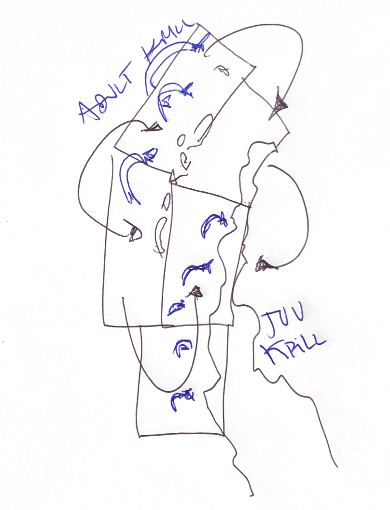

\newpage

# OVERVIEW

This code forms part of the supplementary material for the scientific article titled **"Assessing environmental and predator impacts on Antarctic Krill (*Euphausia superba*) population dynamics from an integrated length-to-age assessment model perspective."**

# MODELING SETTING

```{r setup1, echo=FALSE}
#rm(list = ls())
#set.seed(999)
knitr::opts_chunk$set(echo = FALSE,
                      message = FALSE,
                      warning = FALSE,
                      fig.align = 'center',
                      fig.pos = "H",
                      fig.width = 6,
                      fig.height = 4,
                      dev = 'jpeg',
                      fig.path = "Figs/",
                      dpi = 300,
                      tidy.opts=list(width.cutoff=50),
                      tidy=TRUE)
#XQuartz is a mess, put this in your onload to default to cairo instead
options(bitmapType = "cairo") 
# (https://github.com/tidyverse/ggplot2/issues/2655)
# Lo mapas se hacen mas rapido
```

### Libraries

Libraries necessary to made this analysis;

```{r message=FALSE, echo=TRUE}
# install.packages("devtools")
# devtools::install_github("r4ss/r4ss", ref="development")
# install.packages("caTools")
# library("caTools")
# install.packages("r4ss")
pkgs<-c("r4ss","ss3diags","doParallel",
        "tibble","tidyr","tidyverse",
        "readxl","openxlsx","broom",
        "forecast","mixR","lmtest",
        "car","ggpubr","ggthemes",
        "ggridges","ggrepel",
        "cowplot",
        "kableExtra","flextable","here",
        "scales", "ggthemes", "patchwork")

instalar<-pkgs[!pkgs%in%installed.packages()]
if(length(instalar)>0)install.packages(instalar)

invisible(lapply(pkgs,library,character.only=TRUE))

library(doParallel)
registerDoParallel(8)
```

### Code Repository

The repository with files templates by scenario to replicate this analysis can be found in this [GitHub author link](https://github.com/MauroMardones/SA_Krill/tree/main/scenarios)

```{r message=FALSE, warning=FALSE}
dir1.1<-here::here("s1.1") # no predador- environmental
dir1.2 <- here::here("s1.2") # s1.1 w/ predador
dir1.3 <- here::here("s1.3") # s1.1 w/ env
dir1.4 <- here::here("s1.4") # s1.1 predator and env
Figs <- here::here("Figs")
dir1 <- here::here("s1")
outdir <- here::here("outputs")
```
### Run models

```{r eval=FALSE, message=F, include=FALSE, echoo=TRUE}
### Run Models
directorios <- c("s1.1",
                 "s1.2",
                 "s1.3",
                 "s1.4")  

for (dir in directorios) {
  r4ss::run(
    dir = dir,
    exe = "ss_osx",
    skipfinished = FALSE,
    show_in_console = TRUE
  )
}

```


```{r eval=FALSE, message=F, include=FALSE}
#OR with rby separate
#shell(cmd="ss") # run SS to windows
# or 
r4ss::run(
  dir = dir1.1,
  exe = "ss_osx",
  skipfinished = FALSE, 
  show_in_console = TRUE 
)
# s1.2
r4ss::run(
  dir = dir1.2,
  exe = "ss_osx",
  skipfinished = FALSE, 
  show_in_console = TRUE 
)
# s1.3
r4ss::run(
  dir = dir1.3,
  exe = "ss_osx",
  skipfinished = FALSE, 
  show_in_console = TRUE 
)
# s1.4
r4ss::run(
  dir = dir1.4,
  exe = "ss_osx",
  skipfinished = FALSE, 
  show_in_console = TRUE 
)
```

```{r message=F, include=FALSE}
#s1.1
base.model1.1 <- SS_output(dir=dir1.1,
                        covar=T,
                        forecast=T)
#s1.2
base.model1.2 <- SS_output(dir=dir1.2,
                        covar=T,
                        forecast=T)
#s1.3
base.model1.3 <- SS_output(dir=dir1.3,
                        covar=T,
                        forecast=T)
#s1.4
base.model1.4 <- SS_output(dir=dir1.4,
                        covar=T,
                        forecast=T)
```

## Spatial dimension of stock assessment

The study focuses on Subarea 48.1 in the Western Antarctic Peninsula, where most krill fishing occurs and CCAMLR is advancing spatially refined management. We use five CCAMLR-defined strata to increase spatial resolution, allowing detection of regional differences in krill dynamics (Figure \@ref(fig:mapa)). This structure, integrated into the stock assessment model, enhances its capacity to capture spatial variability in both biological and environmental data. In this approach, spatial structure is incorporated implicitly by treating different areas as separate fleets [@Nielsen2021; @Waterhouse2014]. This constitutes a spatially implicit modeling framework, where differences among strata are recognized both from the perspective of krill population dynamics and from the influence of environmental variability within Subarea 48.1.


```{r mapa, fig.cap="Subarea 48.1 and management strata considered in the spatio-temporal analysis of intrinsic productivity of Krill (BS=Brainsfield Strait, EI= Elephant Island, Gerlache= Gerlache strait, JOIN= Joinville Island, SSWI= South West)"}
knitr::include_graphics('Figs/map_SA_krilll.png')
```

Figure \@ref(fig:conceptual) illustrates a conceptual model with the spatial distribution and movement of Antarctic krill in the Western Antarctic Peninsula (WAP). Adult krill are concentrated and move primarily in the northern areas, while juvenile krill dominate the southern regions. Arrows indicate directional flows, suggesting ontogenetic or environmentally-driven migration patterns. In terms of assumptions, although there are spatial differences in population structure, all these areas are considered part of a single, closed population unit upon which the stock assessment is conducted. By leveraging a spatially implicit, ecosystem-informed approach, this assessment provides a robust framework for evaluating krill stock dynamics under changing environmental conditions. These insights are crucial for informing sustainable management strategies in the Antarctic Peninsula region, where krill plays a foundational role in the marine food web.  

```{r conceptual, out.width="50%", fig.cap="Conceptual model used to model dynamics population in Antarctic krill in WAP"}

```

## Statistical Model (`SS3`)

Stock Synthesis (v.3.30.21)  is a widely used tool for assessing fish and invertebrate populations, including Antarctic krill. SS3 is implemented in `C++` with estimation enabled through automatic differentiation (ADMB) [@Fournier2012; @Methot2013]. The source code can be find in [Github SS3 repository](https://github.com/nmfs-ost/ss3-source-code). In this exercise, `SS3` is configured as an integrated stock assessment model, explicitly accounting for age and size structure while incorporating key ecosystem drivers. The model simulates population processes such as growth, maturity, fecundity, recruitment, movement, and mortality, while also integrating environmental variability and predator-prey relationships to refine estimates of population trends in krill. The analysis of model outputs is conducted using R, utilizing the *r4ss* and *ss3diags* packages [@Taylor2019; @Winker2023]. Integrated models can effectively capture the age structure by transforming length observations into population-level dynamics [@Lee2024; @Punt2013]. 

In a catch-at-length model like krill assessment the AKL matrix (Figure \@ref(fig:AKL)) is modeled trough parametrization process and have this shape;

```{r AKL,fig.cap="Representation of ALK Matrix to krill in 48.1"}
alk_matrix <- base.model1.1$ALK[,,1] # Ajusta las dimensiones según tu matriz

# Convertir la matriz en un data.frame
alk_df <- as.data.frame(as.table(alk_matrix))

# Renombrar columnas para mayor claridad
colnames(alk_df) <- c("Length", "TrueAge", "Value")

# Asegúrate de que las columnas Length y TrueAge sean numéricas
alk_df$Length <- as.numeric(as.character(alk_df$Length))
alk_df$TrueAge <- as.numeric(as.character(alk_df$TrueAge))

# Asegúrate de que la columna Value sea numérica
alk_df$Value <- as.numeric(alk_df$Value)

# Crear el plot usando ggplot
ggplot(alk_df, aes(x = TrueAge, y = Length, fill = Value)) +
  geom_tile() +
  scale_fill_gradient(low = "white", high = "blue") +
  labs(x = "True Age",
       y = "Length",
       fill = "Value") +
  theme_bw()+
  theme(legend.position = "none")
```

## Data

### Parameters

The following table summarizes the key parameters to conditioning the reference model, including biological, growth, and population dynamics factors (\@ref(tab:parainit1)).


```{r parainit1, eval=TRUE}
dir1.1 <- here("s1.1")

start1 <- SS_readstarter(file = file.path(dir1.1, "starter.ss"), verbose = FALSE)
dat1   <- SS_readdat(file = file.path(dir1.1, start1$datfile), verbose = FALSE)
ctl1   <- SS_readctl(file = file.path(dir1.1, start1$ctlfil),
                     verbose = FALSE, use_datlist = TRUE, datlist = dat1)
fore1  <- SS_readforecast(file = file.path(dir1.1, "forecast.ss"), verbose = FALSE)

# Extraer parámetros
parbio <- ctl1$MG_parms[1:10, c(1:4,7)]
rownames(parbio) <- c("Nat M", "Lmin", "Lmax", "VonBert K",
                      "CV young", "CV old", "Wt a", "Wt b", "L50%", "Mat slope")

SRpar  <- ctl1$SR_parms[1:5, c(1:4,7)]
Qpar   <- ctl1$Q_parms[1:2, c(1:4,7)]
Selpar <- ctl1$size_selex_parms[1:20, c(1:4,7)]

# Combinar parámetros
parInit <- as.data.frame(rbind(parbio, SRpar, Qpar, Selpar))

# Añadir nombres de fila como columna "Parameter"
parInit$Parameter <- rownames(parInit)

# Añadir categorías y reordenar columnas
parInit <- parInit %>%
  mutate(INIT  = round(INIT, 2),
         PRIOR = round(PRIOR, 2))

# Crear vector de categorías (39 filas)
categories <- c(rep("Natural Mortality", 1),
                rep("Growth", 4),
                rep("Length-Weight Relation", 2),
                rep("Maturity", 2),
                rep("Stock-Recruit Relation", 5),
                rep("Catchability", 2),
                rep("Selectivity", 21))  # OJO: corregido a 23

# Añadir categorías y reordenar columnas
parInit <- parInit %>%
  mutate(Category = categories) %>%
  dplyr::relocate(Category, Parameter)

# Crear flextable
ft <- flextable(parInit)
ft <- set_caption(ft,
                  caption = as_paragraph("Input parameters for the initial SS3 model of krill. Each parameter line contains a minimum value (LO), maximum value (HI), and initial value (INIT). If the phase (PHASE) for the parameter is negative, the parameter is fixed as input"),
                  autonum = NULL)
ft <- autofit(ft)
ft <- theme_booktabs(ft)
ft <- set_table_properties(ft, width = .5, layout = "autofit")
ft <- fontsize(ft, size = 9, part = "all")
ft
```


### Index 

Abundance index in Figure \@ref(fig:index)

```{r index, fig.cap="Standardized indices of krill index abundance and consumption from fishery-dependent, fishery-independent, and predator-based data sources across different strata within Subarea 48.1. Each panel represents a distinct spatial or functional stratum, with trend lines indicating temporal variation from 1990 to 2020. Colors denote data source categories: green for fishery, orange for scientific surveys, and purple for predator-based indices. These patterns highlight spatial and temporal heterogeneity in krill dynamics across the subarea."}


dat1_std <- dat1$CPUE %>%
  mutate(
    index_std = (obs - min(obs)) / (max(obs) - min(obs)),
    index = dplyr::recode(index,
                   `1` = "FISHERYBS",
                   `2` = "FISHERYEI",
                   `3` = "FISHERYGS",
                   `4` = "FISHERYJOIN",
                   `5` = "FISHERYSSIW",
                   `6` = "SURVEYBS",
                   `7` = "SURVEYEI",
                   `8` = "SURVEYGS",
                   `9` = "SURVEYJOIN",
                   `10` = "SURVEYSSIW",
                   `11` = "PREDATOR"),
    index = factor(index, levels = c("FISHERYBS", 
                                     "FISHERYEI", 
                                     "FISHERYGS",
                                     "FISHERYJOIN", 
                                     "FISHERYSSIW", 
                                     "SURVEYBS", 
                                     "SURVEYEI", 
                                     "SURVEYGS", 
                                     "SURVEYJOIN", 
                                     "SURVEYSSIW", 
                                     "PREDATOR")),
    category = case_when(
      index %in% c("FISHERYBS", "FISHERYEI", "FISHERYGS", "FISHERYJOIN", "FISHERYSSIW") ~ "Fishery",
      index %in% c("SURVEYBS", "SURVEYEI", "SURVEYGS", "SURVEYJOIN", "SURVEYSSIW") ~ "Survey",
      index == "PREDATOR" ~ "Predator",
      TRUE ~ NA_character_  
    )
  )


p1 <- ggplot(dat1_std, aes(x = year, y = index_std, group = index, color = category)) +
  geom_point() +
  geom_smooth(method = "lm", se = FALSE) +
  facet_wrap(~index, scales = "free_y", ncol = 5) +  # Ajusta ncol para obtener 3 filas
  scale_color_manual(values = c("Fishery" = '#1b9e77', 
                                "Survey" = '#d95f02',
                                "Predator" = '#7570b3')) + 
  theme_bw() +
  theme(legend.position = "top",
    axis.text.x = element_text(angle = 90, hjust = 1),
         axis.text.y = element_blank()) +
  labs(title = "", x = "", y = "Standard index", color = "Category")
p1
```

### Length compositions

Length compositions in Figure \@ref(fig:length)

```{r length, warning=FALSE, fig.cap="Annual length-frequency distributions of Antarctic krill (Euphausia superba) across different data sources and spatial strata within Subarea 48.1 from 1991 to 2020. Each panel represents a distinct stratum for either fishery-dependent (green), fishery-independent survey (orange), or predator-based (purple) observations. Density ridgelines illustrate variation in krill size structure across years. The red vertical line marks a recruit references length (3.6 cm)."}

dat_lencomp <- dat1$lencomp

# ── Diagnóstico: muestra columnas reales (quitar comentario si hay problemas)
# message("Columnas en dat1$lencomp: ", paste(names(dat_lencomp), collapse = ", "))

# ── Compatibilidad multi-versión de r4ss:
# Detecta la columna de flota sea cual sea su nombre y la normaliza a "FltSvy"
posibles_fleet <- c("FltSvy", "Fleet", "fleet", "Flt", "flt", "FLT",
                    "FLT_SVY", "fltsvy")
col_flota <- intersect(posibles_fleet, names(dat_lencomp))

if (length(col_flota) == 0) {
  # Último recurso: usar la 3ª columna (posición estándar SS3: Yr, Seas, Fleet...)
  col_flota <- names(dat_lencomp)[3]
  message("AVISO: columna de flota no detectada por nombre. ",
          "Usando columna 3 ('", col_flota, "'). ",
          "Columnas disponibles: ", paste(names(dat_lencomp), collapse = ", "))
}

if (col_flota[1] != "FltSvy") {
  dat_lencomp <- dplyr::rename(dat_lencomp, FltSvy = !!rlang::sym(col_flota[1]))
}

# ── Normalizar columna de año: r4ss >= 1.46 usa "year" en vez de "Yr"
if (!"Yr" %in% names(dat_lencomp) && "year" %in% names(dat_lencomp)) {
  dat_lencomp <- dplyr::rename(dat_lencomp, Yr = year)
}

dat_long <- dat_lencomp %>%
  pivot_longer(cols = starts_with("l"),
               names_to = "Talla",
               values_to = "Frecuencia") %>%
  mutate(Talla = as.numeric(sub("l", "", Talla))) %>%
  mutate(FltSvy = dplyr::recode(FltSvy,
                         `1` = "FISHERYBS",
                         `2` = "FISHERYEI",
                         `3` = "FISHERYGS",
                         `4` = "FISHERYJOIN",
                         `5` = "FISHERYSSIW",
                         `6` = "SURVEYBS",
                         `7` = "SURVEYEI",
                         `8` = "SURVEYGS",
                         `9` = "SURVEYJOIN",
                         `10` = "SURVEYSSIW",
                         `11` = "PREDATOR")) %>%
  mutate(FltSvy = factor(FltSvy, levels = c("FISHERYBS", 
                                            "FISHERYEI", 
                                            "FISHERYGS",
                                            "FISHERYJOIN", 
                                            "FISHERYSSIW",
                                            "SURVEYBS",
                                            "SURVEYEI", 
                                            "SURVEYGS", 
                                            "SURVEYJOIN",
                                            "SURVEYSSIW",
                                            "PREDATOR"))) 

mean_talla <- dat_long %>%
  group_by(FltSvy) %>%
  summarise(mean_Talla = mean(Talla, na.rm = TRUE))


dat_expanded <- dat_long %>%
  uncount(weights = Frecuencia)


p2 <- ggplot(dat_expanded, aes(x = Talla, y = as.factor(Yr), fill = FltSvy)) +
  geom_density_ridges_gradient(scale = 1.8,
                               rel_min_height = 0.001,
                               col = "black",
                               alpha=0.4) +
  facet_wrap(~FltSvy, ncol = 10) +
  geom_vline(data = mean_talla, aes(xintercept = mean_Talla), 
             color = "red", 
             size = 0.7,
             alpha = 0.5) +
  scale_fill_manual(values = c("FISHERYBS" = '#1b9e77',  
                               "FISHERYEI" = '#1b9e77',  
                               "FISHERYGS" = '#1b9e77',
                               "FISHERYJOIN" = '#1b9e77',  
                               "FISHERYSSIW" = '#1b9e77',  
                               "SURVEYBS" = '#d95f02',  
                               "SURVEYEI" = '#d95f02',  
                               "SURVEYGS" = '#d95f02',  
                               "SURVEYJOIN" = '#d95f02',  
                               "SURVEYSSIW" = '#d95f02',  
                               "PREDATOR" = '#7570b3')) +  
  labs(title = "",
       x = "cm",
       y = "",
       fill = "Category") +
  theme_bw()+
  theme(legend.position = "none")
p2
```
### Environmental Data

Based on @Mardones2026, Chl-a emerged as the most influential predictor and was therefore selected for incorporation into the stock assessment model as an environmental covariate. Figure \@ref(fig:mapachl) presents a time series of Chl-a concentration (mg m$^{-3}$) in the waters around the Antarctic Peninsula from 2000 to 2020. Each panel represents a different year, showing spatial variations in Chl-a levels as an indicator of phytoplankton biomass. The highest concentrations were observed along the coastal regions, while offshore areas exhibited lower Chl-a levels.

```{r mapachl, out.width="100%", fig.cap="Time series (2000-2020) to Chlorophyll in Subarea 48.1"}
knitr::include_graphics('Figs/chla_grilled.png')
```

The interannual variability of this environmental index from 2000 to 2020 is shown in Figure \@ref(fig:chlindex). The figure highlights fluctuations across years, with periods of higher-than-average chlorophyll variability (e.g., 2003, 2016) as well as years with significantly lower values (e.g., 2011, 2020).

```{r chlindex, fig.height=3, fig.width=9, fig.cap="Interannual variability of the Chlorophyll Variability Index from 2000 to 2020. Positive anomalies (in red) and negative anomalies (in black) indicate below-average conditions"}
chl <- dat1$envdat |>
  setNames(c("year", "variable", "chl_z")) |>
  filter(variable == 1, year != -9999) |>
  mutate(color_z = ifelse(chl_z >= 0, "above", "below"))

# Plot
ggplot(chl, aes(year, chl_z, fill = color_z)) +
  geom_col(width = 0.7, show.legend = FALSE) +
  geom_hline(yintercept = 0, color = "grey30") +
  scale_fill_manual(values = c("above" = "grey20", "below" = "#F44336")) +
  scale_x_continuous(breaks = seq(2000, 2020, 5)) +
  labs(x = "", 
       y = expression(Chl-italic(a)~anomaly~(italic(z)-score))) +
  theme_bw() +
  theme(panel.grid.minor = element_blank(),
        # poner en vertical los nombres de los años
        axis.text.x=element_text(angle=90,vjust=0.5))
```

### Predator Component as a Driver of Krill Dynamics

The top panel in Figure \@ref(fig:mapapre) shows annual krill length distributions derived from penguin diet samples, displayed by predator species. Although median krill lengths remain relatively consistent over time, there is notable interannual variability in the spread and distribution of sizes. Spatiotemporal distribution patterns of the three penguin species across the Antarctic Peninsula showed interannual variability from 2001 to 2020. Adélie penguins exhibited a relatively consistent presence across the northern sector of the Peninsula, with larger colony sizes concentrated toward the southwestern Bransfield Strait, particularly during the early 2000s. Chinstrap penguins were widespread and dominant in both spatial extent and colony size across most years, especially in the central and northeastern portions of the Peninsula. Gentoo penguins appeared in fewer and more localized sites but displayed a slight increase in spatial occurrence during the latter part of the time series  The index exhibits fluctuations over time, with a general decline from the early 1990s to the mid-2000s, followed by a period of relative stabilization and a strong decline toward the end of the time series (bottom panel in Figure \@ref(fig:mapapre)).. 


```{r mapapre, eval=TRUE, out.width="100%", fig.cap= "Ecosystem indicators derived from penguin predator data in the Western Antarctic Peninsula. Top panel: Annual krill length distributions from penguin diet samples by species: adélie, chinstrap, and gentoo. A red horizontal line marks the 3.6 cm as recruit size for reference purposes. Bottom panel: Synoptic index of relative predator biomass, used as an ecosystem input in the stock assessment model."}
knitr::include_graphics('Figs/new_predator_plot.png')
```

This information and all sources can be represented through the following flow diagram (Figure \@ref(fig:path)) of inputs, model, and outputs.


```{r path, out.width="75%", fig.cap="Framework path to stock assessment model in krill in WAP (Yellow boxes is not implemeted yet)."}
knitr::include_graphics('Figs/pathmod.png')
```

Figure \@ref(fig:dataserie) show time series of differente componentes of data sources to this krill stock assessment.

```{r dataserie, fig.width=6, fig.height=10 fig.cap="Data series used in krill modelling in 48.1 Subarea"}
SSplotData(base.model1.4, 
           subplots = 1,
           ptsize = -1.5)
```

## Scenarios

The **reference model** is `s1.1`, wich represents a baseline assessment of *Euphausia superba* population dynamics in Subarea 48.1, excluding environmental and ecological variables. This model assumes that krill productivity and population parameters are driven  by intrinsic biological processes, such as growth, mortality, and recruitment and fishery impacts without accounting for external influences like environmental variability or predation pressure. By serving as a *control scenario*, this model provides a benchmark against which the impact of ecosystem components in productivity can be evaluated, allowing for a direct comparison of how environmental and ecological factors influence krill stock dynamics. Table \@ref(tab:scenarios) show scenarios used for modelling dynamics in krill

```{r scenarios, eval=TRUE}
# Tu código de flextable aquí
scenario_table <- data.frame(
  Scenario = c("s1.1", "s1.2", "s1.3", "s1.4"),
  Description = c(
    "Spatial data without environmental and predator components",
    "\"s1.1\" with predator components",
    "\"s1.1\" with environmental variable",
    "\"s1.1\" with both predator fleet and environmental variable"
  ),
  stringsAsFactors = FALSE
)

scenario_table %>%
  kbl(caption = "Scenarios used for modelling dynamics in krill",
      align = "l",  # Left alignment (or use "c" for center)
      booktabs = TRUE,
      col.names = c("Scenario", "Description")) %>%
  kable_styling(bootstrap_options = c("striped", "hover"),
                full_width = FALSE,
                position = "center",
                font_size = 10,  # Equivalent to fontsize(size = 10)
                latex_options = "HOLD_position") %>%
  row_spec(0, bold = TRUE, color = "black") %>%  # Header formatting
  column_spec(1, width = "2cm") %>%  # Adjust column widths
  column_spec(2, width = "10cm")
```

# RESULTS


```{r eval=FALSE, message=F, include=FALSE}
# Definir la ruta de la carpeta
folder_path <- "s1.1/plots"
# Verificar si la carpeta existe y eliminarla
if (dir.exists(folder_path)) {
  unlink(folder_path, recursive = TRUE)
  message("La carpeta 'plots' ha sido eliminada.")
} else {
  message("La carpeta 'plots' no existe.")
}

SS_plots(base.model1.1, 
         uncertainty = TRUE,
         datplot = T, 
         png=T, 
         aalresids = F,
         btarg=0.75, 
         minbthresh=0.2, 
         forecast=T)

# S 1.2

# Definir la ruta de la carpeta
folder_path2 <- "s1.2/plots"
# Verificar si la carpeta existe y eliminarla
if (dir.exists(folder_path2)) {
  unlink(folder_path2, 
         recursive = TRUE)
  message("La carpeta 'plots' ha sido eliminada.")
} else {
  message("La carpeta 'plots' no existe.")
}

SS_plots(base.model1.2, 
         uncertainty = TRUE,
         datplot = T, 
         png=T, 
         aalresids = F,
         btarg=0.75, 
         minbthresh=0.2, 
         forecast=T)

# S 1.3

# Definir la ruta de la carpeta
folder_path3 <- "s1.3/plots"
# Verificar si la carpeta existe y eliminarla
if (dir.exists(folder_path3)) {
  unlink(folder_path3, 
         recursive = TRUE)
  message("La carpeta 'plots' ha sido eliminada.")
} else {
  message("La carpeta 'plots' no existe.")
}

SS_plots(base.model1.3, 
         uncertainty = TRUE,
         datplot = T, 
         png=T, 
         aalresids = F,
         btarg=0.75, 
         minbthresh=0.2, 
         forecast=T)


# S 1.4

# Definir la ruta de la carpeta
folder_path4 <- "s1.4/plots"
# Verificar si la carpeta existe y eliminarla
if (dir.exists(folder_path4)) {
  unlink(folder_path4, 
         recursive = TRUE)
  message("La carpeta 'plots' ha sido eliminada.")
} else {
  message("La carpeta 'plots' no existe.")
}

SS_plots(base.model1.4, 
         uncertainty = TRUE,
         datplot = T, 
         png=T, 
         aalresids = F,
         btarg=0.75, 
         minbthresh=0.2, 
         forecast=T)
```


Selectivity estimated by scenario in Figure \@ref(fig:selectivity).

```{r selectivity, fig.height=7, fig.cap="Selectivity by fleet in each scenario"}
par(mfrow=c(2,2), mar=c(5,4,1,1))
SSplotSelex(base.model1.1,
            subplots = 1,
            mainTitle = FALSE)
mtext("s1.1", side=3, line=0.5, cex=1.2)
SSplotSelex(base.model1.2,
            subplots = 1,
            mainTitle = FALSE)
mtext("s1.2", side=3, line=0.5, cex=1.2)
SSplotSelex(base.model1.3,
            subplots = 1,
            mainTitle = FALSE)
mtext("s1.3", side=3, line=0.5, cex=1.2)
SSplotSelex(base.model1.4,
            subplots = 1,
            mainTitle = FALSE)
mtext("s1.4", side=3, line=0.5, cex=1.2)
```

This Figure \@ref(fig:index2) shows standardized time series of input indices used in four different model scenarios (s1.1 to s1.4) for the stock assessment of Antarctic krill in Subarea 48.1.

```{r index2,  fig.height=8, fig.cap= "Standardized indices of krill abundance used as input in four model scenarios (s1.1 to s1.4), representing fishery-dependent (FISHERY) and fishery-independent (SURVEY) data across five spatial strata: Bransfield Strait (BS), Elephant Island (EI), Gerlache Strait (GS), Joinville Island (JOIN), and South West (SW). Scenario s1.4 also incorporates a predator index (PREDATOR), reflecting the integration of ecosystem variables into the assessment framework"}
par(mfrow=c(2,2), mar=c(5,4,2,1)) 
SSplotIndices(base.model1.1, subplots = 9)
mtext("s1.1", side=3, line=0.5, cex=1.2)
SSplotIndices(base.model1.2, subplots = 9)
mtext("s1.2", side=3, line=0.5, cex=1.2)
SSplotIndices(base.model1.3, subplots = 9)
mtext("s1.3", side=3, line=0.5, cex=1.2)
SSplotIndices(base.model1.4, subplots = 9)
mtext("s1.4", side=3, line=0.5, cex=1.2)
```

Main Variables poulation in `s1.1` scenario (Figure \@ref(fig:scen1))

```{r scen1, fig.cap="Main variables scenario s1.1"}
par(mfrow=c(1,3), mar=c(5,4,1,1)) 
SSplotTimeseries(base.model1.1,
                 subplot = 1,
                 xlab = "")
SSplotTimeseries(base.model1.1,
                 subplot = 9,
                 xlab = "")
SSplotTimeseries(base.model1.1,
                 subplot = 7,
                 xlab = "")
```

Main Variables poulation in `s1.2` scenario (Figure \@ref(fig:scen2))

```{r scen2, fig.cap="Main variables scenario s1.2"}
par(mfrow=c(1,3), mar=c(5,4,1,1))
SSplotTimeseries(base.model1.2,
                 subplot = 1,
                 xlab = "")
SSplotTimeseries(base.model1.2,
                 subplot = 9,
                 xlab = "")
SSplotTimeseries(base.model1.2,
                 subplot = 7,
                 xlab = "")
```

Main Variables poulation in `s1.3` scenario (Figure \@ref(fig:scen3))

```{r scen3,  fig.cap="Main variables scenario s1.3"}
par(mfrow=c(1,3), mar=c(5,4,1,1))
SSplotTimeseries(base.model1.3,
                 subplot = 1,
                 xlab = "")
SSplotTimeseries(base.model1.3,
                 subplot = 9,
                 xlab = "")
SSplotTimeseries(base.model1.3,
                 subplot = 7,
                 xlab = "")
```


Main Variables poulation in `s1.4` scenario (Figure \@ref(fig:scen4))

```{r scen4,  fig.cap="Main variables scenario s1.4"}
par(mfrow=c(1,3), mar=c(5,4,1,1))
SSplotTimeseries(base.model1.4,
                 subplot = 1,
                 xlab = "")
SSplotTimeseries(base.model1.4,
                 subplot = 9,
                 xlab = "")
SSplotTimeseries(base.model1.4,
                 subplot = 7,
                 xlab = "")
```


## Population variables 

(Figure \@ref(fig:popvar2))

```{r popvar2, fig.cap="Time series of different populations variables"}
cols <- c("Yr", "Bio_all", "Bio_smry", "SpawnBio", "Recruit_0")

outps1 <- base.model1.1$timeseries[, cols] %>% mutate(Model = "s1.1")
outps2 <- base.model1.2$timeseries[, cols] %>% mutate(Model = "s1.2")
outps3 <- base.model1.3$timeseries[, cols] %>% mutate(Model = "s1.3")
outps4 <- base.model1.4$timeseries[, cols] %>% mutate(Model = "s1.4")


outps1$Model <- "s1.1"
outps2$Model <- "s1.2"
outps3$Model <- "s1.3"
outps4$Model <- "s1.4"

outpsall <- rbind(outps1, outps2, outps3, outps4)

outpsall_long <- outpsall |>
  pivot_longer(
    cols      = c(Bio_all, Bio_smry, SpawnBio, Recruit_0),
    names_to  = "Variable",
    values_to = "Value"
  ) |>
  filter(Yr >= 1989, Yr <= 2020) |>
  mutate(Variable = case_when(
    Variable == "Bio_all"   ~ "Total Biomass (t)",
    Variable == "Bio_smry"  ~ "Summary Biomass (t)",
    Variable == "SpawnBio"  ~ "Spawning Stock Biomass (t)",
    Variable == "Recruit_0" ~ "Recruitment (N)",
    TRUE ~ Variable
  ))

panel_order <- c("Total Biomass (t)",
                 "Summary Biomass (t)",
                 "Spawning Stock Biomass (t)",
                 "Recruitment (N)")

# ── Survey total con CV propagado → va en Summary Biomass ─────
survey_total <- dat1$CPUE |>
  dplyr::filter(index %in% c(6, 7, 8, 9, 10)) |>
  dplyr::group_by(year) |>
  dplyr::summarise(
    Value   = sum(obs),
    cv_pool = sqrt(sum((se_log * obs)^2)) / sum(obs),
    .groups = "drop"
  ) |>
  dplyr::filter(year >= 1989, year <= 2020) |>
  dplyr::rename(Yr = year) |>
  dplyr::mutate(
    Variable = "Summary Biomass (t)",       
    lo       = Value * exp(-1.96 * cv_pool),
    hi       = Value * exp( 1.96 * cv_pool)
  )

alloutput <- ggplot(
  outpsall_long,
  aes(x = Yr, y = Value, color = Model, group = Model)
) +
  geom_line(linewidth = 0.8) +
  geom_point(size = 1.2, alpha = 0.7) +
  geom_errorbar(
    data        = survey_total,
    aes(x = Yr, ymin = lo, ymax = hi),
    inherit.aes = FALSE,
    color       = "#1f78b4",
    width       = 0.4,
    linewidth   = 0.5,
    alpha       = 0.7
  ) +
  geom_point(
    data        = survey_total,
    aes(x = Yr, y = Value),
    inherit.aes = FALSE,
    color       = "#1f78b4",
    shape       = 18,
    size        = 2.2,
    alpha       = 0.9
  ) +
  facet_wrap(
    ~ factor(Variable, levels = panel_order),
    ncol   = 4,
    scales = "free_y"
  ) +
  scale_color_manual(
    name   = "Scenario",
    values = c("s1.1" = "#ca0020", "s1.2" = "#f4a582",
               "s1.3" = "#bababa", "s1.4" = "#404040")
  ) +
  scale_y_continuous(
    labels = label_number(scale_cut = cut_short_scale())
  ) +
  scale_x_continuous(breaks = seq(1990, 2020, by = 5)) +
  labs(x = "", y = "") +
  theme_few() +
  theme(
    axis.text.x     = element_text(angle = 90, hjust = 1, size = 8),
    axis.text.y     = element_text(size = 8),
    strip.text      = element_text(size = 7),
    legend.position = "bottom",
    legend.title    = element_text(size = 10),
    legend.text     = element_text(size = 9)
  )

ggsave(alloutput, filename = "Figs/popvar_scenarios.png", 
       width = 8, 
       height = 4, 
       units = "in", dpi = 300)
```

Comparsion in long term time series forecasting Figure \@ref(fig:cumsum)

```{r}
# Renombrar y reordenar variables
var_labels <- c(
  "Bio_all"   = "Total Biomass (t)",
  "Bio_smry"  = "Summary Biomass (t)",
  "Recruit_0" = "Recruitment (N)",
  "SpawnBio"  = "Spawning Stock Biomass (t)"
)

outpsall_box <- outpsall |>
  pivot_longer(
    cols      = c(Bio_all, Bio_smry, Recruit_0, SpawnBio),
    names_to  = "Variable",
    values_to = "Value"
  ) |>
  filter(Yr >= 1989, Yr <= 2020) |>
  mutate(
    Variable = case_when(
      Variable == "Bio_all"   ~ "Total Biomass (t)",
      Variable == "Bio_smry"  ~ "Summary Biomass (t)",
      Variable == "Recruit_0" ~ "Recruitment (N)",
      Variable == "SpawnBio"  ~ "Spawning Stock Biomass (t)",
      TRUE ~ Variable
    ),
    Variable = factor(Variable, levels = var_labels)
  )

boxout <- ggplot(outpsall_box,
                 aes(x = Model, y = Value, fill = Model)) +
  geom_boxplot(outlier.size = 0.8, outlier.alpha = 0.5, linewidth = 0.4) +
  facet_wrap(~ Variable, ncol = 4, scales = "free_y") +
  scale_fill_manual(
    name   = "Scenario",
    values = c("s1.1" = "#ca0020", "s1.2" = "#f4a582",
               "s1.3" = "#bababa", "s1.4" = "#404040")
  ) +
  scale_y_continuous(
    labels = scales::label_number(scale_cut = cut_short_scale())
  ) +
  labs(x = "", y = "") +
  theme_few() +
  theme(
    axis.text.x     = element_text(size = 8),
    axis.text.y     = element_text(size = 8),
    strip.text      = element_text(size = 9),
    legend.position = "bottom"
  )

boxout
```


```{r eval=FALSE}
#read in all model runs
#note if cover=T you need a hessian; if covar=F you do not need a hessian
biglist1_4 <- SSgetoutput(keyvec = NULL,
                       dirvec = c(
                                  dir1.1,
                                  dir1.2,
                                  dir1.3,
                                  dir1.4),
                       getcovar = F)

#create summary of model runs from list above
summaryoutput1_4 <- SSsummarize(biglist1_4)

SSplotComparisons(summaryoutput1_4,
                  legendlabels = c("s1.1 (Ref Model)",
                 "s1.2",
                 "s1.3",
                 "s1.4"),
                 filenameprefix = "COM1",
                 labels = c("Year", 
                            "Spawning biomass (t)",
                            "Relative spawning biomass", 
                            "Age-0 recruits (1,000s)",
                            "Recruitment deviations", 
                            "Index", "Log index", 
                            "1 - SPR", 
                            "Density",
                            "Management target", 
                            "Minimum stock size threshold",
                            "Spawning output",
                            "Harvest rate"),
                 png=TRUE,
                 plotdir=Figs)
```


## Relationship Stock-Recruit

\[
R = \frac{R_0 \cdot S}{S_0 (1 - h) + S (5h - 1)}
\]

Where:  
- \( R \) is the predicted recruitment.  
- \( S \) is the spawning stock biomass.  
- \( R_0 \) is the recruitment at unfished equilibrium.  
- \( S_0 \) is the spawning biomass at unfished equilibrium.  
- \( h \) is the steepness parameter (the proportion of \( R_0 \) produced when \( S = 20\% \cdot S_0 \)).

The blue line represents the Beverton–Holt stock-recruitment relationship, commonly used in fisheries models to describe the compensatory response of recruitment to changes in spawning biomass.


## Productivity and Interannual Variability by Scenario

Estimating the productivity of Antarctic krill is critical for understanding the species’ capacity to replenish its population in response to varying levels of spawning biomass. Productivity, defined as the ratio of recruitment to spawning stock biomass, provides a standardized measure of reproductive success and population resilience under different ecological and fishing pressures. Comparing productivity across scenarios—each representing different assumptions about environmental drivers, fishing mortality, or predator dynamics—enables a robust evaluation of how krill populations reflect this changes.

For each scenario \( i \) and year \( t \), we computed the productivity as the ratio between recruitment and spawning stock biomass (SSB):

$$
\text{Productivity}_{i,t} = \frac{\text{Recruitment}_{i,t}}{\text{SSB}_{i,t}}
$$

We also calculated the **interannual percentage change** in recruitment and SSB as:

$$
\text{Change in Recruitment}_{i,t} = \left( \frac{\text{Recruitment}_{i,t} - \text{Recruitment}_{i,t-1}}{\text{Recruitment}_{i,t-1}} \right) \times 100
$$

$$
\text{Change in SSB}_{i,t} = \left( \frac{\text{SSB}_{i,t} - \text{SSB}_{i,t-1}}{\text{SSB}_{i,t-1}} \right) \times 100
$$

These metrics allow us to analyze both the productivity and the temporal dynamics of the population under each scenario \( i \).

```{r}
# ── Paleta y tema común ───────────────────────────────────────
colors <- c("s1.1" = "#ca0020", "s1.2" = "#f4a582",
            "s1.3" = "#bababa", "s1.4" = "#404040")
shapes <- c("s1.1" = 16, "s1.2" = 17, "s1.3" = 15, "s1.4" = 4)

theme_prod <- theme_bw() +
  theme(
    panel.grid.minor = element_blank(),
    panel.grid.major = element_line(color = "grey92"),
    strip.background = element_blank(),
    legend.position  = "none",
    axis.text        = element_text(size = 9),
    axis.title       = element_text(size = 10)
  )

# ══════════════════════════════════════════════════════════════
# PANEL A — STOCK-RECRUITMENT RELATIONSHIP
# ══════════════════════════════════════════════════════════════

models <- list(
  s1.1 = base.model1.1,
  s1.2 = base.model1.2,
  s1.3 = base.model1.3,
  s1.4 = base.model1.4
)

plot_data  <- list()
curve_data <- list()
label_data <- list()

for (group in names(models)) {
  model <- models[[group]]

  l  <- model$recruit$SpawnBio
  m  <- model$recruit$pred_recr
  yr <- model$recruit$Yr

  valid <- which(is.finite(l) & is.finite(m) & l > 0 & m > 0)
  l  <- l[valid]
  m  <- m[valid]
  yr <- yr[valid]

  df <- data.frame(l = l, m = m, yr = yr, Group = group)
  plot_data[[group]]  <- df
  label_data[[group]] <- df |> filter(yr %% 5 == 0)

  tryCatch({
    fit   <- nls(m ~ (a * l) / (1 + b * l),
                 start   = list(a = max(m) / max(l), b = 1 / max(l)),
                 data    = data.frame(l = l, m = m),
                 control = nls.control(maxiter = 300))
    l_seq <- seq(min(l), max(l), length.out = 200)
    curve_data[[group]] <- data.frame(
      l     = l_seq,
      m     = predict(fit, newdata = data.frame(l = l_seq)),
      Group = group
    )
  }, error = function(e) message("BH nls falló: ", group, " — ", e$message))
}

plot_data_all  <- bind_rows(plot_data)
curve_data_all <- bind_rows(curve_data)
label_data_all <- bind_rows(label_data)

srr_sce <- ggplot() +
  geom_point(
    data  = plot_data_all,
    aes(x = l / 1e6, y = m / 1e9, shape = Group, color = Group),
    size = 1.8, alpha = 0.5
  ) +
  geom_line(
    data  = curve_data_all,
    aes(x = l / 1e6, y = m / 1e9, color = Group),
    linewidth = 1.0
  ) +
  geom_text_repel(
    data  = label_data_all,
    aes(x = l / 1e6, y = m / 1e9, label = yr, color = Group),
    size = 2.5, max.overlaps = 10,
    segment.size = 0.3, segment.alpha = 0.4,
    box.padding = 0.3, show.legend = FALSE
  ) +
  scale_color_manual(values = colors, name = "Scenario") +
  scale_shape_manual(values = shapes, name = "Scenario") +
  scale_x_continuous(
    n.breaks = 5,
    labels   = label_number(suffix = " M", big.mark = ",")
  ) +
  scale_y_continuous(
    labels = label_number(suffix = " B")
  ) +
  coord_cartesian(ylim = c(0, 60)) +
  labs(
    x = "Spawning Stock Biomass",
    y = "Predicted Recruitment (B)"
  ) +
  theme_prod

# ══════════════════════════════════════════════════════════════
# PANEL B — PRODUCTIVITY (R/SSB vs SSB/SSB0)
# ══════════════════════════════════════════════════════════════

escenarios <- list(
  s1.1 = base.model1.1$SPAWN_RECR_CURVE,
  s1.2 = base.model1.2$SPAWN_RECR_CURVE,
  s1.3 = base.model1.3$SPAWN_RECR_CURVE,
  s1.4 = base.model1.4$SPAWN_RECR_CURVE
)

# Verifica nombres: names(base.model1.1$SPAWN_RECR_CURVE)
# Ajusta los nombres de columna abajo si es necesario
resultados <- imap_dfr(escenarios, function(df, nombre) {
  df |>
    mutate(
      Scenario      = nombre,
      Productividad = Recruitment / SSB
    )
})

prod <- ggplot(
  resultados,
  aes(x = `SSB/SSB_virgin`, y = Productividad,
      color = Scenario, shape = Scenario)
) +
  geom_line(linewidth = 0.9) +
  geom_point(size = 1.5, alpha = 0.6) +
  scale_color_manual(values = colors, name = "Scenario") +
  scale_shape_manual(values = shapes, name = "Scenario") +
  coord_cartesian(ylim = c(0, 15000), xlim = c(0, 1.25)) +
  labs(
    x = expression(SSB / SSB[0]),
    y = "Recruitment efficiency (R/SSB)"
  ) +
  theme_prod

# ══════════════════════════════════════════════════════════════
# PANEL C — ln(R0) DENSITY
# ══════════════════════════════════════════════════════════════

get_lnR0 <- function(model) {
  pars <- model$parameters
  row  <- pars[grepl("SR_LN\\(R0\\)", pars$Label), ]
  if (nrow(row) == 0) row <- pars[grepl("SR_LN", pars$Label), ]
  list(value = row$Value[1], sd = row$Parm_StDev[1])
}

r0_vals <- data.frame(
  model = c("s1.1", "s1.2", "s1.3", "s1.4"),
  value = c(
    get_lnR0(base.model1.1)$value,
    get_lnR0(base.model1.2)$value,
    get_lnR0(base.model1.3)$value,
    get_lnR0(base.model1.4)$value
  ),
  sd = c(
    get_lnR0(base.model1.1)$sd,
    get_lnR0(base.model1.2)$sd,
    get_lnR0(base.model1.3)$sd,
    get_lnR0(base.model1.4)$sd
  )
)

x_range <- seq(
  min(r0_vals$value) - 5 * max(r0_vals$sd),
  max(r0_vals$value) + 5 * max(r0_vals$sd),
  length.out = 500
)

dens_data <- pmap_dfr(r0_vals, function(model, value, sd) {
  data.frame(
    x        = x_range,
    density  = dnorm(x_range, mean = value, sd = sd),
    Scenario = model
  )
})

r0plot <- ggplot(dens_data, aes(x = x, y = density, color = Scenario)) +
  geom_line(linewidth = 1.0) +
  geom_vline(
    data     = r0_vals,
    aes(xintercept = value, color = model),
    linetype = "dashed", linewidth = 0.5, alpha = 0.7
  ) +
  scale_color_manual(values = colors, name = "Scenario") +
  labs(
    x = expression(ln(R[0])),
    y = "Density"
  ) +
  theme_prod


legend_src <- srr_sce +
  theme(
    legend.position   = "bottom",
    legend.title      = element_text(size = 10, face = "bold"),
    legend.text       = element_text(size = 9),
    legend.key.size   = unit(0.5, "cm"),
    legend.background = element_blank()
  ) +
  guides(
    color = guide_legend(nrow = 1,
                         override.aes = list(linetype = "solid", size = 3)),
    shape = guide_legend(nrow = 1)
  )

shared_legend <- get_legend(legend_src)
```


```{r recpro, fig.cap = "Stock–recruitment relationships (A), recruitment efficiency (B), and posterior distribution of ln(R0) (C) for Antarctic krill under four assessment scenarios: s1.1 (base), s1.2 (predator mortality), s1.3 (environmental covariates), and s1.4 (predator + environment). Beverton–Holt curves fitted to observed SSB–recruitment pairs; panel B shows per-capita productivity (R/SSB) as a function of relative spawning biomass (SSB/SSB\\textsubscript{0}); panel C shows the marginal posterior of virgin recruitment."}
# Tres paneles sin leyenda individual
top_row <- plot_grid(
  srr_sce + theme(legend.position = "none"),
  prod    + theme(legend.position = "none"),
  r0plot  + theme(legend.position = "none"),
  ncol       = 3,
  labels     = c("A", "B", "C"),
  label_size = 11,
  align      = "h",
  axis       = "tb"
)

# Combinar paneles + leyenda
fig_recpro <- plot_grid(
  top_row,
  shared_legend,
  ncol        = 1,
  rel_heights = c(1, 0.10)
)

fig_recpro

# Guardar (opcional)
#ggsave("fig_recpro.png", fig_recpro, width = 10, height = 4, dpi = 300)
```

Figure \@ref(fig:recdev) shows the recruitment deviations for the four assessment scenarios. The reference model (s1.1) shows a relatively stable pattern of recruitment deviations, while the other scenarios exhibit more variability, particularly in the later years. This suggests that incorporating predator and environmental data can influence the estimated recruitment dynamics of Antarctic krill.


```{r recdev, warning=FALSE, message=FALSE}
## Recruit deviation
dev1 <- base.model1.1$recruit[8:35,c(1,7)]%>% 
  mutate(Serie = "s1.1")
dev2 <- base.model1.2$recruit[8:35,c(1,7)] %>% 
  mutate(Serie = "s1.2")
dev3 <- base.model1.3$recruit[8:35,c(1,7)] %>% 
  mutate(Serie = "s1.3")
dev4 <- base.model1.4$recruit[8:35,c(1,7)] %>% 
  mutate(Serie = "s1.4")


data_list <- list(dev1, 
                  dev2,
                  dev3,
                  dev4)
titles <- c("Ref Model: No Env-Predator",
                 "S1.1 w/ Predator data",
                 "S1.1 w/ Env data",
                 "S1.1 w/ Env and Predator data")
# Lista para almacenar los gráficos
plots <- list()

for (i in 1:length(data_list)) {
  p <- ggplot(data_list[[i]], aes(x = Yr, y = dev)) +
    geom_point() +
    stat_smooth(method = "loess", 
                span = 0.15, 
                se = T) +
    geom_hline(yintercept = 0,
               col="red",
               linetype = "dotdash")+
    ggtitle(titles[i]) +
    theme(axis.text.x = element_text(angle = 90,
                                   hjust = 1))+
    ylim(-2,2)+
    theme_few()
  plots[[i]] <- p
}


combined_plot <- plot_grid(plotlist = plots, ncol = 2, nrow = 2)
combined_plot
```
Explotation rato (havest rate) in Figure \@ref(fig:hrate)

```{r hrate, warning=FALSE, message=FALSE, fig.cap="Harves rate by scenario in krill overtime"}
df1 <- base.model1.1$exploitation[, c(1, 4)] %>% mutate(model = "s1.1")
df2 <- base.model1.2$exploitation[, c(1, 4)] %>% mutate(model = "s1.2")
df3 <- base.model1.3$exploitation[, c(1, 4)] %>% mutate(model = "s1.3")
df4 <- base.model1.4$exploitation[, c(1, 4)] %>% mutate(model = "s1.4")


df_all <- bind_rows(df1, df2, df3, df4)
colnames(df_all) <- c("year", "exploitation_rate", "model")

colores <- c("s1.1" = "#ca0020", 
             "s1.2" = "#f4a582", 
             "s1.3" = "#bababa", 
             "s1.4" = "#404040")
ggplot(df_all, aes(x = year, y = exploitation_rate, color = model)) +
  geom_line() +
  geom_point(size = 3, shape = 16) +
  scale_color_manual(values = colores) +
  scale_x_continuous(
    breaks = seq(1998, 2020, by = 1)  # etiquetas cada 2 años
  ) +
  labs(
    title = "",
    x = "",
    y = "Exploitation Rate",
    color = "Model"
  ) +
  xlim(1997,2020)+
  theme_minimal()+
  theme(
    axis.text.x = element_text(angle = 90, vjust = 0.5, hjust = 1)  # texto vertical
  )
```


## Model Perfomance

The convergence criterion used for model calibration is set to a final threshold of **0.0001** (or equivalently **1.0e-04**). This criterion defines the minimum acceptable difference between successive model iterations. Convergence is considered achieved when the absolute change in the objective function value or key parameters falls below this threshold. A smaller convergence value ensures that the model achieves a high degree of accuracy and stability in its final estimates, indicating that further iterations are unlikely to result in significant changes to the parameter estimates.


```{r acf, fig.height=4, fig.width=8, fig.cap="Autocorrelation in Recruit by scenario"}
cols <- c("s1.1" = "#ca0020", "s1.2" = "#f4a582",
          "s1.3" = "#bababa", "s1.4" = "#404040")
plot_acf_color <- function(x, label, color) {
  ac <- acf(x, plot = FALSE)
  ci <- qnorm(0.975) / sqrt(length(x))
  df <- data.frame(lag = ac$lag[-1], acf = ac$acf[-1])
  ggplot(df, aes(lag, acf)) +
    geom_hline(yintercept = 0, color = "grey40") +
    geom_hline(yintercept = c(-ci, ci), linetype = "dashed", color = "grey60") +
    geom_segment(aes(xend = lag, yend = 0), color = color, linewidth = 1) +
    ylim(-1, 1) +
    labs(title = label, x = "Lag", y = "ACF") +
    theme_few() +
    theme(panel.grid.minor = element_blank(),
          strip.background = element_blank(),
          plot.title       = element_text())
}

p1 <- plot_acf_color(base.model1.1$recruit$pred_recr, "s1.1", cols["s1.1"])
p2 <- plot_acf_color(base.model1.2$recruit$pred_recr, "s1.2", cols["s1.2"])
p3 <- plot_acf_color(base.model1.3$recruit$pred_recr, "s1.3", cols["s1.3"])
p4 <- plot_acf_color(base.model1.4$recruit$pred_recr, "s1.4", cols["s1.4"])

acf_combined <- wrap_plots(list(p1, p2, p3, p4), ncol = 4, nrow = 1)

ggsave("Figs/acf_recruitment.png",
       plot   = acf_combined,
       width  = 10,
       height = 3,
       dpi    = 300)
```


This Figure \@ref(fig:pearson)  and Figure \@ref(fig:pearsontrend) shows the Pearson residuals and trends of predicted length distributions for krill across four modeling scenarios, each incorporating different levels of ecosystem complexity.

\begin{landscape}

```{r pearson, fig.cap="Pearson residual by scenario and fleet"}
# ── Función robusta: normaliza nombres de columna según versión de r4ss
create_heatmap_df <- function(df, model_name) {
  df_norm <- df

  # Año: "Yr" (old r4ss) o "year" (new r4ss)
  if (!"Yr" %in% names(df_norm) && "year" %in% names(df_norm))
    df_norm <- dplyr::rename(df_norm, Yr = year)

  # Bin de longitud
  bin_col <- intersect(c("Bin", "bin", "Lbin_lo", "lbin_lo"), names(df_norm))[1]
  if (!is.na(bin_col) && bin_col != "Bin")
    df_norm <- dplyr::rename(df_norm, Bin = !!rlang::sym(bin_col))

  # Residual de Pearson
  pear_col <- intersect(c("Pearson", "pearson"), names(df_norm))[1]
  if (!is.na(pear_col) && pear_col != "Pearson")
    df_norm <- dplyr::rename(df_norm, Pearson = !!rlang::sym(pear_col))

  # Flota (numérica)
  fleet_col <- intersect(c("Fleet", "FltSvy", "fleet", "Flt"), names(df_norm))[1]
  if (!is.na(fleet_col) && fleet_col != "Fleet")
    df_norm <- dplyr::rename(df_norm, Fleet = !!rlang::sym(fleet_col))

  df_norm %>%
    dplyr::filter(Pearson < 5) %>%
    dplyr::select(Yr, Bin, Pearson, Fleet) %>%
    dplyr::mutate(
      Fleet = dplyr::case_when(
        Fleet == 1  ~ "FISHERYBS",
        Fleet == 2  ~ "FISHERYEI",
        Fleet == 3  ~ "FISHERYGS",
        Fleet == 4  ~ "FISHERYJOIN",
        Fleet == 5  ~ "FISHERYSSIW",
        Fleet == 6  ~ "SURVEYBS",
        Fleet == 7  ~ "SURVEYEI",
        Fleet == 8  ~ "SURVEYGS",
        Fleet == 9  ~ "SURVEYJOIN",
        Fleet == 10 ~ "SURVEYSSIW",
        Fleet == 11 ~ "PREDATOR",
        TRUE ~ NA_character_
      ),
      Model = model_name
    )
}

# Unir los datasets en uno solo
df_all <- bind_rows(
  create_heatmap_df(base.model1.1$lendbase, "s1.1"),
  create_heatmap_df(base.model1.2$lendbase, "s1.2"),
  create_heatmap_df(base.model1.3$lendbase, "s1.3"),
  create_heatmap_df(base.model1.4$lendbase, "s1.4")
)


circleplot_res <- df_all |>
  filter(!is.na(Fleet)) |>
  filter(!is.na(Fleet), abs(Pearson) > 0.25) |>
  ggplot(aes(x = Yr, y = Bin)) +
  geom_point(
    aes(fill = Pearson, size = abs(Pearson)),
    shape = 21, color = "grey20", stroke = 0.15, alpha = 0.65
  ) +
  scale_fill_gradient2(
    low      = "#B2182B",
    mid      = "white",
    high     = "#2166AC",
    midpoint = 0,
    limits   = c(-3, 3),
    oob      = squish,
    name     = "Pearson\nresidual"
  ) +
  scale_size_continuous(range = c(0.3, 3.5), guide = "none") +
  scale_x_continuous(breaks = c(1995,2000, 2005, 2010, 2015)) +
  facet_grid(Model ~ Fleet) +
  theme_bw() +
  theme(
    axis.text.x      = element_text(angle = 90, vjust = 0.5, size = 6),
    axis.text.y      = element_text(size = 7),
    axis.title       = element_text(size = 9),
    strip.text.x     = element_text(size = 6.5, face = "bold", angle = 90),
    strip.text.y     = element_text(size = 8,   face = "bold"),
    strip.background = element_blank(),
    panel.grid.minor = element_blank(),
    legend.position  = "bottom",
    legend.key.width = unit(0.5, "cm"),
    legend.title     = element_text(size = 8),
    legend.text      = element_text(size = 7)
  ) +
  labs(x = "", y = "Length (cm)")

circleplot_res

ggsave(
  filename = file.path(Figs, "pearson_residuals.png"),
  plot     = circleplot_res,
  width    = 10,
  height   = 5,
  dpi      = 300
)
```
\end{landscape}

\pagebreak

\begin{landscape}


```{r pearsontrend, message=FALSE, warning=F, fig.cap="Pearson residual trend by scenario and fleet"}
# 1. Calcular pendiente y p-value por Fleet y Modelo
lm_stats <- df_all %>%
  group_by(Model, Fleet) %>%
  do({
    mod <- lm(Pearson ~ Yr, data = .)
    out <- tidy(mod)
    slope <- out$estimate[out$term == "Yr"]
    pval <- out$p.value[out$term == "Yr"]
    data.frame(slope = round(slope, 3),
               pval = round(pval, 3))
  }) %>%
  ungroup()

# 2. Plot con nubes de puntos y línea de tendencia
ggplot(df_all, aes(x = Yr, y = Pearson)) +
  geom_point(alpha = 0.5, size = 0.7, color = "grey30") +
  geom_smooth(method = "lm", se = TRUE, color = "blue", linewidth = 0.6) +
  facet_grid(Model ~ Fleet) +
  theme_bw(base_size = 9) +
  labs(x = "", y = "Pearson residuals") +
  theme(strip.text = element_text(size = 7),
        axis.text.x      = element_text(angle = 90, vjust = 0.5, size = 6)) +
  # 3. Añadir pendiente y p-value dentro de cada panel
  geom_text(data = lm_stats,
            aes(x = min(df_all$Yr) + 0.5,
                y = max(df_all$Pearson, na.rm = TRUE) - 0.5,
                label = paste0("slope=", slope, "\np=", pval)),
            inherit.aes = FALSE,
            size = 2.5, hjust = 0)+
  
  ylim(-2, 2)
```


\end{landscape}

\pagebreak

```{r}
cpue_resid <- bind_rows(
  base.model1.1$cpue %>% mutate(model = "s1.1"),
  base.model1.2$cpue %>% mutate(model = "s1.2"),
  base.model1.3$cpue %>% mutate(model = "s1.3"),
  base.model1.4$cpue %>% mutate(model = "s1.4")
)


len_resid <- bind_rows(
  base.model1.1$lendbase %>% mutate(model = "s1.1"),
  base.model1.2$lendbase %>% mutate(model = "s1.2"),
  base.model1.3$lendbase %>% mutate(model = "s1.3"),
  base.model1.4$lendbase %>% mutate(model = "s1.4")
)

# Normalizar columnas de lendbase (r4ss >= 1.46 renombra Yr -> year, Fleet puede variar)
if (!"Yr"    %in% names(len_resid) && "year"  %in% names(len_resid))
  len_resid <- dplyr::rename(len_resid, Yr = year)
if (!"Fleet" %in% names(len_resid)) {
  fc <- intersect(c("FltSvy", "fleet", "Flt"), names(len_resid))[1]
  if (!is.na(fc)) len_resid <- dplyr::rename(len_resid, Fleet = !!rlang::sym(fc))
}

# Normalizar columnas de cpue (Yr puede estar como year)
if (!"Yr" %in% names(cpue_resid) && "year" %in% names(cpue_resid))
  cpue_resid <- dplyr::rename(cpue_resid, Yr = year)

cpue_df <- cpue_resid %>%
  transmute(
    Yr = Yr,
    Obs = Obs,
    Exp = Exp,
    model = model,
    Fleet_name = as.character(Fleet_name),  # Asegura que es character
    type = "Index"
  )

len_df <- len_resid %>%
  transmute(
    Yr = Yr,
    Obs = Obs,
    Exp = Exp,
    model = model,
    Fleet_name = as.character(Fleet),  # Lo convertimos para que combine bien
    type = "Length"
  )

resid_all <- rbind(cpue_df,
                   len_df)

resid_all <- resid_all %>%
  mutate(Fleet_name = as.character(Fleet_name),
         Fleet_name = case_when(
           Fleet_name == "1"  ~ "FISHERYBS",
           Fleet_name == "2"  ~ "FISHERYEI",
           Fleet_name == "3"  ~ "FISHERYGS",
           Fleet_name == "4"  ~ "FISHERYJOIN",
           Fleet_name == "5"  ~ "FISHERYSSIW",
           Fleet_name == "6"  ~ "SURVEYBS",
           Fleet_name == "7"  ~ "SURVEYEI",
           Fleet_name == "8"  ~ "SURVEYGS",
           Fleet_name == "9"  ~ "SURVEYJOIN",
           Fleet_name == "10" ~ "SURVEYSSIW",
           Fleet_name == "11" ~ "PREDATOR",
           TRUE ~ Fleet_name  # mantiene los nombres ya correctos
         ))

```


### Residual consistency 

Residual analysis is a critical component of model diagnostics in stock assessments. It helps evaluate the fit of the model to observed data and detect potential biases or inconsistencies. This process is applied to both length composition data and abundance indices such as CPUE (Catch Per Unit Effort) and survey-derived estimates. For length composition data, residuals represent the difference between observed and model-predicted length distributions. The standardized residuals are calculated as the difference between observed and expected proportions at each length bin. These residuals are plotted by year to identify systematic trends, biases, or inconsistencies in the data. Ideally, they should be randomly distributed around zero, indicating no systematic over- or underestimation.  

For abundance indices such as CPUE and fishery-independent surveys, residuals are analyzed to assess model fit and potential sources of bias. Residuals are computed as the difference between observed index values and those predicted by the model, typically standardized by dividing by the standard error to facilitate comparison across years. These residuals are then plotted over time to evaluate trends. A shaded confidence region, like the green area in the provided plot, represents expected variability, with outliers highlighted in red or other distinct markers. Persistent positive or negative residuals may indicate systematic bias in the model or data collection process.  

Statistical diagnostics are also performed to check for autocorrelation in residuals, which can indicate potential model misspecifications. When mean residual values are close to zero, the model fit is considered unbiased. By integrating these residual analyses for both length and abundance indices, stock assessment models can be refined, improving their reliability and increasing confidence in the assessment results.

```{r}
par(mfrow=c(2,4), mar=c(5,4,2,1)) 
SSplotRunstest(base.model1.1,
               subplots = "len",
               add=T,
               plot = TRUE,
               plotdir = Figs)
par(mfrow=c(2,5), mar=c(5,4,2,1)) 
SSplotRunstest(base.model1.2,
               subplots = "len",
               add=T,
               plot = TRUE,
               plotdir = Figs)
par(mfrow=c(2,4), mar=c(5,4,2,1)) 
SSplotRunstest(base.model1.3,
               subplots = "len",
               add=T,
               plot = TRUE,
               plotdir = Figs)
par(mfrow=c(2,5), mar=c(5,4,2,1)) 
SSplotRunstest(base.model1.4,
               subplots = "len",
               add=T,
               plot = TRUE,
               plotdir = Figs)
```


```{r}
par(mfrow=c(2,5), mar=c(5,4,2,1))
SSplotRunstest(base.model1.1,
               subplots = "cpue",
               add=T,
               plot = TRUE,
               plotdir = Figs)
par(mfrow=c(2,5), mar=c(5,4,2,1))
SSplotRunstest(base.model1.2,
               subplots = "cpue",
               add=T,
               plot = TRUE,
               plotdir = Figs)
par(mfrow=c(2,5), mar=c(5,4,2,1))
SSplotRunstest(base.model1.3,
               subplots = "cpue",
               add=T,
               plot = TRUE,
               plotdir = Figs)
par(mfrow=c(2,5), mar=c(5,4,2,1))
SSplotRunstest(base.model1.4,
               subplots = "cpue",
               add=T,
               plot = TRUE,
               plotdir = Figs)
```


### Residual Analysis and RMSE 

By analyzing residual patterns and RMSE values, the model can be refined to improve the accuracy of mean length predictions, ultimately enhancing the reliability of stock assessment outcomes and management recommendations (Figure \@ref(fig:rmse1)).

```{r rmse1, fig.height=8, fig.width=8, fig.cap="Time series of RMSE of length compositions by scenario"}
par(mfrow=c(2,2), mar=c(5,4,2,1))
rmse1l <- SSplotJABBAres(base.model1.1,
               subplots = "len",
               add=T)
rmse2l <- SSplotJABBAres(base.model1.2,
               subplots = "len",
               add=T)
rmse3l <- SSplotJABBAres(base.model1.3,
               subplots = "len",
               add=T)
rmse4l <- SSplotJABBAres(base.model1.4,
               subplots = "len",
               add=T)
```
Figure \@ref(fig:rmse2) show RMSE to index.

```{r rmse2, fig.height=8, fig.width=8, fig.cap="Time series of RMSE of CPUE compositions by scenario"}
par(mfrow=c(2,2), mar=c(5,4,2,1))
rmse1c <- SSplotJABBAres(base.model1.1,
               subplots = "cpue",
               add=T)
rmse2c <- SSplotJABBAres(base.model1.2,
               subplots = "cpue",
               add=T)
rmse3c <- SSplotJABBAres(base.model1.3,
               subplots = "cpue",
               add=T)
rmse4c <- SSplotJABBAres(base.model1.4,
               subplots = "cpue",
               add=T)
```


```{r}
dfpearson_long <- data.frame(
  Pearson = c(base.model1.1$lendbase$Pearson,
              base.model1.2$lendbase$Pearson,
              base.model1.3$lendbase$Pearson,
              base.model1.4$lendbase$Pearson),
  Scenario = factor(c(rep("s1.1", length(base.model1.1$lendbase$Pearson)),
                      rep("s1.2", length(base.model1.2$lendbase$Pearson)),
                      rep("s1.3", length(base.model1.3$lendbase$Pearson)),
                      rep("s1.4", length(base.model1.4$lendbase$Pearson))))
)

pearson_plot <- ggplot(dfpearson_long, aes(x = Scenario, 
                                            y = Pearson, 
                                            fill = Scenario)) +
  geom_boxplot(width = 0.2, alpha = 0.8,
               outliers = FALSE) +
  #geom_jitter(width = 0.01, alpha = 0.3) +
  theme_minimal() +
  scale_fill_manual(name = "Scenario",
                    values = c("s1.1" = "#ca0020", 
                               "s1.2" = "#f4a582", 
                               "s1.3" = "#bababa", 
                               "s1.4" = "#404040")) +
  labs(title = "", x = "", y = "Residual") +
  theme(legend.position = "none")

```


```{r rmse3, fig.cap="RMSE and Residual values for krill model evaluation across scenarios (s1.1-s1.4), highlighting precision and prediction errors."}

extract_rmse <- function(rmse_obj, n = NULL) {
  x <- rmse_obj |> filter(indices != "Combined") |> pull(RMSE.perc)
  if (!is.null(n)) x <- x[1:n]
  x
}

# ── Número común de flotas ───────────────────────────────────
n_common_idx <- min(
  nrow(filter(rmse1c, indices != "Combined")),
  nrow(filter(rmse2c, indices != "Combined")),
  nrow(filter(rmse3c, indices != "Combined")),
  nrow(filter(rmse4c, indices != "Combined"))
)

n_common_len <- min(
  nrow(filter(rmse1l, indices != "Combined")),
  nrow(filter(rmse2l, indices != "Combined")),
  nrow(filter(rmse3l, indices != "Combined")),
  nrow(filter(rmse4l, indices != "Combined"))
)

# ── Data frames ──────────────────────────────────────────────
dfrmse_index <- data.frame(
  s1.1 = extract_rmse(rmse1c, n_common_idx),
  s1.2 = extract_rmse(rmse2c, n_common_idx),
  s1.3 = extract_rmse(rmse3c, n_common_idx),
  s1.4 = extract_rmse(rmse4c, n_common_idx)
)

dfrmse_len <- data.frame(
  s1.1 = extract_rmse(rmse1l, n_common_len),
  s1.2 = extract_rmse(rmse2l, n_common_len),
  s1.3 = extract_rmse(rmse3l, n_common_len),
  s1.4 = extract_rmse(rmse4l, n_common_len)
)

# ── Función plot ─────────────────────────────────────────────
plot_rmse <- function(df, title = "") {
  reshape2::melt(df) |>
    mutate(value = value / 100) |>        # convertir a 0-1
    ggplot(aes(x = variable, y = value, fill = variable)) +
    geom_boxplot(width = 0.2, alpha = 0.8, outlier.shape = NA) +
    geom_jitter(width = 0.01, alpha = 0.3) +
    scale_fill_manual(values = c("s1.1" = "#ca0020", "s1.2" = "#f4a582",
                                 "s1.3" = "#bababa", "s1.4" = "#404040")) +
    labs(x = "", y = "RMSE", title = title) +
    theme_few() +
    theme(axis.text.x = element_text(angle = 90, hjust = 1),
          panel.grid.minor = element_blank(),
          strip.background = element_blank(),
          legend.position  = "none")
}

# ── Plots ────────────────────────────────────────────────────
p_rmse_index <- plot_rmse(dfrmse_index, "Abundance indices")
p_rmse_len   <- plot_rmse(dfrmse_len,   "Length compositions")

ggsave(file.path(Figs, "rmse_scenarios.png"),
      p_rmse_index + p_rmse_len,
       width = 10, height = 4, dpi = 300)

```
Table of RMSE values for each scenario and type (index and length) is created below. The RMSE values are extracted from the respective data frames for each scenario.

```{r}
combined_rmse <- tibble(
  Scenario     = c("s1.1", "s1.2", "s1.3", "s1.4"),
  RMSE_index   = c(rmse1c |> filter(indices == "Combined") |> pull(RMSE.perc),
                   rmse2c |> filter(indices == "Combined") |> pull(RMSE.perc),
                   rmse3c |> filter(indices == "Combined") |> pull(RMSE.perc),
                   rmse4c |> filter(indices == "Combined") |> pull(RMSE.perc)),
  RMSE_length  = c(rmse1l |> filter(indices == "Combined") |> pull(RMSE.perc),
                   rmse2l |> filter(indices == "Combined") |> pull(RMSE.perc),
                   rmse3l |> filter(indices == "Combined") |> pull(RMSE.perc),
                   rmse4l |> filter(indices == "Combined") |> pull(RMSE.perc))
)
kbl(combined_rmse)
```


### Retrospective Analysis in Model Evaluation


```{r eval=FALSE}
#one by one
retro(
    dir = dir1.2,
    oldsubdir = "",
    newsubdir = "Retrospective",
    years = 0:-5,
    exe = "ss_osx",
    extras = "-nox",
    skipfinished = FALSE)
```


```{r eval=FALSE, echo=TRUE}
directorios <- c("s1.1",
                 "s1.2",
                 "s1.3",
                 "s1.4")  
for (dir in directorios) {
  retro(
    dir = dir,
    oldsubdir = "",
    newsubdir = "Retrospective",
    years = 0:-5,
    exe = "ss_osx",
    extras = "-nox",
    skipfinished = FALSE
  )
}
```

```{r message=FALSE, warning=FALSE}
#stest
retroModels1.1 <- SSgetoutput(dirvec=file.path(dir1.1,
                                            "Retrospective",
                                            paste("retro",0:-5,
                                                  sep="")))

retroSummary1.1 <- SSsummarize(retroModels1.1)
#stest
retroModels1.2 <- SSgetoutput(dirvec=file.path(dir1.2,
                                            "Retrospective",
                                            paste("retro",0:-5,
                                                  sep="")))

retroSummary1.2 <- SSsummarize(retroModels1.2)
#stest
retroModels1.3 <- SSgetoutput(dirvec=file.path(dir1.3,
                                            "Retrospective",
                                            paste("retro",0:-5,
                                                  sep="")))

retroSummary1.3 <- SSsummarize(retroModels1.3)
#stest
retroModels1.4 <- SSgetoutput(dirvec=file.path(dir1.4,
                                            "Retrospective",
                                            paste("retro",0:-5,
                                                  sep="")))

retroSummary1.4 <- SSsummarize(retroModels1.4)


```

Using `retro()` and `SSplotRetro()` functions, we obtain main results

Retrospective analysis for spawning biomass (Figure \@ref(fig:retrossb))

```{r retrossb, fig.cap="Retrospective analysis for spawning biomass by scenario in krill"}
par(mfrow=c(2,2), mar=c(5,4,1,1)) 
retro1.1 <- SSplotRetro(retroSummary1.1,
            add=T,
            forecast = F,
            legend = T,
            verbose=F,
            subplots = c("SSB"))
retro1.2 <- SSplotRetro(retroSummary1.2,
            add=T,
            forecast = F,
            legend = T,
            verbose=F,
            subplots = c("SSB"))
retro1.3 <- SSplotRetro(retroSummary1.3,
            add=T,
            forecast = F,
            legend = T,
            verbose=F,
            subplots = c("SSB"))
retro1.4 <- SSplotRetro(retroSummary1.4,
            add=T,
            forecast = F,
            legend = T,
            verbose=F,
            subplots = c("SSB"))
```

Retrospective analysis for fishing mortality (Figure \@ref(fig:retrof))

```{r retrof, fig.cap="Retrospective analysis for fishing mortality by scenario in krill"}
par(mfrow=c(2,2), mar=c(5,4,1,1)) 
retro1.1 <- SSplotRetro(retroSummary1.1,
            add=T,
            forecast = F,
            legend = T,
            verbose=F,
            subplots = c("F"))
retro1.2 <- SSplotRetro(retroSummary1.2,
            add=T,
            forecast = F,
            legend = T,
            verbose=F,
            subplots = c("F"))
retro1.3 <- SSplotRetro(retroSummary1.3,
            add=T,
            forecast = F,
            legend = T,
            verbose=F,
            subplots = c("F"))
retro1.4 <- SSplotRetro(retroSummary1.4,
            add=T,
            forecast = F,
            legend = T,
            verbose=F,
            subplots = c("F"))
```


```{r}
# model01
tablebias01 <- SShcbias(retroSummary1.1,quant="SSB",verbose=F)
tablebias01a <- SShcbias(retroSummary1.1,quant="F",verbose=F)

kbl(tablebias01, booktabs = T,format = "latex",
    caption = "Rho parameter in SSB model s01")  %>% 
    kable_styling(latex_options = "HOLD_position")

kbl(tablebias01a, booktabs = T,format = "latex",
    caption = "Rho parameter in F model s01")  %>% 
    kable_styling(latex_options = "HOLD_position")

# model2
tablebias2 <- SShcbias(retroSummary1.2,quant="SSB",verbose=F)
tablebias2a <- SShcbias(retroSummary1.2,quant="F",verbose=F)

kbl(tablebias2, booktabs = T,format = "latex",
    caption = "Rho parameter in SSB model s2")  %>% 
    kable_styling(latex_options = "HOLD_position")

kbl(tablebias2a, booktabs = T,format = "latex",
    caption = "Rho parameter in F model s2")  %>% 
    kable_styling(latex_options = "HOLD_position")

# model3
tablebias3 <- SShcbias(retroSummary1.3,quant="SSB",verbose=F)
tablebias3a <- SShcbias(retroSummary1.3,quant="F",verbose=F)

kbl(tablebias3, booktabs = T,format = "latex",
    caption = "Rho parameter in SSB model s3")  %>% 
    kable_styling(latex_options = "HOLD_position")

kbl(tablebias3a, booktabs = T,format = "latex",
    caption = "Rho parameter in F model s3")  %>% 
    kable_styling(latex_options = "HOLD_position")


# model4
tablebias4 <- SShcbias(retroSummary1.4,quant="SSB",verbose=F)
tablebias4a <- SShcbias(retroSummary1.4,quant="F",verbose=F)

kbl(tablebias4, booktabs = T,format = "latex",
    caption = "Rho parameter in SSB model s4")  %>% 
    kable_styling(latex_options = "HOLD_position")

kbl(tablebias4a, booktabs = T,format = "latex",
    caption = "Rho parameter in F model s4")  %>% 
    kable_styling(latex_options = "HOLD_position")


# Combine the results from all models into one table
tablebias_combined <- bind_rows(
  data.frame(Model = "s1.1", 
             Quant = "SSB", 
             Rho = SShcbias(retroSummary1.1, 
                            quant = "SSB", verbose = F)),
  data.frame(Model = "s1.1", 
             Quant = "F", 
             Rho = SShcbias(retroSummary1.1, 
                            quant = "F", verbose = F)),
  data.frame(Model = "s1.2", 
             Quant = "SSB", 
             Rho = SShcbias(retroSummary1.2, 
                            quant = "SSB", verbose = F)),
  data.frame(Model = "s1.2", 
             Quant = "F", 
             Rho = SShcbias(retroSummary1.2, 
                            quant = "F", verbose = F)),
  data.frame(Model = "s1.3", 
             Quant = "SSB", 
             Rho = SShcbias(retroSummary1.3, 
                            quant = "SSB", verbose = F)),
  data.frame(Model = "s1.3", 
             Quant = "F", 
             Rho = SShcbias(retroSummary1.3, 
                            quant = "F", verbose = F)),
  data.frame(Model = "s1.4", 
             Quant = "SSB", 
             Rho = SShcbias(retroSummary1.4, 
                            quant = "SSB", verbose = F)),
  data.frame(Model = "s1.4",
             Quant = "F", 
             Rho = SShcbias(retroSummary1.4, 
                            quant = "F", verbose = F))
)
```


```{r bias, fig.cap= "Summary of retrospective analisis by scenario in F and SSB"}
rho_max <- max(abs(tablebias_combined$Rho.Rho), na.rm = TRUE)
rho_lim <- round(ceiling(rho_max * 10) / 10, 1)

rhoplot <- ggplot(tablebias_combined,
                  aes(x = Rho.peel, y = Rho.Rho, group = Model, fill = Model)) +
  geom_hline(yintercept = 0, color = "grey40", linewidth = 0.5) +
  geom_point(size = 3, shape = 21, color = "black") +
  facet_wrap(~ Quant, scales = "fixed") +
  coord_cartesian(ylim = c(-rho_lim, rho_lim)) +   # zoom sin eliminar datos
  scale_y_continuous(
    breaks = pretty(c(-rho_lim, rho_lim), n = 8),   # breaks limpios automáticos
    labels = scales::label_number(accuracy = 0.1)    # sin notación científica
  ) +
  scale_fill_manual(
    name   = "",
    values = c("s1.1" = "#ca0020", "s1.2" = "#f4a582",
               "s1.3" = "#bababa", "s1.4" = "#404040")
  ) +
  labs(x = "", y = expression(rho)) +
  theme_few() +
  theme(
    axis.text.x      = element_text(angle = 90, hjust = 1, size = 8),
    axis.text.y      = element_text(size = 9),
    panel.grid.minor = element_blank(),
    legend.position  = "bottom"
  )

ggsave(rhoplot, 
       filename = file.path(Figs, "rhoplot.png"),
       width = 7, height = 4, dpi = 300)
```
See Table \@ref(tab:rhoparameters) for details.

```{r rhoparameters}
tablerho <- tablebias_combined |>
  filter(Rho.peel == "Combined") |>
  dplyr::select(Model, Quant, Rho.Rho) |>
  pivot_wider(names_from = Quant, values_from = Rho.Rho) |>
  kbl(
    booktabs = TRUE,
    format   = "latex",
    digits   = 3,
    col.names = c("Scenario", "F", "SSB"),
    caption  = "Mohn's $\\rho$ (combined retrospective) for fishing mortality (F) and spawning stock biomass (SSB) across assessment scenarios."
  ) |>
  kable_styling(latex_options = "HOLD_position")
tablerho
```

### Hindcast Cross-Validation and Prediction Skill

The Hindcast Cross-Validation (HCxval) diagnostic in Stock Synthesis is implemented using the model outputs generated by the `r4ss::SS_doRetro()` and using `SSplotHCval()` function. This diagnostic evaluates the predictive performance of the model by comparing hindcast predictions with observed data. To assess prediction skill, we employ the Mean Absolute Scaled Error (MASE) as a robust metric. MASE is calculated by scaling the mean absolute error of the model predictions relative to the mean absolute error of a naïve baseline prediction. Specifically, the MASE score is computed as follows:


Hindcast validation for `s1.1` (Figure \@ref(fig:hcval1))

```{r hcval1, fig.cap="Hindcast validation for s1.1 by fleet"}
par(mfrow=c(3,3), mar=c(5,4,2,1))
hci1 = SSplotHCxval(retroSummary1.1, 
                   add = T, 
                   verbose = F, 
                   legendcex = 0.7)
```

Hindcast validation for `s1.2` (Figure \@ref(fig:hcval2))

```{r hcval2, fig.cap="Hindcast validation for s1.2 by fleet"}
par(mfrow=c(3,3), mar=c(5,4,2,1))
hci2 = SSplotHCxval(retroSummary1.2, 
                   add = T, 
                   verbose = F, 
                   legendcex = 0.7)
```


Hindcast validation for `s1.3` (Figure \@ref(fig:hcval3))

```{r hcval3, fig.cap="Hindcast validation for s1.3 by fleet"}
par(mfrow=c(3,3), mar=c(5,4,2,1))
hci3 = SSplotHCxval(retroSummary1.3, 
                   add = T, 
                   verbose = F, 
                   legendcex = 0.7)
```

Hindcast validation for `s1.4` (Figure \@ref(fig:hcval4))

```{r hcval4, fig.cap="Hindcast validation for s1.4 by fleet"}
par(mfrow=c(3,3), mar=c(5,4,2,1))
hci4 = SSplotHCxval(retroSummary1.4, 
                   add = T, 
                   verbose = F, 
                   legendcex = 0.7) 
```

```{r}
extract_mase <- function(hci, scenario) {
  hci |>
    as_tibble() |>
    mutate(Scenario = scenario) |>
    filter(!is.na(MASE))   # solo excluye NA
}

mase_all <- bind_rows(
  extract_mase(hci1, "s1.1"),
  extract_mase(hci2, "s1.2"),
  extract_mase(hci3, "s1.3"),
  extract_mase(hci4, "s1.4")
)

mase_means <- mase_all |>
  dplyr::group_by(Scenario) |>
  dplyr::summarise(mean_MASE = mean(MASE, na.rm = TRUE), .groups = "drop")

p_mase <- ggplot(mase_all, aes(x = Index, y = MASE)) +
  geom_hline(yintercept = 1, linetype = "dashed", color = "grey50", linewidth = 0.5) +
  geom_point(aes(fill = MASE < 1), size = 3, shape = 21,
             color = "grey20", stroke = 0.4) +
  geom_text(data = mase_means,
            aes(x = Inf, y = 6,
                label = paste0("mean = ", round(mean_MASE, 2))),
            hjust = 1.1, vjust = 1.5, size = 3.2,
            color = "grey20", fontface = "bold",
            inherit.aes = FALSE) +
  scale_fill_manual(values = c("TRUE" = "#2166AC", "FALSE" = "#B2182B"),
                    labels = c("TRUE" = "MASE < 1", "FALSE" = "MASE ≥ 1"),
                    name = NULL) +
  facet_wrap(~ Scenario, ncol = 1) +
  labs(x = NULL, y = "MASE") +
  theme_bw() +
  theme(panel.grid.minor = element_blank(),
        strip.background = element_blank(),
        strip.text       = element_text(size = 9, face = "bold"),
        legend.position  = "bottom",
        axis.text.x      = element_text(angle = 90, hjust = 1, size = 8))

ggsave(file.path(Figs, "mase_hcxval_scenarios.png"), p_mase,
       width = 4, height = 8, dpi = 300)
```


```{r eval=FALSE, echo = FALSE}
<!-- ### Likelihood Profile  -->
# 1. Identificar el directorio donde se encuentra el modelo base ----
dirname.model.run <- here("s1.1")
# 2. Crear un nuevo directorio para el "Perfil_Verosimilitud"  
dirname.R0.profile <- here("s1.1",
                           "Perfil_Verosimilitud")
dir.create(path=dirname.R0.profile, 
           showWarnings = TRUE, 
           recursive = TRUE)
# 3. Crear un subdirectorio llamado "plots_Verosimilitud" ----
plotdir=paste0(dirname.R0.profile, "/plots_Verosimilitud")
dir.create(path=plotdir,
           showWarnings = TRUE, 
           recursive = TRUE)
# 4. Crear un subdirectorio llamado "simple" ----
reference.dir <- paste0(dirname.R0.profile,'/simple') 
dir.create(path=reference.dir, showWarnings = TRUE, recursive = TRUE)
# 5. Copiar el resultado del modelo base completo en este directorio ----
file.copy(Sys.glob(paste(dirname.model.run, "*.*", sep="/"),
                   dirmark = FALSE),
                    reference.dir)
# 6. Leer la salida del modelo base ----
Base <- SS_output(dir=reference.dir,covar=T)
# 7. Copiar los archivos necesarios de "simple" al directorio "Perfil_Verosimilitud" ----
copy_SS_inputs(dir.old = reference.dir, 
               dir.new =  dirname.R0.profile,
               copy_exe = TRUE,
               verbose = FALSE)
# 8. Leer los archivos del modelo ----
inputs <- r4ss::SS_read(dir = dirname.R0.profile)
# 9. Editar el archivo control la fase de estimación recdev ----
inputs$ctl$recdev_phase <- 1
# 10. Editar el archivo starter para leer los valores de inicio ----
inputs$start$init_values_src <- 0
# 11. Vector de valores para el perfil ----
R0.vec <- seq(18,30,1)  
Nprof.R0 <- length(R0.vec)
# 12. Cambiar el nombre del archivo control en el archivo starter.ss ----
inputs$start$ctlfile <- "control_modified.ss" 
# 13. Incluir prior_like para parámetros no estimados ----
inputs$start$prior_like <- 1                                 
# 14. Escribir los modelos modificados ----
r4ss::SS_write(inputs, dir = dirname.R0.profile, overwrite = TRUE)
# 15. Ejecutar la función profile() ----
#?SS_profile()
profile <- profile(dir=dirname.R0.profile, # directory
                      exe="ss_osx",
                      oldctlfile ="control.ss",
                      newctlfile="control_modified.ss",
                      string="SR_LN(R0)",
                      profilevec=R0.vec)
# 16. Leer los archivos de salida ----
# (con nombres como Report1.sso, Report2.sso, etc.)
prof.R0.models <- SSgetoutput(dirvec=dirname.R0.profile, 
                              keyvec=1:Nprof.R0, 
                              getcovar = FALSE) 
# 17. Resumir las salidas con la función SSsummarize()  ----
prof.R0.summary <- SSsummarize(prof.R0.models)
# 18. Identificar los componentes de Verosimilitud ----
mainlike_components         <- c('TOTAL',
                                 "Survey", 
                                 'Length_comp',
                                 "Age_comp",
                                 "Catch",
                                 'Size_at_age',
                                 'Recruitment') 
mainlike_components_labels  <- c('Total likelihood',
                                 'Index likelihood',
                                 'Length likelihood',
                                 "Age likelihood",
                                 "Catch Likelihood",
                                 'Size_at_age likelihood',
                                 'Recruitment likelihood') 
##
png(file.path(plotdir,"R0_profile_plot.png"),
    width=7,
    height=4.5,
    res=300,
    units='in')
par(mar=c(5,4,1,1))
SSplotProfile(prof.R0.summary,           # summary object
              profile.string = "R0",     # substring of profile parameter
              profile.label=expression(log(italic(R)[0])), 
              ymax=2050,minfraction = 0.001,
              pheight=4.5, 
              print=FALSE, 
              plotdir=plotdir, 
              components = mainlike_components, 
              component.labels = mainlike_components_labels,
              add_cutoff = TRUE,
              cutoff_prob = 0.95)

Baseval <- round(Base$parameters$Value[grep("R0",Base$parameters$Label)],2)
Baselab <- paste(Baseval,sep="")
axis(1,at=Baseval,label=Baselab)
abline(v = Baseval, lty=2)
dev.off()

# Comparación de series de tiempo 
labs <- paste("SR_Ln(R0) = ",R0.vec)
labs[which(round(R0.vec,2)==Baseval)] <- paste("SR_Ln(R0) = ",
                                               Baseval,"(Base model)")

SSplotComparisons(prof.R0.summary,
                  legendlabels=labs,
                  pheight=4.5,png=TRUE,
                  plotdir=plotdir,
                  legendloc='bottomleft')

#piner Plot
#### R0_profile_plot_Length_like ----
png(file.path(plotdir,"R0_profile_plot_Length_like.png"),
    width=7,
    height=4.5,
    res=300,
    units='in')
par(mar=c(5,4,1,1))
PinerPlot(prof.R0.summary, 
          profile.string = "R0", 
          component = "Length_like",
          main = "Changes in length-composition likelihoods by fleet",
          add_cutoff = TRUE,
          cutoff_prob = 0.95)
Baseval <- round(Base$parameters$Value[grep("SR_LN",
                                      Base$parameters$Label)],2)
Baselab <- paste(Baseval,sep="")
axis(1,at=Baseval,
     label=Baselab)
abline(v = Baseval, lty=2)
dev.off()

#### R0_profile_plot_Survey_like ----
png(file.path(plotdir,"R0_profile_plot_Survey_like.png"),
    width=7,
    height=4.5,
    res=300,
    units='in')
par(mar=c(5,4,1,1))
PinerPlot(prof.R0.summary, 
          profile.string = "R0", 
          component = "Surv_like",
          main = "Changes in Index likelihoods by fleet",
          add_cutoff = TRUE,
          cutoff_prob = 0.95, legendloc="topleft")
Baseval <- round(Base$parameters$Value[grep("SR_LN",
                                            Base$parameters$Label)],2)
Baselab <- paste(Baseval,sep="")
axis(1,at=Baseval,label=Baselab)
abline(v = Baseval, lty=2)
dev.off()
```

### Likelihood tables

Figure \@ref(fig:likecompo2) show the likelihood components for the four models. The total likelihood is the sum of the individual components, and the lower the value, the better the fit. The base model (s1.1) has a total likelihood of 2050, while the other models have higher total likelihoods, indicating worse fits to the data.


```{r likecompo2, fig.cap="total likelihood composition by scenario"}
df1 <- base.model1.1$likelihoods_used %>%
  dplyr::select(values) %>%
  mutate(Componente = rownames(base.model1.1$likelihoods_used), Modelo = "s1.1")
df2 <- base.model1.2$likelihoods_used %>%
  dplyr::select(values) %>%
  mutate(Componente = rownames(base.model1.2$likelihoods_used), Modelo = "s1.2")
df3 <- base.model1.3$likelihoods_used %>%
  dplyr::select(values) %>%
  mutate(Componente = rownames(base.model1.3$likelihoods_used), Modelo = "s1.3")
df4 <- base.model1.4$likelihoods_used %>%
  dplyr::select(values) %>%
  mutate(Componente = rownames(base.model1.4$likelihoods_used), Modelo = "s1.4")

df <- bind_rows(df1, 
                df2,
                df3,
                df4)
ggplot(df %>% 
         filter(values > 1), aes(x = Componente, y = values, fill = Modelo)) +
  geom_col(position = position_dodge(), width = 0.7) +  
  theme_few() +
  coord_flip() +  
  scale_fill_manual(name= "Scenario",
                    values = c("s1.1" = '#ca0020',
                               "s1.2" = '#f4a582', 
                               "s1.3" = '#bababa',
                               "s1.4" = '#404040')) + 
  labs(x = "",
       y = "Log-Normal Likelihood", 
       title = "") 
```

```{r}
# Modelo s1.1
diag1.1 <- data.frame(
  Scenario = "s1.1",
  Convergency = base.model1.1$maximum_gradient_component,
  AIC = as.numeric(2 * dim(base.model1.1$estimated_non_dev_parameters)[1] + 2 * base.model1.1$likelihoods_used[1, 1]),
  Total_like = base.model1.1$likelihoods_used$values[rownames(base.model1.1$likelihoods_used) == "TOTAL"],
  N_Params = as.numeric(2 * dim(base.model1.1$estimated_non_dev_parameters)[1]),
  Survey_like = base.model1.1$likelihoods_used$values[rownames(base.model1.1$likelihoods_used) == "Survey"],
  Length_comp_like = base.model1.1$likelihoods_used$values[rownames(base.model1.1$likelihoods_used) == "Length_comp"],
  RMSE_index = rmse1c$RMSE.perc[rmse1c$indices == "Combined"],
  RMSE_length = rmse1l$RMSE.perc[rmse1l$indices == "Combined"],
  MASE = mean(hci1$MASE, na.rm = TRUE),
  Retro_Rho_ssb = tablebias01[5, 3],
  Forecast_Rho_ssb = tablebias01[5, 4],
  Forecast_Rho_f = tablebias01a[5, 3],
  Rho_f = tablebias01a[5, 4]
)

# Modelo s1.2
diag1.2 <- data.frame(
  Scenario = "s1.2",
  Convergency = base.model1.2$maximum_gradient_component,
  AIC = as.numeric(2 * dim(base.model1.2$estimated_non_dev_parameters)[1] + 2 * base.model1.2$likelihoods_used[1, 1]),
  Total_like = base.model1.2$likelihoods_used$values[rownames(base.model1.2$likelihoods_used) == "TOTAL"],
  N_Params = as.numeric(2 * dim(base.model1.2$estimated_non_dev_parameters)[1]),
  Survey_like = base.model1.2$likelihoods_used$values[rownames(base.model1.2$likelihoods_used) == "Survey"],
  Length_comp_like = base.model1.2$likelihoods_used$values[rownames(base.model1.2$likelihoods_used) == "Length_comp"],
  RMSE_index = rmse2c$RMSE.perc[rmse2c$indices == "Combined"],
  RMSE_length = rmse2l$RMSE.perc[rmse2l$indices == "Combined"],
  MASE = mean(hci2$MASE, na.rm = TRUE),
  Retro_Rho_ssb = tablebias2[5, 3],
  Forecast_Rho_ssb = tablebias2[5, 4],
  Forecast_Rho_f = tablebias2a[5, 3],
  Rho_f = tablebias2a[5, 4]
)

# Modelo s1.3
diag1.3 <- data.frame(
  Scenario = "s1.3",
  Convergency = base.model1.3$maximum_gradient_component,
  AIC = as.numeric(2 * dim(base.model1.3$estimated_non_dev_parameters)[1] + 2 * base.model1.3$likelihoods_used[1, 1]),
  Total_like = base.model1.3$likelihoods_used$values[rownames(base.model1.3$likelihoods_used) == "TOTAL"],
  N_Params = as.numeric(2 * dim(base.model1.3$estimated_non_dev_parameters)[1]),
  Survey_like = base.model1.3$likelihoods_used$values[rownames(base.model1.3$likelihoods_used) == "Survey"],
  Length_comp_like = base.model1.3$likelihoods_used$values[rownames(base.model1.3$likelihoods_used) == "Length_comp"],
  RMSE_index = rmse3c$RMSE.perc[rmse3c$indices == "Combined"],
  RMSE_length = rmse3l$RMSE.perc[rmse3l$indices == "Combined"],
  MASE = mean(hci3$MASE, na.rm = TRUE),
  Retro_Rho_ssb = tablebias3[5, 3],
  Forecast_Rho_ssb = tablebias3[5, 4],
  Forecast_Rho_f = tablebias3a[5, 3],
  Rho_f = tablebias3a[5, 4]
)

# Modelo s1.4
diag1.4 <- data.frame(
  Scenario = "s1.4",
  Convergency = base.model1.4$maximum_gradient_component,
  AIC = as.numeric(2 * dim(base.model1.4$estimated_non_dev_parameters)[1] + 
                     2 * base.model1.4$likelihoods_used[1, 1]),
  Total_like = base.model1.4$likelihoods_used$values[rownames(base.model1.4$likelihoods_used) == "TOTAL"],
  N_Params = as.numeric(2 * dim(base.model1.4$estimated_non_dev_parameters)[1]),
  Survey_like = base.model1.4$likelihoods_used$values[rownames(base.model1.4$likelihoods_used) == "Survey"],
  Length_comp_like = base.model1.4$likelihoods_used$values[rownames(base.model1.4$likelihoods_used) == "Length_comp"],
  RMSE_index = rmse4c$RMSE.perc[rmse4c$indices == "Combined"],
  RMSE_length = rmse4l$RMSE.perc[rmse4l$indices == "Combined"],
  MASE = mean(hci4$MASE, na.rm = TRUE),
  Retro_Rho_ssb = tablebias4[5, 3],
  Forecast_Rho_ssb = tablebias4[5, 4],
  Forecast_Rho_f = tablebias4a[5, 3],
  Rho_f = tablebias4a[5, 4]
)


diag_all <- rbind(diag1.1,
                  diag1.2, 
                  diag1.3, 
                  diag1.4)


diag_tidy <- diag_all |>
  pivot_longer(cols = -Scenario, names_to = "Description", values_to = "Value") |>
  pivot_wider(names_from = Scenario, values_from = Value)

diag_tidy[, 2:5] <- lapply(diag_tidy[, 2:5], function(x) as.numeric(format(round(x, 3), nsmall = 3)))
```

See Table \@ref(tab:likecom) for details. 

```{r eval=FALSE}
diag_pub <- diag_tidy |>
  mutate(across(c(s1.1, s1.2, s1.3, s1.4), ~ ifelse(
    Description == "Convergency",
    formatC(.x, digits = 3, format = "f"),
    formatC(.x, digits = 2, format = "f")
  ))) |>
  mutate(Description = case_when(
    Description == "Convergency"       ~ "Final gradient",
    Description == "AIC"               ~ "AIC",
    Description == "Total_like"        ~ "Total likelihood",
    Description == "N_Params"          ~ "No. parameters",
    Description == "Survey_like"       ~ "Survey likelihood",
    Description == "Length_comp_like"  ~ "Length composition likelihood",
    Description == "RMSE_index"        ~ "RMSE (abundance index)",
    Description == "RMSE_length"       ~ "RMSE (length composition)",
    Description == "MASE"              ~ "MASE",
    Description == "Retro_Rho_ssb"     ~ "Mohn Rho (SSB)",
    Description == "Rho_f"             ~ "Mohn Rho (F)",
    Description == "Forecast_Rho_ssb"  ~ "Forecast Rho (SSB)",
    Description == "Forecast_Rho_f"    ~ "Forecast Rho (F)",
    TRUE ~ Description
  ))

# Guardar
write_csv(diag_pub, file.path(outdir,
                                      "model_diagnosis_results.csv"))
```

As shown in Table \@ref(tab:parametercomparison), the models differ substantially in key parameter estimates and likelihood contributions.

```{r parametercomparison, warning=FALSE, message=FALSE}
#read in all model runs
#note if cover=T you need a hessian; if covar=F you do not need a hessian
biglist <- SSgetoutput(keyvec = NULL,
                       dirvec = c(dir1.1,
                                  dir1.2,
                                  dir1.3,
                                  dir1.4),
                       getcovar = F)
summaryoutputall <- SSsummarize(biglist)

legend.labels <- c('s1.1','s1.2','s1.3', 's1.4')

#read in all model runs
#note if cover=T you need a hessian; if covar=F you do not need a hessian
biglist <- SSgetoutput(keyvec = NULL, dirvec = c(dir1.1,
                                                 dir1.2,
                                                 dir1.3,
                                                 dir1.4),	getcovar = F)

#create summary of model runs from list above
summaryoutput <- SSsummarize(biglist)

# Crear tabla con SStableComparisons
tablelike <- SStableComparisons(
  summaryoutput,
  likenames = c("TOTAL", "Survey", "Length_comp", "Age_comp", "priors", "Size_at_age"), 
  names = c("Recr_Virgin", "R0", "SSB_Virg", "Bratio_2020", "SPRratio_2020"),
  digits = NULL,
  modelnames = legend.labels,
  csv = TRUE,
  csvdir = "/Users/mauriciomardones/DOCAS/SA_Krill",
  csvfile = "parameter_comparison_table.csv",
  verbose = TRUE,
  mcmc = FALSE
)

# Limpiar la tabla: eliminar columnas o filas con solo NAs y evitar notación científica
table_clean <- tablelike %>%
  mutate(across(where(is.numeric), ~ format(.x, scientific = FALSE, digits = 4))) %>%
  dplyr::select(where(~ !all(is.na(.))))  # elimina columnas que son completamente NA

# Renderizar con kable
kbl(table_clean, booktabs = TRUE, format = "latex", 
    caption = "Model parameter and likelihood comparison") %>%
  kable_styling(latex_options = "scale_down")

```

### Statistics analisys differences bewteen models

To evaluate the residual behavior across model scenarios, we computed residuals as the difference between observed and expected values (`residual = Obs - Exp`). Basic statistics, including sample size (`n()`), mean (`mean()`), and standard deviation (`sd()`), were calculated for each combination of model and type. To test the normality of residuals, we applied the Shapiro-Wilk test (`shapiro.test()`) [@shapiro1965analysis], which is appropriate for small to moderate sample sizes. Temporal autocorrelation was assessed using the Ljung-Box test (`Box.test()` [@ljung1978measure] with `type = "Ljung-Box"` and `lag = 10`), evaluating the null hypothesis of independence across lags. To detect heteroscedasticity, we used the Breusch-Pagan test (`bptest()` from the `lmtest` package) [@breusch1979simple], fitting a linear model of residuals against year (`residual ~ Yr`) and testing for non-constant variance in the residuals. These diagnostics provide insight into the validity of model assumptions across different scenarios.


```{r message=FALSE, warning=FALSE}
resid_all <- resid_all %>%
  mutate(residual = Obs - Exp)

# Estadísticas básicas
resid_stats <- resid_all %>%
  dplyr::group_by(type, model) %>%
  dplyr::summarise(
    N = n(),
    Mean = mean(residual, na.rm = TRUE),
    SD = sd(residual, na.rm = TRUE),
    .groups = "drop"
  )

# Shapiro-Wilk (normalidad)
shapiro_p <- resid_all %>%
  dplyr::group_by(type, model) %>%
  dplyr::summarise(
    shapiro_p = ifelse(n() > 3, shapiro.test(residual)$p.value, NA),
    .groups = "drop"
  )

# Ljung-Box (autocorrelación temporal)
ljung_p <- resid_all %>%
  dplyr::group_by(type, model) %>%
  dplyr::summarise(
    ljung_p = ifelse(n() > 10, Box.test(residual, lag = 10, type = "Ljung-Box")$p.value, NA),
    .groups = "drop"
  )

# Breusch-Pagan (heterocedasticidad)
bp_p <- resid_all %>%
  dplyr::group_by(type, model) %>%
  dplyr::summarise(
    bp_p = ifelse(n() > 3, bptest(lm(residual ~ Yr, data = cur_data()))$p.value, NA),
    .groups = "drop"
  )

```

As shown in Table \@ref(tab:residualsummary), the residuals exhibit different statistical properties across model scenarios.


```{r residualsummary, message=FALSE, warning=FALSE}
tabla_resumen <- resid_stats %>%
  left_join(shapiro_p, by = c("type", "model")) %>%
  left_join(ljung_p, by = c("type", "model")) %>%
  left_join(bp_p, by = c("type", "model")) %>%
  mutate(across(where(is.numeric), ~ round(.x, 5)))

tabla_resumen %>%
  kbl(caption = "Summary statistics and residual diagnostic tests by type and model",
      digits = 5,  # Redondeo a 5 decimales
      align = "c",  # Centrado
      booktabs = TRUE) %>%
  kable_styling(bootstrap_options = c("striped", "hover"),
                full_width = FALSE,
                position = "center",
                latex_options = "HOLD_position") %>%
  row_spec(0, bold = TRUE) %>%  # Encabezados en negrita
  column_spec(1, bold = TRUE)   # Primera columna en negrita (opcional)
```


# REFERENCES
