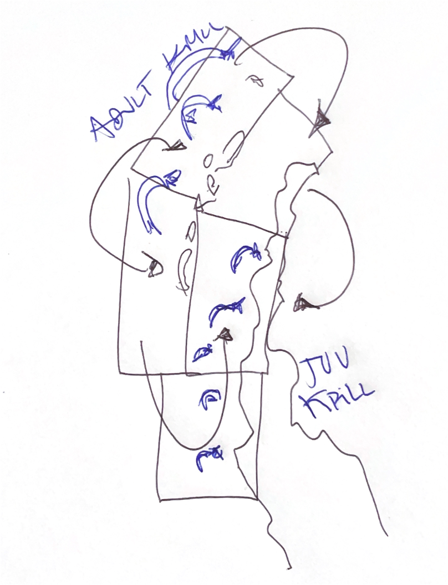

## MODELING SETTING


### Libraries

Libraries necessary to made this analysis;


``` r
# install.packages('devtools')
# devtools::install_github('r4ss/r4ss',
# ref='development') install.packages('caTools')
# library('caTools') install.packages('r4ss')
library(r4ss)
library(here)
# remotes::install_github('PIFSCstockassessments/ss3diags')
library(ss3diags)
library(kableExtra)
library(doParallel)
detectCores()
```

```
## [1] 16
```

``` r
registerDoParallel(8)
library(ggpubr)
library(tibble)
library(openxlsx)
library(ggthemes)
library(forecast)
library(tidyr)
library(mixR)
library(readxl)
library(tidyverse)
library(ggridges)
library(ggrepel)
library(broom)
library(lmtest)
library(flextable)
library(car)
```

### Code Repository

The repository with files templates by scenario to replicate this analysis can be found in this [GitHub author link](https://github.com/MauroMardones/SA_Krill/tree/main/scenarios)


``` r
dir1.1 <- here("s1.1")  # no predador- environmental
dir1.2 <- here("s1.2")  # s1.1 w/ predador
dir1.3 <- here("s1.3")  # s1.1 w/ env
dir1.4 <- here("s1.4")  # s1.1 predator and env
Figs <- here("Figs")
```


# OVERVIEW


This study aims to evaluate the impact of ecosystem components—such as environmental variables and predator-prey interactions—on the productivity and key population dynamics of *Euphausia superba* in Subarea 48.1. By incorporating these factors into the assessment, we analyze how krill population variables respond to ecological variability, providing insights into their resilience and potential management implications. This code forms part of the supplementary material for the scientific article titled **"Assessing environmental and predator impacts on Antarctic Krill (*Euphausia superba*) population dynamics from an integrated length-to-age assessment model perspective."**


## Spatial dimension of stock assessment

The study focuses on Subarea 48.1 in the Western Antarctic Peninsula, where most krill fishing occurs and CCAMLR is advancing spatially refined management. We use five CCAMLR-defined strata to increase spatial resolution, allowing detection of regional differences in krill dynamics (Figure \@ref(fig:mapa)). This structure, integrated into the stock assessment model, enhances its capacity to capture spatial variability in both biological and environmental data. In this approach, spatial structure is incorporated implicitly by treating different areas as separate fleets [@Nielsen2021; @Waterhouse2014]. This constitutes a spatially implicit modeling framework, where differences among strata are recognized both from the perspective of krill population dynamics and from the influence of environmental variability within Subarea 48.1.


<div class="figure" style="text-align: center">

<p class="caption">(\#fig:mapa)Subarea 48.1 and management strata considered in the spatio-temporal analysis of intrinsic productivity of Krill (BS=Brainsfield Strait, EI= Elephant Island, Gerlache= Gerlache strait, JOIN= Joinville Island, SSWI= South West)</p>
</div>

Figure \@ref(fig:conceptual) illustrates a conceptual model with the spatial distribution and movement of Antarctic krill in the Western Antarctic Peninsula (WAP). Adult krill are concentrated and move primarily in the northern areas, while juvenile krill dominate the southern regions. Arrows indicate directional flows, suggesting ontogenetic or environmentally-driven migration patterns. In terms of assumptions, although there are spatial differences in population structure, all these areas are considered part of a single, closed population unit upon which the stock assessment is conducted. By leveraging a spatially implicit, ecosystem-informed approach, this assessment provides a robust framework for evaluating krill stock dynamics under changing environmental conditions. These insights are crucial for informing sustainable management strategies in the Antarctic Peninsula region, where krill plays a foundational role in the marine food web.  

<div class="figure" style="text-align: center">

<p class="caption">(\#fig:conceptual)Conceptual model used to model dynamics population in Antarctic krill in WAP</p>
</div>

## Statistical Model (`SS3`)

Stock Synthesis (v.3.30.21)  is a widely used tool for assessing fish and invertebrate populations, including Antarctic krill. SS3 is implemented in `C++` with estimation enabled through automatic differentiation (ADMB) [@Fournier2012; @Methot2013]. The spurce code can be find in [Github SS3 repository](https://github.com/nmfs-ost/ss3-source-code). In this exercise, `SS3` is configured as an integrated stock assessment model, explicitly accounting for age and size structure while incorporating key ecosystem drivers. The model simulates population processes such as growth, maturity, fecundity, recruitment, movement, and mortality, while also integrating environmental variability and predator-prey relationships to refine estimates of population trends in krill. The analysis of model outputs is conducted using R, utilizing the *r4ss* and *ss3diags* packages [@Taylor2019; @Winker2023]. Integrated models can effectively capture the age structure by transforming length observations into population-level dynamics [@Lee2024; @Punt2013]. 

On the other hand, length data, which are cost-effective and readily available [@Canales2021; @Chong2019], provide valuable insights into krill population structure due to their correlation with age [@Thanassekos2014]. For made this transformation, the models often use an Age-Length Keys (ALKs). An ALK is a probabilistic matrix that estimates the likelihood of individuals of a given length belonging to specific age classed and this method assume both aged and measured fish are random samples from the same population and should be applied within the same time period to avoid biases [@ICCA2003; @Punt2003; @Punt2013; @Lee2024]. The ALK matrix is typically defined as:

In a catch-at-length model like krill assessment the AKL matrix (Figure \@ref(fig:AKL)) is modeled trough parametrization process and have this shape;

<div class="figure" style="text-align: center">

<p class="caption">(\#fig:AKL)Representation of ALK Matrix to krill in 48.1</p>
</div>

## Data

### Parameters

The following table summarizes the key parameters to conditioning the reference model, including biological, growth, and population dynamics factors.


<table class="table" style="font-size: 8px; color: black; margin-left: auto; margin-right: auto;">
<caption style="font-size: initial !important;">(\#tab:unnamed-chunk-8)Input parameters for the initial SS3 model of krill. Each parameter line contains a minimum value (LO), maximum value (HI), and initial value (INIT). If the phase (PHASE) for the parameter is negative, the parameter is fixed as input</caption>
 <thead>
  <tr>
   <th style="text-align:left;">   </th>
   <th style="text-align:right;"> LO </th>
   <th style="text-align:right;"> HI </th>
   <th style="text-align:right;"> INIT </th>
   <th style="text-align:right;"> PHASE </th>
  </tr>
 </thead>
<tbody>
  <tr grouplength="1"><td colspan="5" style="border-bottom: 1px solid;"><strong>Natural Mortality</strong></td></tr>
<tr>
   <td style="text-align:left;padding-left: 2em;" indentlevel="1"> Nat M </td>
   <td style="text-align:right;"> 0.20 </td>
   <td style="text-align:right;"> 1.00 </td>
   <td style="text-align:right;"> 0.270 </td>
   <td style="text-align:right;"> -3 </td>
  </tr>
  <tr grouplength="5"><td colspan="5" style="border-bottom: 1px solid;"><strong>Growth</strong></td></tr>
<tr>
   <td style="text-align:left;padding-left: 2em;" indentlevel="1"> Lmin </td>
   <td style="text-align:right;"> 0.00 </td>
   <td style="text-align:right;"> 5.00 </td>
   <td style="text-align:right;"> 3.400 </td>
   <td style="text-align:right;"> -2 </td>
  </tr>
  <tr>
   <td style="text-align:left;padding-left: 2em;" indentlevel="1"> Lmax </td>
   <td style="text-align:right;"> 1.00 </td>
   <td style="text-align:right;"> 10.00 </td>
   <td style="text-align:right;"> 5.000 </td>
   <td style="text-align:right;"> -4 </td>
  </tr>
  <tr>
   <td style="text-align:left;padding-left: 2em;" indentlevel="1"> VonBert K </td>
   <td style="text-align:right;"> 0.05 </td>
   <td style="text-align:right;"> 0.80 </td>
   <td style="text-align:right;"> 0.470 </td>
   <td style="text-align:right;"> -4 </td>
  </tr>
  <tr>
   <td style="text-align:left;padding-left: 2em;" indentlevel="1"> CV young </td>
   <td style="text-align:right;"> 0.05 </td>
   <td style="text-align:right;"> 0.25 </td>
   <td style="text-align:right;"> 0.140 </td>
   <td style="text-align:right;"> -4 </td>
  </tr>
  <tr>
   <td style="text-align:left;padding-left: 2em;" indentlevel="1"> CV old </td>
   <td style="text-align:right;"> 0.05 </td>
   <td style="text-align:right;"> 0.25 </td>
   <td style="text-align:right;"> 0.070 </td>
   <td style="text-align:right;"> -4 </td>
  </tr>
  <tr grouplength="2"><td colspan="5" style="border-bottom: 1px solid;"><strong>relationship Length-Weigth</strong></td></tr>
<tr>
   <td style="text-align:left;padding-left: 2em;" indentlevel="1"> Wt a </td>
   <td style="text-align:right;"> 0.00 </td>
   <td style="text-align:right;"> 3.00 </td>
   <td style="text-align:right;"> 0.000 </td>
   <td style="text-align:right;"> -3 </td>
  </tr>
  <tr>
   <td style="text-align:left;padding-left: 2em;" indentlevel="1"> Wt b </td>
   <td style="text-align:right;"> 1.00 </td>
   <td style="text-align:right;"> 4.00 </td>
   <td style="text-align:right;"> 3.347 </td>
   <td style="text-align:right;"> -3 </td>
  </tr>
  <tr grouplength="2"><td colspan="5" style="border-bottom: 1px solid;"><strong>Maturity</strong></td></tr>
<tr>
   <td style="text-align:left;padding-left: 2em;" indentlevel="1"> L50% </td>
   <td style="text-align:right;"> 0.20 </td>
   <td style="text-align:right;"> 5.00 </td>
   <td style="text-align:right;"> 1.800 </td>
   <td style="text-align:right;"> -4 </td>
  </tr>
  <tr>
   <td style="text-align:left;padding-left: 2em;" indentlevel="1"> Mat slope </td>
   <td style="text-align:right;"> -3.00 </td>
   <td style="text-align:right;"> 3.00 </td>
   <td style="text-align:right;"> -2.900 </td>
   <td style="text-align:right;"> -4 </td>
  </tr>
  <tr grouplength="5"><td colspan="5" style="border-bottom: 1px solid;"><strong>S-R relation</strong></td></tr>
<tr>
   <td style="text-align:left;padding-left: 2em;" indentlevel="1"> SR_LN(R0) </td>
   <td style="text-align:right;"> 3.00 </td>
   <td style="text-align:right;"> 30.00 </td>
   <td style="text-align:right;"> 23.000 </td>
   <td style="text-align:right;"> 1 </td>
  </tr>
  <tr>
   <td style="text-align:left;padding-left: 2em;" indentlevel="1"> SR_BH_steep </td>
   <td style="text-align:right;"> 0.20 </td>
   <td style="text-align:right;"> 1.00 </td>
   <td style="text-align:right;"> 0.850 </td>
   <td style="text-align:right;"> -4 </td>
  </tr>
  <tr>
   <td style="text-align:left;padding-left: 2em;" indentlevel="1"> SR_sigmaR </td>
   <td style="text-align:right;"> 0.00 </td>
   <td style="text-align:right;"> 2.00 </td>
   <td style="text-align:right;"> 1.200 </td>
   <td style="text-align:right;"> -4 </td>
  </tr>
  <tr>
   <td style="text-align:left;padding-left: 2em;" indentlevel="1"> SR_regime </td>
   <td style="text-align:right;"> -5.00 </td>
   <td style="text-align:right;"> 5.00 </td>
   <td style="text-align:right;"> 0.000 </td>
   <td style="text-align:right;"> -4 </td>
  </tr>
  <tr>
   <td style="text-align:left;padding-left: 2em;" indentlevel="1"> SR_autocorr </td>
   <td style="text-align:right;"> 0.00 </td>
   <td style="text-align:right;"> 0.00 </td>
   <td style="text-align:right;"> 0.000 </td>
   <td style="text-align:right;"> -99 </td>
  </tr>
  <tr grouplength="2"><td colspan="5" style="border-bottom: 1px solid;"><strong>Catchability</strong></td></tr>
<tr>
   <td style="text-align:left;padding-left: 2em;" indentlevel="1"> LnQ_base_FISHERYBS(1) </td>
   <td style="text-align:right;"> -25.00 </td>
   <td style="text-align:right;"> 25.00 </td>
   <td style="text-align:right;"> -5.722 </td>
   <td style="text-align:right;"> 1 </td>
  </tr>
  <tr>
   <td style="text-align:left;padding-left: 2em;" indentlevel="1"> LnQ_base_FISHERYEI(2) </td>
   <td style="text-align:right;"> -25.00 </td>
   <td style="text-align:right;"> 25.00 </td>
   <td style="text-align:right;"> -5.722 </td>
   <td style="text-align:right;"> 1 </td>
  </tr>
  <tr grouplength="4"><td colspan="5" style="border-bottom: 1px solid;"><strong>Selectivity</strong></td></tr>
<tr>
   <td style="text-align:left;padding-left: 2em;" indentlevel="1"> SizeSel_P_1_FISHERYBS(1) </td>
   <td style="text-align:right;"> 0.01 </td>
   <td style="text-align:right;"> 8.00 </td>
   <td style="text-align:right;"> 2.000 </td>
   <td style="text-align:right;"> -3 </td>
  </tr>
  <tr>
   <td style="text-align:left;padding-left: 2em;" indentlevel="1"> SizeSel_P_2_FISHERYBS(1) </td>
   <td style="text-align:right;"> 0.00 </td>
   <td style="text-align:right;"> 8.00 </td>
   <td style="text-align:right;"> 2.000 </td>
   <td style="text-align:right;"> -2 </td>
  </tr>
  <tr>
   <td style="text-align:left;padding-left: 2em;" indentlevel="1"> SizeSel_P_1_FISHERYEI(2) </td>
   <td style="text-align:right;"> 0.01 </td>
   <td style="text-align:right;"> 8.00 </td>
   <td style="text-align:right;"> 3.500 </td>
   <td style="text-align:right;"> -3 </td>
  </tr>
  <tr>
   <td style="text-align:left;padding-left: 2em;" indentlevel="1"> SizeSel_P_2_FISHERYEI(2) </td>
   <td style="text-align:right;"> 0.00 </td>
   <td style="text-align:right;"> 8.00 </td>
   <td style="text-align:right;"> 4.000 </td>
   <td style="text-align:right;"> -2 </td>
  </tr>
  <tr>
   <td style="text-align:left;"> SizeSel_P_1_FISHERYGS(3) </td>
   <td style="text-align:right;"> 0.01 </td>
   <td style="text-align:right;"> 8.00 </td>
   <td style="text-align:right;"> 2.000 </td>
   <td style="text-align:right;"> -3 </td>
  </tr>
  <tr>
   <td style="text-align:left;"> SizeSel_P_2_FISHERYGS(3) </td>
   <td style="text-align:right;"> 0.00 </td>
   <td style="text-align:right;"> 8.00 </td>
   <td style="text-align:right;"> 2.000 </td>
   <td style="text-align:right;"> 2 </td>
  </tr>
  <tr>
   <td style="text-align:left;"> SizeSel_P_1_FISHERYJOIN(4) </td>
   <td style="text-align:right;"> 0.01 </td>
   <td style="text-align:right;"> 8.00 </td>
   <td style="text-align:right;"> 3.500 </td>
   <td style="text-align:right;"> -3 </td>
  </tr>
  <tr>
   <td style="text-align:left;"> SizeSel_P_2_FISHERYJOIN(4) </td>
   <td style="text-align:right;"> 0.00 </td>
   <td style="text-align:right;"> 8.00 </td>
   <td style="text-align:right;"> 2.000 </td>
   <td style="text-align:right;"> -2 </td>
  </tr>
  <tr>
   <td style="text-align:left;"> SizeSel_P_1_FISHERYSSIW(5) </td>
   <td style="text-align:right;"> 0.01 </td>
   <td style="text-align:right;"> 8.00 </td>
   <td style="text-align:right;"> 3.500 </td>
   <td style="text-align:right;"> -3 </td>
  </tr>
  <tr>
   <td style="text-align:left;"> SizeSel_P_2_FISHERYSSIW(5) </td>
   <td style="text-align:right;"> 0.00 </td>
   <td style="text-align:right;"> 8.00 </td>
   <td style="text-align:right;"> 2.000 </td>
   <td style="text-align:right;"> -2 </td>
  </tr>
  <tr>
   <td style="text-align:left;"> SizeSel_P_1_SURVEYBS(6) </td>
   <td style="text-align:right;"> 1.00 </td>
   <td style="text-align:right;"> 7.00 </td>
   <td style="text-align:right;"> 2.000 </td>
   <td style="text-align:right;"> -2 </td>
  </tr>
  <tr>
   <td style="text-align:left;"> SizeSel_P_2_SURVEYBS(6) </td>
   <td style="text-align:right;"> 1.00 </td>
   <td style="text-align:right;"> 7.00 </td>
   <td style="text-align:right;"> 1.000 </td>
   <td style="text-align:right;"> -3 </td>
  </tr>
  <tr>
   <td style="text-align:left;"> SizeSel_P_1_SURVEYEI(7) </td>
   <td style="text-align:right;"> 1.00 </td>
   <td style="text-align:right;"> 7.00 </td>
   <td style="text-align:right;"> 3.000 </td>
   <td style="text-align:right;"> -2 </td>
  </tr>
  <tr>
   <td style="text-align:left;"> SizeSel_P_2_SURVEYEI(7) </td>
   <td style="text-align:right;"> 1.00 </td>
   <td style="text-align:right;"> 7.00 </td>
   <td style="text-align:right;"> 1.000 </td>
   <td style="text-align:right;"> -3 </td>
  </tr>
  <tr>
   <td style="text-align:left;"> SizeSel_P_1_SURVEYGS(8) </td>
   <td style="text-align:right;"> 1.00 </td>
   <td style="text-align:right;"> 7.00 </td>
   <td style="text-align:right;"> 2.000 </td>
   <td style="text-align:right;"> -2 </td>
  </tr>
  <tr>
   <td style="text-align:left;"> SizeSel_P_2_SURVEYGS(8) </td>
   <td style="text-align:right;"> 1.00 </td>
   <td style="text-align:right;"> 7.00 </td>
   <td style="text-align:right;"> 1.000 </td>
   <td style="text-align:right;"> -3 </td>
  </tr>
  <tr>
   <td style="text-align:left;"> SizeSel_P_1_SURVEYJOIN(9) </td>
   <td style="text-align:right;"> 1.00 </td>
   <td style="text-align:right;"> 7.00 </td>
   <td style="text-align:right;"> 3.000 </td>
   <td style="text-align:right;"> 2 </td>
  </tr>
  <tr>
   <td style="text-align:left;"> SizeSel_P_2_SURVEYJOIN(9) </td>
   <td style="text-align:right;"> 1.00 </td>
   <td style="text-align:right;"> 7.00 </td>
   <td style="text-align:right;"> 1.000 </td>
   <td style="text-align:right;"> 3 </td>
  </tr>
  <tr>
   <td style="text-align:left;"> SizeSel_P_1_SURVEYSSIW(10) </td>
   <td style="text-align:right;"> 1.00 </td>
   <td style="text-align:right;"> 7.00 </td>
   <td style="text-align:right;"> 2.000 </td>
   <td style="text-align:right;"> -2 </td>
  </tr>
  <tr>
   <td style="text-align:left;"> SizeSel_P_2_SURVEYSSIW(10) </td>
   <td style="text-align:right;"> 1.00 </td>
   <td style="text-align:right;"> 7.00 </td>
   <td style="text-align:right;"> 1.000 </td>
   <td style="text-align:right;"> -3 </td>
  </tr>
  <tr>
   <td style="text-align:left;"> SizeSel_P_1_PREDATOR(11) </td>
   <td style="text-align:right;"> 0.00 </td>
   <td style="text-align:right;"> 3.00 </td>
   <td style="text-align:right;"> 0.200 </td>
   <td style="text-align:right;"> 2 </td>
  </tr>
  <tr>
   <td style="text-align:left;"> SizeSel_P_2_PREDATOR(11) </td>
   <td style="text-align:right;"> 0.00 </td>
   <td style="text-align:right;"> 3.00 </td>
   <td style="text-align:right;"> 0.200 </td>
   <td style="text-align:right;"> 3 </td>
  </tr>
</tbody>
</table>


### Index 

Abundance index in Figure \@ref(fig:index)


<div class="figure" style="text-align: center">

<p class="caption">(\#fig:index)Standardized indices of krill index abundance and consumption from fishery-dependent, fishery-independent, and predator-based data sources across different strata within Subarea 48.1. Each panel represents a distinct spatial or functional stratum, with trend lines indicating temporal variation from 1990 to 2020. Colors denote data source categories: green for fishery, orange for scientific surveys, and purple for predator-based indices. These patterns highlight spatial and temporal heterogeneity in krill dynamics across the subarea.</p>
</div>

### Length comositions


Length compositions in Figure \@ref(fig:length)

<div class="figure" style="text-align: center">

<p class="caption">(\#fig:length)Annual length-frequency distributions of Antarctic krill (Euphausia superba) across different data sources and spatial strata within Subarea 48.1 from 1991 to 2020. Each panel represents a distinct stratum for either fishery-dependent (green), fishery-independent survey (orange), or predator-based (purple) observations. Density ridgelines illustrate variation in krill size structure across years. The red vertical line marks a recruit references length (3.6 cm).</p>
</div>

## Summary data sources to Modelling

Finally, this information and all sources can be represented through the following flow diagram (Figure \@ref(fig:path)) of inputs, model, and outputs.


<div class="figure" style="text-align: center">

<p class="caption">(\#fig:path)Framework path to stock assessment model in krill in WAP (Yellow boxes is not implemeted yet).</p>
</div>

Figure \@ref(fig:dataserie) show time series of differente componentes of data sources to this krill stock assessment.


## Scenarios

Here, the **reference model** is `s1.1`, wich represents a baseline assessment of *Euphausia superba* population dynamics in Subarea 48.1, excluding environmental and ecological variables. This model assumes that krill productivity and population parameters are driven  by intrinsic biological processes, such as growth, mortality, and recruitment and fishery impacts without accounting for external influences like environmental variability or predation pressure. By serving as a *control scenario*, this model provides a benchmark against which the impact of ecosystem components in productivity can be evaluated, allowing for a direct comparison of how environmental and ecological factors influence krill stock dynamics.

Table \@ref(tab:scenarios) show scenarios used for modelling dynamics in krill

<table class="table table-striped table-hover" style="font-size: 10px; color: black; width: auto !important; margin-left: auto; margin-right: auto;">
<caption style="font-size: initial !important;">(\#tab:scenario)Scenarios used for modelling dynamics in krill</caption>
 <thead>
  <tr>
   <th style="text-align:left;font-weight: bold;color: black !important;"> Scenario </th>
   <th style="text-align:left;font-weight: bold;color: black !important;"> Description </th>
  </tr>
 </thead>
<tbody>
  <tr>
   <td style="text-align:left;width: 2cm; "> s1.1 </td>
   <td style="text-align:left;width: 10cm; "> Spatial data without environmental and predator components </td>
  </tr>
  <tr>
   <td style="text-align:left;width: 2cm; "> s1.2 </td>
   <td style="text-align:left;width: 10cm; "> "s1.1" with predator components </td>
  </tr>
  <tr>
   <td style="text-align:left;width: 2cm; "> s1.3 </td>
   <td style="text-align:left;width: 10cm; "> "s1.1" with environmental variable </td>
  </tr>
  <tr>
   <td style="text-align:left;width: 2cm; "> s1.4 </td>
   <td style="text-align:left;width: 10cm; "> "s1.1" with both predator fleet and environmental variable </td>
  </tr>
</tbody>
</table>


# RESULTS

## Population Variables by scenario


Main Variables poulation in `s1.1` scenario (Figure \@ref(fig:scen1))

<div class="figure" style="text-align: center">

<p class="caption">(\#fig:scen1)Main variables scenario s1.1</p>
</div>

Main Variables poulation in `s1.2` scenario (Figure \@ref(fig:scen2))

<div class="figure" style="text-align: center">

<p class="caption">(\#fig:scen2)Main variables scenario s1.2</p>
</div>

Main Variables poulation in `s1.3` scenario (Figure \@ref(fig:scen3))

<div class="figure" style="text-align: center">

<p class="caption">(\#fig:scen3)Main variables scenario s1.3</p>
</div>


Main Variables poulation in `s1.4` scenario (Figure \@ref(fig:scen4))

<div class="figure" style="text-align: center">

<p class="caption">(\#fig:scen4)Main variables scenario s1.4</p>
</div>

Selectivity estimated by scenario in Figure \@ref(fig:selectivity).

<div class="figure" style="text-align: center">

<p class="caption">(\#fig:selectivity)Selectivity by fleet in each scenario</p>
</div>

This Figure \@ref(fig:index2) shows standardized time series of input indices used in four different model scenarios (s1.1 to s1.4) for the stock assessment of Antarctic krill in Subarea 48.1. Each panel presents fishery-dependent (FISHERY) and fishery-independent (SURVEY) indices across five management strata: Bransfield Strait (BS), Elephant Island (EI), Gerlache Strait (GS), Joinville Island (JOIN), and South West (SW), from the mid-1990s to 2020. Scenario s1.4 additionally includes a predator index, highlighting the incorporation of ecosystem variables. The figure illustrates spatial and temporal variability in data availability and trends among sources.


<div class="figure" style="text-align: center">

<p class="caption">(\#fig:index2)Standardized indices of krill abundance used as input in four model scenarios (s1.1 to s1.4), representing fishery-dependent (FISHERY) and fishery-independent (SURVEY) data across five spatial strata: Bransfield Strait (BS), Elephant Island (EI), Gerlache Strait (GS), Joinville Island (JOIN), and South West (SW). Scenario s1.4 also incorporates a predator index (PREDATOR), reflecting the integration of ecosystem variables into the assessment framework</p>
</div>

### Outputs Variables `s1.1`

<table class="table" style="font-size: 8px; color: black; margin-left: auto; margin-right: auto;">
<caption style="font-size: initial !important;">(\#tab:unnamed-chunk-12)Main variables outputs from stock asssessment krill in WAP `s1.1`</caption>
 <thead>
  <tr>
   <th style="text-align:left;">   </th>
   <th style="text-align:right;"> Yr </th>
   <th style="text-align:left;"> Era </th>
   <th style="text-align:right;"> Seas </th>
   <th style="text-align:right;"> Bio_all </th>
   <th style="text-align:right;"> Bio_smry </th>
   <th style="text-align:right;"> SpawnBio </th>
   <th style="text-align:right;"> Recruit_0 </th>
  </tr>
 </thead>
<tbody>
  <tr>
   <td style="text-align:left;"> 1254 </td>
   <td style="text-align:right;"> 1989 </td>
   <td style="text-align:left;"> VIRG </td>
   <td style="text-align:right;"> 1 </td>
   <td style="text-align:right;"> 2184230 </td>
   <td style="text-align:right;"> 2176360 </td>
   <td style="text-align:right;"> 3565180 </td>
   <td style="text-align:right;"> 107962000 </td>
  </tr>
  <tr>
   <td style="text-align:left;"> 1255 </td>
   <td style="text-align:right;"> 1990 </td>
   <td style="text-align:left;"> INIT </td>
   <td style="text-align:right;"> 1 </td>
   <td style="text-align:right;"> 1498570 </td>
   <td style="text-align:right;"> 1490900 </td>
   <td style="text-align:right;"> 2259200 </td>
   <td style="text-align:right;"> 105278000 </td>
  </tr>
  <tr>
   <td style="text-align:left;"> 1256 </td>
   <td style="text-align:right;"> 1991 </td>
   <td style="text-align:left;"> TIME </td>
   <td style="text-align:right;"> 1 </td>
   <td style="text-align:right;"> 1498570 </td>
   <td style="text-align:right;"> 1490900 </td>
   <td style="text-align:right;"> 2259200 </td>
   <td style="text-align:right;"> 105278000 </td>
  </tr>
  <tr>
   <td style="text-align:left;"> 1257 </td>
   <td style="text-align:right;"> 1992 </td>
   <td style="text-align:left;"> TIME </td>
   <td style="text-align:right;"> 1 </td>
   <td style="text-align:right;"> 1616910 </td>
   <td style="text-align:right;"> 1609190 </td>
   <td style="text-align:right;"> 2452620 </td>
   <td style="text-align:right;"> 105844000 </td>
  </tr>
  <tr>
   <td style="text-align:left;"> 1258 </td>
   <td style="text-align:right;"> 1993 </td>
   <td style="text-align:left;"> TIME </td>
   <td style="text-align:right;"> 1 </td>
   <td style="text-align:right;"> 1723130 </td>
   <td style="text-align:right;"> 1715370 </td>
   <td style="text-align:right;"> 2661750 </td>
   <td style="text-align:right;"> 106370000 </td>
  </tr>
  <tr>
   <td style="text-align:left;"> 1259 </td>
   <td style="text-align:right;"> 1994 </td>
   <td style="text-align:left;"> TIME </td>
   <td style="text-align:right;"> 1 </td>
   <td style="text-align:right;"> 1814140 </td>
   <td style="text-align:right;"> 1806360 </td>
   <td style="text-align:right;"> 2839670 </td>
   <td style="text-align:right;"> 106759000 </td>
  </tr>
  <tr>
   <td style="text-align:left;"> 1260 </td>
   <td style="text-align:right;"> 1995 </td>
   <td style="text-align:left;"> TIME </td>
   <td style="text-align:right;"> 1 </td>
   <td style="text-align:right;"> 1889790 </td>
   <td style="text-align:right;"> 1881980 </td>
   <td style="text-align:right;"> 2987350 </td>
   <td style="text-align:right;"> 107049000 </td>
  </tr>
  <tr>
   <td style="text-align:left;"> 1261 </td>
   <td style="text-align:right;"> 1996 </td>
   <td style="text-align:left;"> TIME </td>
   <td style="text-align:right;"> 1 </td>
   <td style="text-align:right;"> 1951400 </td>
   <td style="text-align:right;"> 1943580 </td>
   <td style="text-align:right;"> 3107870 </td>
   <td style="text-align:right;"> 107266000 </td>
  </tr>
  <tr>
   <td style="text-align:left;"> 1262 </td>
   <td style="text-align:right;"> 1997 </td>
   <td style="text-align:left;"> TIME </td>
   <td style="text-align:right;"> 1 </td>
   <td style="text-align:right;"> 2000910 </td>
   <td style="text-align:right;"> 1993080 </td>
   <td style="text-align:right;"> 3204890 </td>
   <td style="text-align:right;"> 107430000 </td>
  </tr>
  <tr>
   <td style="text-align:left;"> 1263 </td>
   <td style="text-align:right;"> 1998 </td>
   <td style="text-align:left;"> TIME </td>
   <td style="text-align:right;"> 1 </td>
   <td style="text-align:right;"> 2031670 </td>
   <td style="text-align:right;"> 2031470 </td>
   <td style="text-align:right;"> 3280300 </td>
   <td style="text-align:right;"> 2722690 </td>
  </tr>
  <tr>
   <td style="text-align:left;"> 1264 </td>
   <td style="text-align:right;"> 1999 </td>
   <td style="text-align:left;"> TIME </td>
   <td style="text-align:right;"> 1 </td>
   <td style="text-align:right;"> 1950370 </td>
   <td style="text-align:right;"> 1950080 </td>
   <td style="text-align:right;"> 3329570 </td>
   <td style="text-align:right;"> 3861330 </td>
  </tr>
  <tr>
   <td style="text-align:left;"> 1265 </td>
   <td style="text-align:right;"> 2000 </td>
   <td style="text-align:left;"> TIME </td>
   <td style="text-align:right;"> 1 </td>
   <td style="text-align:right;"> 1709860 </td>
   <td style="text-align:right;"> 1703160 </td>
   <td style="text-align:right;"> 3365450 </td>
   <td style="text-align:right;"> 91895800 </td>
  </tr>
  <tr>
   <td style="text-align:left;"> 1266 </td>
   <td style="text-align:right;"> 2001 </td>
   <td style="text-align:left;"> TIME </td>
   <td style="text-align:right;"> 1 </td>
   <td style="text-align:right;"> 1523110 </td>
   <td style="text-align:right;"> 1504210 </td>
   <td style="text-align:right;"> 2802010 </td>
   <td style="text-align:right;"> 259242000 </td>
  </tr>
  <tr>
   <td style="text-align:left;"> 1267 </td>
   <td style="text-align:right;"> 2002 </td>
   <td style="text-align:left;"> TIME </td>
   <td style="text-align:right;"> 1 </td>
   <td style="text-align:right;"> 1638890 </td>
   <td style="text-align:right;"> 1627610 </td>
   <td style="text-align:right;"> 2264810 </td>
   <td style="text-align:right;"> 154705000 </td>
  </tr>
  <tr>
   <td style="text-align:left;"> 1268 </td>
   <td style="text-align:right;"> 2003 </td>
   <td style="text-align:left;"> TIME </td>
   <td style="text-align:right;"> 1 </td>
   <td style="text-align:right;"> 1971710 </td>
   <td style="text-align:right;"> 1971470 </td>
   <td style="text-align:right;"> 2294470 </td>
   <td style="text-align:right;"> 3332310 </td>
  </tr>
  <tr>
   <td style="text-align:left;"> 1269 </td>
   <td style="text-align:right;"> 2004 </td>
   <td style="text-align:left;"> TIME </td>
   <td style="text-align:right;"> 1 </td>
   <td style="text-align:right;"> 2079960 </td>
   <td style="text-align:right;"> 2078730 </td>
   <td style="text-align:right;"> 3317380 </td>
   <td style="text-align:right;"> 16879800 </td>
  </tr>
  <tr>
   <td style="text-align:left;"> 1270 </td>
   <td style="text-align:right;"> 2005 </td>
   <td style="text-align:left;"> TIME </td>
   <td style="text-align:right;"> 1 </td>
   <td style="text-align:right;"> 1916790 </td>
   <td style="text-align:right;"> 1913490 </td>
   <td style="text-align:right;"> 3747190 </td>
   <td style="text-align:right;"> 45270000 </td>
  </tr>
  <tr>
   <td style="text-align:left;"> 1271 </td>
   <td style="text-align:right;"> 2006 </td>
   <td style="text-align:left;"> TIME </td>
   <td style="text-align:right;"> 1 </td>
   <td style="text-align:right;"> 1724010 </td>
   <td style="text-align:right;"> 1708750 </td>
   <td style="text-align:right;"> 3238060 </td>
   <td style="text-align:right;"> 209287000 </td>
  </tr>
  <tr>
   <td style="text-align:left;"> 1272 </td>
   <td style="text-align:right;"> 2007 </td>
   <td style="text-align:left;"> TIME </td>
   <td style="text-align:right;"> 1 </td>
   <td style="text-align:right;"> 1640040 </td>
   <td style="text-align:right;"> 1631050 </td>
   <td style="text-align:right;"> 2612060 </td>
   <td style="text-align:right;"> 123361000 </td>
  </tr>
  <tr>
   <td style="text-align:left;"> 1273 </td>
   <td style="text-align:right;"> 2008 </td>
   <td style="text-align:left;"> TIME </td>
   <td style="text-align:right;"> 1 </td>
   <td style="text-align:right;"> 1833350 </td>
   <td style="text-align:right;"> 1832360 </td>
   <td style="text-align:right;"> 2343170 </td>
   <td style="text-align:right;"> 13566800 </td>
  </tr>
  <tr>
   <td style="text-align:left;"> 1274 </td>
   <td style="text-align:right;"> 2009 </td>
   <td style="text-align:left;"> TIME </td>
   <td style="text-align:right;"> 1 </td>
   <td style="text-align:right;"> 1869200 </td>
   <td style="text-align:right;"> 1864810 </td>
   <td style="text-align:right;"> 3037610 </td>
   <td style="text-align:right;"> 60221700 </td>
  </tr>
  <tr>
   <td style="text-align:left;"> 1275 </td>
   <td style="text-align:right;"> 2010 </td>
   <td style="text-align:left;"> TIME </td>
   <td style="text-align:right;"> 1 </td>
   <td style="text-align:right;"> 1731220 </td>
   <td style="text-align:right;"> 1719710 </td>
   <td style="text-align:right;"> 3226670 </td>
   <td style="text-align:right;"> 157914000 </td>
  </tr>
  <tr>
   <td style="text-align:left;"> 1276 </td>
   <td style="text-align:right;"> 2011 </td>
   <td style="text-align:left;"> TIME </td>
   <td style="text-align:right;"> 1 </td>
   <td style="text-align:right;"> 1606630 </td>
   <td style="text-align:right;"> 1586690 </td>
   <td style="text-align:right;"> 2567950 </td>
   <td style="text-align:right;"> 273609000 </td>
  </tr>
  <tr>
   <td style="text-align:left;"> 1277 </td>
   <td style="text-align:right;"> 2012 </td>
   <td style="text-align:left;"> TIME </td>
   <td style="text-align:right;"> 1 </td>
   <td style="text-align:right;"> 1905570 </td>
   <td style="text-align:right;"> 1872960 </td>
   <td style="text-align:right;"> 2385900 </td>
   <td style="text-align:right;"> 447447000 </td>
  </tr>
  <tr>
   <td style="text-align:left;"> 1278 </td>
   <td style="text-align:right;"> 2013 </td>
   <td style="text-align:left;"> TIME </td>
   <td style="text-align:right;"> 1 </td>
   <td style="text-align:right;"> 2520170 </td>
   <td style="text-align:right;"> 2519760 </td>
   <td style="text-align:right;"> 2744410 </td>
   <td style="text-align:right;"> 5517500 </td>
  </tr>
  <tr>
   <td style="text-align:left;"> 1279 </td>
   <td style="text-align:right;"> 2014 </td>
   <td style="text-align:left;"> TIME </td>
   <td style="text-align:right;"> 1 </td>
   <td style="text-align:right;"> 2918840 </td>
   <td style="text-align:right;"> 2914270 </td>
   <td style="text-align:right;"> 3602640 </td>
   <td style="text-align:right;"> 62737200 </td>
  </tr>
  <tr>
   <td style="text-align:left;"> 1280 </td>
   <td style="text-align:right;"> 2015 </td>
   <td style="text-align:left;"> TIME </td>
   <td style="text-align:right;"> 1 </td>
   <td style="text-align:right;"> 2758580 </td>
   <td style="text-align:right;"> 2740280 </td>
   <td style="text-align:right;"> 5255400 </td>
   <td style="text-align:right;"> 251086000 </td>
  </tr>
  <tr>
   <td style="text-align:left;"> 1281 </td>
   <td style="text-align:right;"> 2016 </td>
   <td style="text-align:left;"> TIME </td>
   <td style="text-align:right;"> 1 </td>
   <td style="text-align:right;"> 2672990 </td>
   <td style="text-align:right;"> 2619030 </td>
   <td style="text-align:right;"> 4425950 </td>
   <td style="text-align:right;"> 740188000 </td>
  </tr>
  <tr>
   <td style="text-align:left;"> 1282 </td>
   <td style="text-align:right;"> 2017 </td>
   <td style="text-align:left;"> TIME </td>
   <td style="text-align:right;"> 1 </td>
   <td style="text-align:right;"> 3269820 </td>
   <td style="text-align:right;"> 3269180 </td>
   <td style="text-align:right;"> 3819450 </td>
   <td style="text-align:right;"> 8874990 </td>
  </tr>
  <tr>
   <td style="text-align:left;"> 1283 </td>
   <td style="text-align:right;"> 2018 </td>
   <td style="text-align:left;"> TIME </td>
   <td style="text-align:right;"> 1 </td>
   <td style="text-align:right;"> 4057150 </td>
   <td style="text-align:right;"> 3997160 </td>
   <td style="text-align:right;"> 4289280 </td>
   <td style="text-align:right;"> 823040000 </td>
  </tr>
  <tr>
   <td style="text-align:left;"> 1284 </td>
   <td style="text-align:right;"> 2019 </td>
   <td style="text-align:left;"> TIME </td>
   <td style="text-align:right;"> 1 </td>
   <td style="text-align:right;"> 4780510 </td>
   <td style="text-align:right;"> 4672090 </td>
   <td style="text-align:right;"> 7517290 </td>
   <td style="text-align:right;"> 1487330000 </td>
  </tr>
  <tr>
   <td style="text-align:left;"> 1285 </td>
   <td style="text-align:right;"> 2020 </td>
   <td style="text-align:left;"> TIME </td>
   <td style="text-align:right;"> 1 </td>
   <td style="text-align:right;"> 6934500 </td>
   <td style="text-align:right;"> 6933840 </td>
   <td style="text-align:right;"> 6701380 </td>
   <td style="text-align:right;"> 8978140 </td>
  </tr>
  <tr>
   <td style="text-align:left;"> 1286 </td>
   <td style="text-align:right;"> 2021 </td>
   <td style="text-align:left;"> FORE </td>
   <td style="text-align:right;"> 1 </td>
   <td style="text-align:right;"> 8884260 </td>
   <td style="text-align:right;"> 8876160 </td>
   <td style="text-align:right;"> 10056300 </td>
   <td style="text-align:right;"> 111127000 </td>
  </tr>
  <tr>
   <td style="text-align:left;"> 1287 </td>
   <td style="text-align:right;"> 2022 </td>
   <td style="text-align:left;"> FORE </td>
   <td style="text-align:right;"> 1 </td>
   <td style="text-align:right;"> 8472730 </td>
   <td style="text-align:right;"> 8464580 </td>
   <td style="text-align:right;"> 16411100 </td>
   <td style="text-align:right;"> 111824000 </td>
  </tr>
  <tr>
   <td style="text-align:left;"> 1288 </td>
   <td style="text-align:right;"> 2023 </td>
   <td style="text-align:left;"> FORE </td>
   <td style="text-align:right;"> 1 </td>
   <td style="text-align:right;"> 7532870 </td>
   <td style="text-align:right;"> 7524730 </td>
   <td style="text-align:right;"> 14262700 </td>
   <td style="text-align:right;"> 111657000 </td>
  </tr>
  <tr>
   <td style="text-align:left;"> 1289 </td>
   <td style="text-align:right;"> 2024 </td>
   <td style="text-align:left;"> FORE </td>
   <td style="text-align:right;"> 1 </td>
   <td style="text-align:right;"> 6398190 </td>
   <td style="text-align:right;"> 6390070 </td>
   <td style="text-align:right;"> 11986300 </td>
   <td style="text-align:right;"> 111416000 </td>
  </tr>
  <tr>
   <td style="text-align:left;"> 1290 </td>
   <td style="text-align:right;"> 2025 </td>
   <td style="text-align:left;"> FORE </td>
   <td style="text-align:right;"> 1 </td>
   <td style="text-align:right;"> 5398930 </td>
   <td style="text-align:right;"> 5390840 </td>
   <td style="text-align:right;"> 9988720 </td>
   <td style="text-align:right;"> 111115000 </td>
  </tr>
</tbody>
</table>

### Outputs Variables `s1.2`

<table class="table" style="font-size: 8px; color: black; margin-left: auto; margin-right: auto;">
<caption style="font-size: initial !important;">(\#tab:unnamed-chunk-13)Main variables outputs from stock asssessment krill in WAP in `s1.2`</caption>
 <thead>
  <tr>
   <th style="text-align:left;">   </th>
   <th style="text-align:right;"> Yr </th>
   <th style="text-align:left;"> Era </th>
   <th style="text-align:right;"> Seas </th>
   <th style="text-align:right;"> Bio_all </th>
   <th style="text-align:right;"> Bio_smry </th>
   <th style="text-align:right;"> SpawnBio </th>
   <th style="text-align:right;"> Recruit_0 </th>
  </tr>
 </thead>
<tbody>
  <tr>
   <td style="text-align:left;"> 1354 </td>
   <td style="text-align:right;"> 1989 </td>
   <td style="text-align:left;"> VIRG </td>
   <td style="text-align:right;"> 1 </td>
   <td style="text-align:right;"> 2299170 </td>
   <td style="text-align:right;"> 2268860 </td>
   <td style="text-align:right;"> 2213450 </td>
   <td style="text-align:right;"> 415800000 </td>
  </tr>
  <tr>
   <td style="text-align:left;"> 1355 </td>
   <td style="text-align:right;"> 1990 </td>
   <td style="text-align:left;"> INIT </td>
   <td style="text-align:right;"> 1 </td>
   <td style="text-align:right;"> 2140700 </td>
   <td style="text-align:right;"> 2110590 </td>
   <td style="text-align:right;"> 1919210 </td>
   <td style="text-align:right;"> 413006000 </td>
  </tr>
  <tr>
   <td style="text-align:left;"> 1356 </td>
   <td style="text-align:right;"> 1991 </td>
   <td style="text-align:left;"> TIME </td>
   <td style="text-align:right;"> 1 </td>
   <td style="text-align:right;"> 2140700 </td>
   <td style="text-align:right;"> 2110590 </td>
   <td style="text-align:right;"> 1919210 </td>
   <td style="text-align:right;"> 413006000 </td>
  </tr>
  <tr>
   <td style="text-align:left;"> 1357 </td>
   <td style="text-align:right;"> 1992 </td>
   <td style="text-align:left;"> TIME </td>
   <td style="text-align:right;"> 1 </td>
   <td style="text-align:right;"> 2210510 </td>
   <td style="text-align:right;"> 2180300 </td>
   <td style="text-align:right;"> 2052100 </td>
   <td style="text-align:right;"> 414362000 </td>
  </tr>
  <tr>
   <td style="text-align:left;"> 1358 </td>
   <td style="text-align:right;"> 1993 </td>
   <td style="text-align:left;"> TIME </td>
   <td style="text-align:right;"> 1 </td>
   <td style="text-align:right;"> 2249080 </td>
   <td style="text-align:right;"> 2218830 </td>
   <td style="text-align:right;"> 2126300 </td>
   <td style="text-align:right;"> 415049000 </td>
  </tr>
  <tr>
   <td style="text-align:left;"> 1359 </td>
   <td style="text-align:right;"> 1994 </td>
   <td style="text-align:left;"> TIME </td>
   <td style="text-align:right;"> 1 </td>
   <td style="text-align:right;"> 2270970 </td>
   <td style="text-align:right;"> 2240690 </td>
   <td style="text-align:right;"> 2163880 </td>
   <td style="text-align:right;"> 415380000 </td>
  </tr>
  <tr>
   <td style="text-align:left;"> 1360 </td>
   <td style="text-align:right;"> 1995 </td>
   <td style="text-align:left;"> TIME </td>
   <td style="text-align:right;"> 1 </td>
   <td style="text-align:right;"> 2283380 </td>
   <td style="text-align:right;"> 2253090 </td>
   <td style="text-align:right;"> 2185490 </td>
   <td style="text-align:right;"> 415565000 </td>
  </tr>
  <tr>
   <td style="text-align:left;"> 1361 </td>
   <td style="text-align:right;"> 1996 </td>
   <td style="text-align:left;"> TIME </td>
   <td style="text-align:right;"> 1 </td>
   <td style="text-align:right;"> 2290340 </td>
   <td style="text-align:right;"> 2260040 </td>
   <td style="text-align:right;"> 2197820 </td>
   <td style="text-align:right;"> 415669000 </td>
  </tr>
  <tr>
   <td style="text-align:left;"> 1362 </td>
   <td style="text-align:right;"> 1997 </td>
   <td style="text-align:left;"> TIME </td>
   <td style="text-align:right;"> 1 </td>
   <td style="text-align:right;"> 2294230 </td>
   <td style="text-align:right;"> 2263930 </td>
   <td style="text-align:right;"> 2204700 </td>
   <td style="text-align:right;"> 415727000 </td>
  </tr>
  <tr>
   <td style="text-align:left;"> 1363 </td>
   <td style="text-align:right;"> 1998 </td>
   <td style="text-align:left;"> TIME </td>
   <td style="text-align:right;"> 1 </td>
   <td style="text-align:right;"> 2266810 </td>
   <td style="text-align:right;"> 2265650 </td>
   <td style="text-align:right;"> 2207770 </td>
   <td style="text-align:right;"> 15962500 </td>
  </tr>
  <tr>
   <td style="text-align:left;"> 1364 </td>
   <td style="text-align:right;"> 1999 </td>
   <td style="text-align:left;"> TIME </td>
   <td style="text-align:right;"> 1 </td>
   <td style="text-align:right;"> 1867210 </td>
   <td style="text-align:right;"> 1863690 </td>
   <td style="text-align:right;"> 2202490 </td>
   <td style="text-align:right;"> 48340700 </td>
  </tr>
  <tr>
   <td style="text-align:left;"> 1365 </td>
   <td style="text-align:right;"> 2000 </td>
   <td style="text-align:left;"> TIME </td>
   <td style="text-align:right;"> 1 </td>
   <td style="text-align:right;"> 1196690 </td>
   <td style="text-align:right;"> 1191800 </td>
   <td style="text-align:right;"> 2199340 </td>
   <td style="text-align:right;"> 67016200 </td>
  </tr>
  <tr>
   <td style="text-align:left;"> 1366 </td>
   <td style="text-align:right;"> 2001 </td>
   <td style="text-align:left;"> TIME </td>
   <td style="text-align:right;"> 1 </td>
   <td style="text-align:right;"> 828069 </td>
   <td style="text-align:right;"> 768871 </td>
   <td style="text-align:right;"> 1232060 </td>
   <td style="text-align:right;"> 812129000 </td>
  </tr>
  <tr>
   <td style="text-align:left;"> 1367 </td>
   <td style="text-align:right;"> 2002 </td>
   <td style="text-align:left;"> TIME </td>
   <td style="text-align:right;"> 1 </td>
   <td style="text-align:right;"> 1347830 </td>
   <td style="text-align:right;"> 1298870 </td>
   <td style="text-align:right;"> 737765 </td>
   <td style="text-align:right;"> 671607000 </td>
  </tr>
  <tr>
   <td style="text-align:left;"> 1368 </td>
   <td style="text-align:right;"> 2003 </td>
   <td style="text-align:left;"> TIME </td>
   <td style="text-align:right;"> 1 </td>
   <td style="text-align:right;"> 2369680 </td>
   <td style="text-align:right;"> 2367790 </td>
   <td style="text-align:right;"> 534842 </td>
   <td style="text-align:right;"> 25993000 </td>
  </tr>
  <tr>
   <td style="text-align:left;"> 1369 </td>
   <td style="text-align:right;"> 2004 </td>
   <td style="text-align:left;"> TIME </td>
   <td style="text-align:right;"> 1 </td>
   <td style="text-align:right;"> 2358800 </td>
   <td style="text-align:right;"> 2347400 </td>
   <td style="text-align:right;"> 2222130 </td>
   <td style="text-align:right;"> 156448000 </td>
  </tr>
  <tr>
   <td style="text-align:left;"> 1370 </td>
   <td style="text-align:right;"> 2005 </td>
   <td style="text-align:left;"> TIME </td>
   <td style="text-align:right;"> 1 </td>
   <td style="text-align:right;"> 1692350 </td>
   <td style="text-align:right;"> 1681210 </td>
   <td style="text-align:right;"> 2907030 </td>
   <td style="text-align:right;"> 152806000 </td>
  </tr>
  <tr>
   <td style="text-align:left;"> 1371 </td>
   <td style="text-align:right;"> 2006 </td>
   <td style="text-align:left;"> TIME </td>
   <td style="text-align:right;"> 1 </td>
   <td style="text-align:right;"> 1334460 </td>
   <td style="text-align:right;"> 1282450 </td>
   <td style="text-align:right;"> 1706020 </td>
   <td style="text-align:right;"> 713509000 </td>
  </tr>
  <tr>
   <td style="text-align:left;"> 1372 </td>
   <td style="text-align:right;"> 2007 </td>
   <td style="text-align:left;"> TIME </td>
   <td style="text-align:right;"> 1 </td>
   <td style="text-align:right;"> 1587260 </td>
   <td style="text-align:right;"> 1564820 </td>
   <td style="text-align:right;"> 1167630 </td>
   <td style="text-align:right;"> 307877000 </td>
  </tr>
  <tr>
   <td style="text-align:left;"> 1373 </td>
   <td style="text-align:right;"> 2008 </td>
   <td style="text-align:left;"> TIME </td>
   <td style="text-align:right;"> 1 </td>
   <td style="text-align:right;"> 2058080 </td>
   <td style="text-align:right;"> 2050430 </td>
   <td style="text-align:right;"> 968864 </td>
   <td style="text-align:right;"> 104953000 </td>
  </tr>
  <tr>
   <td style="text-align:left;"> 1374 </td>
   <td style="text-align:right;"> 2009 </td>
   <td style="text-align:left;"> TIME </td>
   <td style="text-align:right;"> 1 </td>
   <td style="text-align:right;"> 1799590 </td>
   <td style="text-align:right;"> 1784940 </td>
   <td style="text-align:right;"> 2225020 </td>
   <td style="text-align:right;"> 200938000 </td>
  </tr>
  <tr>
   <td style="text-align:left;"> 1375 </td>
   <td style="text-align:right;"> 2010 </td>
   <td style="text-align:left;"> TIME </td>
   <td style="text-align:right;"> 1 </td>
   <td style="text-align:right;"> 1401810 </td>
   <td style="text-align:right;"> 1386880 </td>
   <td style="text-align:right;"> 1981840 </td>
   <td style="text-align:right;"> 204876000 </td>
  </tr>
  <tr>
   <td style="text-align:left;"> 1376 </td>
   <td style="text-align:right;"> 2011 </td>
   <td style="text-align:left;"> TIME </td>
   <td style="text-align:right;"> 1 </td>
   <td style="text-align:right;"> 1141310 </td>
   <td style="text-align:right;"> 1130440 </td>
   <td style="text-align:right;"> 1172540 </td>
   <td style="text-align:right;"> 149095000 </td>
  </tr>
  <tr>
   <td style="text-align:left;"> 1377 </td>
   <td style="text-align:right;"> 2012 </td>
   <td style="text-align:left;"> TIME </td>
   <td style="text-align:right;"> 1 </td>
   <td style="text-align:right;"> 1076390 </td>
   <td style="text-align:right;"> 1042010 </td>
   <td style="text-align:right;"> 1058820 </td>
   <td style="text-align:right;"> 471730000 </td>
  </tr>
  <tr>
   <td style="text-align:left;"> 1378 </td>
   <td style="text-align:right;"> 2013 </td>
   <td style="text-align:left;"> TIME </td>
   <td style="text-align:right;"> 1 </td>
   <td style="text-align:right;"> 1258030 </td>
   <td style="text-align:right;"> 1225100 </td>
   <td style="text-align:right;"> 995034 </td>
   <td style="text-align:right;"> 451783000 </td>
  </tr>
  <tr>
   <td style="text-align:left;"> 1379 </td>
   <td style="text-align:right;"> 2014 </td>
   <td style="text-align:left;"> TIME </td>
   <td style="text-align:right;"> 1 </td>
   <td style="text-align:right;"> 1685050 </td>
   <td style="text-align:right;"> 1599720 </td>
   <td style="text-align:right;"> 774750 </td>
   <td style="text-align:right;"> 1170600000 </td>
  </tr>
  <tr>
   <td style="text-align:left;"> 1380 </td>
   <td style="text-align:right;"> 2015 </td>
   <td style="text-align:left;"> TIME </td>
   <td style="text-align:right;"> 1 </td>
   <td style="text-align:right;"> 2619570 </td>
   <td style="text-align:right;"> 2612840 </td>
   <td style="text-align:right;"> 1328470 </td>
   <td style="text-align:right;"> 92363200 </td>
  </tr>
  <tr>
   <td style="text-align:left;"> 1381 </td>
   <td style="text-align:right;"> 2016 </td>
   <td style="text-align:left;"> TIME </td>
   <td style="text-align:right;"> 1 </td>
   <td style="text-align:right;"> 2961350 </td>
   <td style="text-align:right;"> 2947640 </td>
   <td style="text-align:right;"> 1691030 </td>
   <td style="text-align:right;"> 188112000 </td>
  </tr>
  <tr>
   <td style="text-align:left;"> 1382 </td>
   <td style="text-align:right;"> 2017 </td>
   <td style="text-align:left;"> TIME </td>
   <td style="text-align:right;"> 1 </td>
   <td style="text-align:right;"> 2137730 </td>
   <td style="text-align:right;"> 2126280 </td>
   <td style="text-align:right;"> 3483620 </td>
   <td style="text-align:right;"> 157048000 </td>
  </tr>
  <tr>
   <td style="text-align:left;"> 1383 </td>
   <td style="text-align:right;"> 2018 </td>
   <td style="text-align:left;"> TIME </td>
   <td style="text-align:right;"> 1 </td>
   <td style="text-align:right;"> 1632790 </td>
   <td style="text-align:right;"> 1493160 </td>
   <td style="text-align:right;"> 2050430 </td>
   <td style="text-align:right;"> 1915550000 </td>
  </tr>
  <tr>
   <td style="text-align:left;"> 1384 </td>
   <td style="text-align:right;"> 2019 </td>
   <td style="text-align:left;"> TIME </td>
   <td style="text-align:right;"> 1 </td>
   <td style="text-align:right;"> 3002460 </td>
   <td style="text-align:right;"> 2903520 </td>
   <td style="text-align:right;"> 1450160 </td>
   <td style="text-align:right;"> 1357410000 </td>
  </tr>
  <tr>
   <td style="text-align:left;"> 1385 </td>
   <td style="text-align:right;"> 2020 </td>
   <td style="text-align:left;"> TIME </td>
   <td style="text-align:right;"> 1 </td>
   <td style="text-align:right;"> 5247580 </td>
   <td style="text-align:right;"> 5235720 </td>
   <td style="text-align:right;"> 1111080 </td>
   <td style="text-align:right;"> 162708000 </td>
  </tr>
  <tr>
   <td style="text-align:left;"> 1386 </td>
   <td style="text-align:right;"> 2021 </td>
   <td style="text-align:left;"> FORE </td>
   <td style="text-align:right;"> 1 </td>
   <td style="text-align:right;"> 5161170 </td>
   <td style="text-align:right;"> 5130090 </td>
   <td style="text-align:right;"> 5069530 </td>
   <td style="text-align:right;"> 426398000 </td>
  </tr>
  <tr>
   <td style="text-align:left;"> 1387 </td>
   <td style="text-align:right;"> 2022 </td>
   <td style="text-align:left;"> FORE </td>
   <td style="text-align:right;"> 1 </td>
   <td style="text-align:right;"> 3655000 </td>
   <td style="text-align:right;"> 3623850 </td>
   <td style="text-align:right;"> 5768290 </td>
   <td style="text-align:right;"> 427421000 </td>
  </tr>
  <tr>
   <td style="text-align:left;"> 1388 </td>
   <td style="text-align:right;"> 2023 </td>
   <td style="text-align:left;"> FORE </td>
   <td style="text-align:right;"> 1 </td>
   <td style="text-align:right;"> 2833070 </td>
   <td style="text-align:right;"> 2802300 </td>
   <td style="text-align:right;"> 3345400 </td>
   <td style="text-align:right;"> 422101000 </td>
  </tr>
  <tr>
   <td style="text-align:left;"> 1389 </td>
   <td style="text-align:right;"> 2024 </td>
   <td style="text-align:left;"> FORE </td>
   <td style="text-align:right;"> 1 </td>
   <td style="text-align:right;"> 2415010 </td>
   <td style="text-align:right;"> 2384550 </td>
   <td style="text-align:right;"> 2502690 </td>
   <td style="text-align:right;"> 417931000 </td>
  </tr>
  <tr>
   <td style="text-align:left;"> 1390 </td>
   <td style="text-align:right;"> 2025 </td>
   <td style="text-align:left;"> FORE </td>
   <td style="text-align:right;"> 1 </td>
   <td style="text-align:right;"> 2214670 </td>
   <td style="text-align:right;"> 2184410 </td>
   <td style="text-align:right;"> 2127620 </td>
   <td style="text-align:right;"> 415061000 </td>
  </tr>
</tbody>
</table>


### Outputs Variables `s1.3`

<table class="table" style="font-size: 8px; color: black; margin-left: auto; margin-right: auto;">
<caption style="font-size: initial !important;">(\#tab:unnamed-chunk-14)Main variables outputs from stock asssessment krill in WAP in `s1.3`</caption>
 <thead>
  <tr>
   <th style="text-align:left;">   </th>
   <th style="text-align:right;"> Yr </th>
   <th style="text-align:left;"> Era </th>
   <th style="text-align:right;"> Seas </th>
   <th style="text-align:right;"> Bio_all </th>
   <th style="text-align:right;"> Bio_smry </th>
   <th style="text-align:right;"> SpawnBio </th>
   <th style="text-align:right;"> Recruit_0 </th>
  </tr>
 </thead>
<tbody>
  <tr>
   <td style="text-align:left;"> 1305 </td>
   <td style="text-align:right;"> 1989 </td>
   <td style="text-align:left;"> VIRG </td>
   <td style="text-align:right;"> 1 </td>
   <td style="text-align:right;"> 1353400 </td>
   <td style="text-align:right;"> 1348530 </td>
   <td style="text-align:right;"> 2209070 </td>
   <td style="text-align:right;"> 66896000 </td>
  </tr>
  <tr>
   <td style="text-align:left;"> 1306 </td>
   <td style="text-align:right;"> 1990 </td>
   <td style="text-align:left;"> INIT </td>
   <td style="text-align:right;"> 1 </td>
   <td style="text-align:right;"> 924676 </td>
   <td style="text-align:right;"> 919929 </td>
   <td style="text-align:right;"> 1365380 </td>
   <td style="text-align:right;"> 65120800 </td>
  </tr>
  <tr>
   <td style="text-align:left;"> 1307 </td>
   <td style="text-align:right;"> 1991 </td>
   <td style="text-align:left;"> TIME </td>
   <td style="text-align:right;"> 1 </td>
   <td style="text-align:right;"> 924676 </td>
   <td style="text-align:right;"> 919929 </td>
   <td style="text-align:right;"> 1365380 </td>
   <td style="text-align:right;"> 65120800 </td>
  </tr>
  <tr>
   <td style="text-align:left;"> 1308 </td>
   <td style="text-align:right;"> 1992 </td>
   <td style="text-align:left;"> TIME </td>
   <td style="text-align:right;"> 1 </td>
   <td style="text-align:right;"> 1011120 </td>
   <td style="text-align:right;"> 1006340 </td>
   <td style="text-align:right;"> 1537670 </td>
   <td style="text-align:right;"> 65631800 </td>
  </tr>
  <tr>
   <td style="text-align:left;"> 1309 </td>
   <td style="text-align:right;"> 1993 </td>
   <td style="text-align:left;"> TIME </td>
   <td style="text-align:right;"> 1 </td>
   <td style="text-align:right;"> 1081550 </td>
   <td style="text-align:right;"> 1076740 </td>
   <td style="text-align:right;"> 1677420 </td>
   <td style="text-align:right;"> 65973500 </td>
  </tr>
  <tr>
   <td style="text-align:left;"> 1310 </td>
   <td style="text-align:right;"> 1994 </td>
   <td style="text-align:left;"> TIME </td>
   <td style="text-align:right;"> 1 </td>
   <td style="text-align:right;"> 1138370 </td>
   <td style="text-align:right;"> 1133540 </td>
   <td style="text-align:right;"> 1787730 </td>
   <td style="text-align:right;"> 66207600 </td>
  </tr>
  <tr>
   <td style="text-align:left;"> 1311 </td>
   <td style="text-align:right;"> 1995 </td>
   <td style="text-align:left;"> TIME </td>
   <td style="text-align:right;"> 1 </td>
   <td style="text-align:right;"> 1183710 </td>
   <td style="text-align:right;"> 1178870 </td>
   <td style="text-align:right;"> 1876090 </td>
   <td style="text-align:right;"> 66376300 </td>
  </tr>
  <tr>
   <td style="text-align:left;"> 1312 </td>
   <td style="text-align:right;"> 1996 </td>
   <td style="text-align:left;"> TIME </td>
   <td style="text-align:right;"> 1 </td>
   <td style="text-align:right;"> 1219630 </td>
   <td style="text-align:right;"> 1214790 </td>
   <td style="text-align:right;"> 1946320 </td>
   <td style="text-align:right;"> 66500000 </td>
  </tr>
  <tr>
   <td style="text-align:left;"> 1313 </td>
   <td style="text-align:right;"> 1997 </td>
   <td style="text-align:left;"> TIME </td>
   <td style="text-align:right;"> 1 </td>
   <td style="text-align:right;"> 1248020 </td>
   <td style="text-align:right;"> 1243170 </td>
   <td style="text-align:right;"> 2001930 </td>
   <td style="text-align:right;"> 66592100 </td>
  </tr>
  <tr>
   <td style="text-align:left;"> 1314 </td>
   <td style="text-align:right;"> 1998 </td>
   <td style="text-align:left;"> TIME </td>
   <td style="text-align:right;"> 1 </td>
   <td style="text-align:right;"> 1265270 </td>
   <td style="text-align:right;"> 1264970 </td>
   <td style="text-align:right;"> 2044760 </td>
   <td style="text-align:right;"> 4181950 </td>
  </tr>
  <tr>
   <td style="text-align:left;"> 1315 </td>
   <td style="text-align:right;"> 1999 </td>
   <td style="text-align:left;"> TIME </td>
   <td style="text-align:right;"> 1 </td>
   <td style="text-align:right;"> 1215210 </td>
   <td style="text-align:right;"> 1214650 </td>
   <td style="text-align:right;"> 2069470 </td>
   <td style="text-align:right;"> 7762690 </td>
  </tr>
  <tr>
   <td style="text-align:left;"> 1316 </td>
   <td style="text-align:right;"> 2000 </td>
   <td style="text-align:left;"> TIME </td>
   <td style="text-align:right;"> 1 </td>
   <td style="text-align:right;"> 1072930 </td>
   <td style="text-align:right;"> 1068190 </td>
   <td style="text-align:right;"> 2087520 </td>
   <td style="text-align:right;"> 64986400 </td>
  </tr>
  <tr>
   <td style="text-align:left;"> 1317 </td>
   <td style="text-align:right;"> 2001 </td>
   <td style="text-align:left;"> TIME </td>
   <td style="text-align:right;"> 1 </td>
   <td style="text-align:right;"> 973382 </td>
   <td style="text-align:right;"> 957638 </td>
   <td style="text-align:right;"> 1743440 </td>
   <td style="text-align:right;"> 215996000 </td>
  </tr>
  <tr>
   <td style="text-align:left;"> 1318 </td>
   <td style="text-align:right;"> 2002 </td>
   <td style="text-align:left;"> TIME </td>
   <td style="text-align:right;"> 1 </td>
   <td style="text-align:right;"> 1110280 </td>
   <td style="text-align:right;"> 1101160 </td>
   <td style="text-align:right;"> 1435720 </td>
   <td style="text-align:right;"> 125135000 </td>
  </tr>
  <tr>
   <td style="text-align:left;"> 1319 </td>
   <td style="text-align:right;"> 2003 </td>
   <td style="text-align:left;"> TIME </td>
   <td style="text-align:right;"> 1 </td>
   <td style="text-align:right;"> 1430490 </td>
   <td style="text-align:right;"> 1430440 </td>
   <td style="text-align:right;"> 1496900 </td>
   <td style="text-align:right;"> 633499 </td>
  </tr>
  <tr>
   <td style="text-align:left;"> 1320 </td>
   <td style="text-align:right;"> 2004 </td>
   <td style="text-align:left;"> TIME </td>
   <td style="text-align:right;"> 1 </td>
   <td style="text-align:right;"> 1555180 </td>
   <td style="text-align:right;"> 1553690 </td>
   <td style="text-align:right;"> 2431110 </td>
   <td style="text-align:right;"> 20543200 </td>
  </tr>
  <tr>
   <td style="text-align:left;"> 1321 </td>
   <td style="text-align:right;"> 2005 </td>
   <td style="text-align:left;"> TIME </td>
   <td style="text-align:right;"> 1 </td>
   <td style="text-align:right;"> 1457770 </td>
   <td style="text-align:right;"> 1454920 </td>
   <td style="text-align:right;"> 2841870 </td>
   <td style="text-align:right;"> 39014900 </td>
  </tr>
  <tr>
   <td style="text-align:left;"> 1322 </td>
   <td style="text-align:right;"> 2006 </td>
   <td style="text-align:left;"> TIME </td>
   <td style="text-align:right;"> 1 </td>
   <td style="text-align:right;"> 1337590 </td>
   <td style="text-align:right;"> 1324930 </td>
   <td style="text-align:right;"> 2465110 </td>
   <td style="text-align:right;"> 173694000 </td>
  </tr>
  <tr>
   <td style="text-align:left;"> 1323 </td>
   <td style="text-align:right;"> 2007 </td>
   <td style="text-align:left;"> TIME </td>
   <td style="text-align:right;"> 1 </td>
   <td style="text-align:right;"> 1282230 </td>
   <td style="text-align:right;"> 1275120 </td>
   <td style="text-align:right;"> 2003690 </td>
   <td style="text-align:right;"> 97545800 </td>
  </tr>
  <tr>
   <td style="text-align:left;"> 1324 </td>
   <td style="text-align:right;"> 2008 </td>
   <td style="text-align:left;"> TIME </td>
   <td style="text-align:right;"> 1 </td>
   <td style="text-align:right;"> 1458050 </td>
   <td style="text-align:right;"> 1457180 </td>
   <td style="text-align:right;"> 1827320 </td>
   <td style="text-align:right;"> 11817800 </td>
  </tr>
  <tr>
   <td style="text-align:left;"> 1325 </td>
   <td style="text-align:right;"> 2009 </td>
   <td style="text-align:left;"> TIME </td>
   <td style="text-align:right;"> 1 </td>
   <td style="text-align:right;"> 1495670 </td>
   <td style="text-align:right;"> 1492280 </td>
   <td style="text-align:right;"> 2433790 </td>
   <td style="text-align:right;"> 46474800 </td>
  </tr>
  <tr>
   <td style="text-align:left;"> 1326 </td>
   <td style="text-align:right;"> 2010 </td>
   <td style="text-align:left;"> TIME </td>
   <td style="text-align:right;"> 1 </td>
   <td style="text-align:right;"> 1380840 </td>
   <td style="text-align:right;"> 1374560 </td>
   <td style="text-align:right;"> 2577760 </td>
   <td style="text-align:right;"> 86096400 </td>
  </tr>
  <tr>
   <td style="text-align:left;"> 1327 </td>
   <td style="text-align:right;"> 2011 </td>
   <td style="text-align:left;"> TIME </td>
   <td style="text-align:right;"> 1 </td>
   <td style="text-align:right;"> 1216580 </td>
   <td style="text-align:right;"> 1201820 </td>
   <td style="text-align:right;"> 2008220 </td>
   <td style="text-align:right;"> 202555000 </td>
  </tr>
  <tr>
   <td style="text-align:left;"> 1328 </td>
   <td style="text-align:right;"> 2012 </td>
   <td style="text-align:left;"> TIME </td>
   <td style="text-align:right;"> 1 </td>
   <td style="text-align:right;"> 1370620 </td>
   <td style="text-align:right;"> 1354010 </td>
   <td style="text-align:right;"> 1858140 </td>
   <td style="text-align:right;"> 227851000 </td>
  </tr>
  <tr>
   <td style="text-align:left;"> 1329 </td>
   <td style="text-align:right;"> 2013 </td>
   <td style="text-align:left;"> TIME </td>
   <td style="text-align:right;"> 1 </td>
   <td style="text-align:right;"> 1695600 </td>
   <td style="text-align:right;"> 1695400 </td>
   <td style="text-align:right;"> 1915330 </td>
   <td style="text-align:right;"> 2806810 </td>
  </tr>
  <tr>
   <td style="text-align:left;"> 1330 </td>
   <td style="text-align:right;"> 2014 </td>
   <td style="text-align:left;"> TIME </td>
   <td style="text-align:right;"> 1 </td>
   <td style="text-align:right;"> 1790520 </td>
   <td style="text-align:right;"> 1786470 </td>
   <td style="text-align:right;"> 2457810 </td>
   <td style="text-align:right;"> 55596900 </td>
  </tr>
  <tr>
   <td style="text-align:left;"> 1331 </td>
   <td style="text-align:right;"> 2015 </td>
   <td style="text-align:left;"> TIME </td>
   <td style="text-align:right;"> 1 </td>
   <td style="text-align:right;"> 1629840 </td>
   <td style="text-align:right;"> 1613780 </td>
   <td style="text-align:right;"> 3067190 </td>
   <td style="text-align:right;"> 220350000 </td>
  </tr>
  <tr>
   <td style="text-align:left;"> 1332 </td>
   <td style="text-align:right;"> 2016 </td>
   <td style="text-align:left;"> TIME </td>
   <td style="text-align:right;"> 1 </td>
   <td style="text-align:right;"> 1591930 </td>
   <td style="text-align:right;"> 1567500 </td>
   <td style="text-align:right;"> 2435350 </td>
   <td style="text-align:right;"> 335134000 </td>
  </tr>
  <tr>
   <td style="text-align:left;"> 1333 </td>
   <td style="text-align:right;"> 2017 </td>
   <td style="text-align:left;"> TIME </td>
   <td style="text-align:right;"> 1 </td>
   <td style="text-align:right;"> 1924590 </td>
   <td style="text-align:right;"> 1917310 </td>
   <td style="text-align:right;"> 2100960 </td>
   <td style="text-align:right;"> 99782500 </td>
  </tr>
  <tr>
   <td style="text-align:left;"> 1334 </td>
   <td style="text-align:right;"> 2018 </td>
   <td style="text-align:left;"> TIME </td>
   <td style="text-align:right;"> 1 </td>
   <td style="text-align:right;"> 2324970 </td>
   <td style="text-align:right;"> 2262080 </td>
   <td style="text-align:right;"> 2686890 </td>
   <td style="text-align:right;"> 862721000 </td>
  </tr>
  <tr>
   <td style="text-align:left;"> 1335 </td>
   <td style="text-align:right;"> 2019 </td>
   <td style="text-align:left;"> TIME </td>
   <td style="text-align:right;"> 1 </td>
   <td style="text-align:right;"> 3242040 </td>
   <td style="text-align:right;"> 3138410 </td>
   <td style="text-align:right;"> 3990540 </td>
   <td style="text-align:right;"> 1421630000 </td>
  </tr>
  <tr>
   <td style="text-align:left;"> 1336 </td>
   <td style="text-align:right;"> 2020 </td>
   <td style="text-align:left;"> TIME </td>
   <td style="text-align:right;"> 1 </td>
   <td style="text-align:right;"> 5618600 </td>
   <td style="text-align:right;"> 5617370 </td>
   <td style="text-align:right;"> 4015810 </td>
   <td style="text-align:right;"> 16881500 </td>
  </tr>
  <tr>
   <td style="text-align:left;"> 1337 </td>
   <td style="text-align:right;"> 2021 </td>
   <td style="text-align:left;"> FORE </td>
   <td style="text-align:right;"> 1 </td>
   <td style="text-align:right;"> 7720710 </td>
   <td style="text-align:right;"> 7715680 </td>
   <td style="text-align:right;"> 8064010 </td>
   <td style="text-align:right;"> 69109800 </td>
  </tr>
  <tr>
   <td style="text-align:left;"> 1338 </td>
   <td style="text-align:right;"> 2022 </td>
   <td style="text-align:left;"> FORE </td>
   <td style="text-align:right;"> 1 </td>
   <td style="text-align:right;"> 7521960 </td>
   <td style="text-align:right;"> 7516890 </td>
   <td style="text-align:right;"> 14572800 </td>
   <td style="text-align:right;"> 69497300 </td>
  </tr>
  <tr>
   <td style="text-align:left;"> 1339 </td>
   <td style="text-align:right;"> 2023 </td>
   <td style="text-align:left;"> FORE </td>
   <td style="text-align:right;"> 1 </td>
   <td style="text-align:right;"> 6680720 </td>
   <td style="text-align:right;"> 6675660 </td>
   <td style="text-align:right;"> 12858000 </td>
   <td style="text-align:right;"> 69433000 </td>
  </tr>
  <tr>
   <td style="text-align:left;"> 1340 </td>
   <td style="text-align:right;"> 2024 </td>
   <td style="text-align:left;"> FORE </td>
   <td style="text-align:right;"> 1 </td>
   <td style="text-align:right;"> 5627440 </td>
   <td style="text-align:right;"> 5622390 </td>
   <td style="text-align:right;"> 10753000 </td>
   <td style="text-align:right;"> 69326200 </td>
  </tr>
  <tr>
   <td style="text-align:left;"> 1341 </td>
   <td style="text-align:right;"> 2025 </td>
   <td style="text-align:left;"> FORE </td>
   <td style="text-align:right;"> 1 </td>
   <td style="text-align:right;"> 4663130 </td>
   <td style="text-align:right;"> 4658090 </td>
   <td style="text-align:right;"> 8824990 </td>
   <td style="text-align:right;"> 69184200 </td>
  </tr>
</tbody>
</table>

### Outputs Variables `s1.4`

<table class="table" style="font-size: 8px; color: black; margin-left: auto; margin-right: auto;">
<caption style="font-size: initial !important;">(\#tab:unnamed-chunk-15)Main variables outputs from stock asssessment krill in WAP in `s1.4`</caption>
 <thead>
  <tr>
   <th style="text-align:left;">   </th>
   <th style="text-align:right;"> Yr </th>
   <th style="text-align:left;"> Era </th>
   <th style="text-align:right;"> Seas </th>
   <th style="text-align:right;"> Bio_all </th>
   <th style="text-align:right;"> Bio_smry </th>
   <th style="text-align:right;"> SpawnBio </th>
   <th style="text-align:right;"> Recruit_0 </th>
  </tr>
 </thead>
<tbody>
  <tr>
   <td style="text-align:left;"> 1305 </td>
   <td style="text-align:right;"> 1989 </td>
   <td style="text-align:left;"> VIRG </td>
   <td style="text-align:right;"> 1 </td>
   <td style="text-align:right;"> 1353400 </td>
   <td style="text-align:right;"> 1348530 </td>
   <td style="text-align:right;"> 2209070 </td>
   <td style="text-align:right;"> 66896000 </td>
  </tr>
  <tr>
   <td style="text-align:left;"> 1306 </td>
   <td style="text-align:right;"> 1990 </td>
   <td style="text-align:left;"> INIT </td>
   <td style="text-align:right;"> 1 </td>
   <td style="text-align:right;"> 924676 </td>
   <td style="text-align:right;"> 919929 </td>
   <td style="text-align:right;"> 1365380 </td>
   <td style="text-align:right;"> 65120800 </td>
  </tr>
  <tr>
   <td style="text-align:left;"> 1307 </td>
   <td style="text-align:right;"> 1991 </td>
   <td style="text-align:left;"> TIME </td>
   <td style="text-align:right;"> 1 </td>
   <td style="text-align:right;"> 924676 </td>
   <td style="text-align:right;"> 919929 </td>
   <td style="text-align:right;"> 1365380 </td>
   <td style="text-align:right;"> 65120800 </td>
  </tr>
  <tr>
   <td style="text-align:left;"> 1308 </td>
   <td style="text-align:right;"> 1992 </td>
   <td style="text-align:left;"> TIME </td>
   <td style="text-align:right;"> 1 </td>
   <td style="text-align:right;"> 1011120 </td>
   <td style="text-align:right;"> 1006340 </td>
   <td style="text-align:right;"> 1537670 </td>
   <td style="text-align:right;"> 65631800 </td>
  </tr>
  <tr>
   <td style="text-align:left;"> 1309 </td>
   <td style="text-align:right;"> 1993 </td>
   <td style="text-align:left;"> TIME </td>
   <td style="text-align:right;"> 1 </td>
   <td style="text-align:right;"> 1081550 </td>
   <td style="text-align:right;"> 1076740 </td>
   <td style="text-align:right;"> 1677420 </td>
   <td style="text-align:right;"> 65973500 </td>
  </tr>
  <tr>
   <td style="text-align:left;"> 1310 </td>
   <td style="text-align:right;"> 1994 </td>
   <td style="text-align:left;"> TIME </td>
   <td style="text-align:right;"> 1 </td>
   <td style="text-align:right;"> 1138370 </td>
   <td style="text-align:right;"> 1133540 </td>
   <td style="text-align:right;"> 1787730 </td>
   <td style="text-align:right;"> 66207600 </td>
  </tr>
  <tr>
   <td style="text-align:left;"> 1311 </td>
   <td style="text-align:right;"> 1995 </td>
   <td style="text-align:left;"> TIME </td>
   <td style="text-align:right;"> 1 </td>
   <td style="text-align:right;"> 1183710 </td>
   <td style="text-align:right;"> 1178870 </td>
   <td style="text-align:right;"> 1876090 </td>
   <td style="text-align:right;"> 66376300 </td>
  </tr>
  <tr>
   <td style="text-align:left;"> 1312 </td>
   <td style="text-align:right;"> 1996 </td>
   <td style="text-align:left;"> TIME </td>
   <td style="text-align:right;"> 1 </td>
   <td style="text-align:right;"> 1219630 </td>
   <td style="text-align:right;"> 1214790 </td>
   <td style="text-align:right;"> 1946320 </td>
   <td style="text-align:right;"> 66500000 </td>
  </tr>
  <tr>
   <td style="text-align:left;"> 1313 </td>
   <td style="text-align:right;"> 1997 </td>
   <td style="text-align:left;"> TIME </td>
   <td style="text-align:right;"> 1 </td>
   <td style="text-align:right;"> 1248020 </td>
   <td style="text-align:right;"> 1243170 </td>
   <td style="text-align:right;"> 2001930 </td>
   <td style="text-align:right;"> 66592100 </td>
  </tr>
  <tr>
   <td style="text-align:left;"> 1314 </td>
   <td style="text-align:right;"> 1998 </td>
   <td style="text-align:left;"> TIME </td>
   <td style="text-align:right;"> 1 </td>
   <td style="text-align:right;"> 1265270 </td>
   <td style="text-align:right;"> 1264970 </td>
   <td style="text-align:right;"> 2044760 </td>
   <td style="text-align:right;"> 4181950 </td>
  </tr>
  <tr>
   <td style="text-align:left;"> 1315 </td>
   <td style="text-align:right;"> 1999 </td>
   <td style="text-align:left;"> TIME </td>
   <td style="text-align:right;"> 1 </td>
   <td style="text-align:right;"> 1215210 </td>
   <td style="text-align:right;"> 1214650 </td>
   <td style="text-align:right;"> 2069470 </td>
   <td style="text-align:right;"> 7762690 </td>
  </tr>
  <tr>
   <td style="text-align:left;"> 1316 </td>
   <td style="text-align:right;"> 2000 </td>
   <td style="text-align:left;"> TIME </td>
   <td style="text-align:right;"> 1 </td>
   <td style="text-align:right;"> 1072930 </td>
   <td style="text-align:right;"> 1068190 </td>
   <td style="text-align:right;"> 2087520 </td>
   <td style="text-align:right;"> 64986400 </td>
  </tr>
  <tr>
   <td style="text-align:left;"> 1317 </td>
   <td style="text-align:right;"> 2001 </td>
   <td style="text-align:left;"> TIME </td>
   <td style="text-align:right;"> 1 </td>
   <td style="text-align:right;"> 973382 </td>
   <td style="text-align:right;"> 957638 </td>
   <td style="text-align:right;"> 1743440 </td>
   <td style="text-align:right;"> 215996000 </td>
  </tr>
  <tr>
   <td style="text-align:left;"> 1318 </td>
   <td style="text-align:right;"> 2002 </td>
   <td style="text-align:left;"> TIME </td>
   <td style="text-align:right;"> 1 </td>
   <td style="text-align:right;"> 1110280 </td>
   <td style="text-align:right;"> 1101160 </td>
   <td style="text-align:right;"> 1435720 </td>
   <td style="text-align:right;"> 125135000 </td>
  </tr>
  <tr>
   <td style="text-align:left;"> 1319 </td>
   <td style="text-align:right;"> 2003 </td>
   <td style="text-align:left;"> TIME </td>
   <td style="text-align:right;"> 1 </td>
   <td style="text-align:right;"> 1430490 </td>
   <td style="text-align:right;"> 1430440 </td>
   <td style="text-align:right;"> 1496900 </td>
   <td style="text-align:right;"> 633499 </td>
  </tr>
  <tr>
   <td style="text-align:left;"> 1320 </td>
   <td style="text-align:right;"> 2004 </td>
   <td style="text-align:left;"> TIME </td>
   <td style="text-align:right;"> 1 </td>
   <td style="text-align:right;"> 1555180 </td>
   <td style="text-align:right;"> 1553690 </td>
   <td style="text-align:right;"> 2431110 </td>
   <td style="text-align:right;"> 20543200 </td>
  </tr>
  <tr>
   <td style="text-align:left;"> 1321 </td>
   <td style="text-align:right;"> 2005 </td>
   <td style="text-align:left;"> TIME </td>
   <td style="text-align:right;"> 1 </td>
   <td style="text-align:right;"> 1457770 </td>
   <td style="text-align:right;"> 1454920 </td>
   <td style="text-align:right;"> 2841870 </td>
   <td style="text-align:right;"> 39014900 </td>
  </tr>
  <tr>
   <td style="text-align:left;"> 1322 </td>
   <td style="text-align:right;"> 2006 </td>
   <td style="text-align:left;"> TIME </td>
   <td style="text-align:right;"> 1 </td>
   <td style="text-align:right;"> 1337590 </td>
   <td style="text-align:right;"> 1324930 </td>
   <td style="text-align:right;"> 2465110 </td>
   <td style="text-align:right;"> 173694000 </td>
  </tr>
  <tr>
   <td style="text-align:left;"> 1323 </td>
   <td style="text-align:right;"> 2007 </td>
   <td style="text-align:left;"> TIME </td>
   <td style="text-align:right;"> 1 </td>
   <td style="text-align:right;"> 1282230 </td>
   <td style="text-align:right;"> 1275120 </td>
   <td style="text-align:right;"> 2003690 </td>
   <td style="text-align:right;"> 97545800 </td>
  </tr>
  <tr>
   <td style="text-align:left;"> 1324 </td>
   <td style="text-align:right;"> 2008 </td>
   <td style="text-align:left;"> TIME </td>
   <td style="text-align:right;"> 1 </td>
   <td style="text-align:right;"> 1458050 </td>
   <td style="text-align:right;"> 1457180 </td>
   <td style="text-align:right;"> 1827320 </td>
   <td style="text-align:right;"> 11817800 </td>
  </tr>
  <tr>
   <td style="text-align:left;"> 1325 </td>
   <td style="text-align:right;"> 2009 </td>
   <td style="text-align:left;"> TIME </td>
   <td style="text-align:right;"> 1 </td>
   <td style="text-align:right;"> 1495670 </td>
   <td style="text-align:right;"> 1492280 </td>
   <td style="text-align:right;"> 2433790 </td>
   <td style="text-align:right;"> 46474800 </td>
  </tr>
  <tr>
   <td style="text-align:left;"> 1326 </td>
   <td style="text-align:right;"> 2010 </td>
   <td style="text-align:left;"> TIME </td>
   <td style="text-align:right;"> 1 </td>
   <td style="text-align:right;"> 1380840 </td>
   <td style="text-align:right;"> 1374560 </td>
   <td style="text-align:right;"> 2577760 </td>
   <td style="text-align:right;"> 86096400 </td>
  </tr>
  <tr>
   <td style="text-align:left;"> 1327 </td>
   <td style="text-align:right;"> 2011 </td>
   <td style="text-align:left;"> TIME </td>
   <td style="text-align:right;"> 1 </td>
   <td style="text-align:right;"> 1216580 </td>
   <td style="text-align:right;"> 1201820 </td>
   <td style="text-align:right;"> 2008220 </td>
   <td style="text-align:right;"> 202555000 </td>
  </tr>
  <tr>
   <td style="text-align:left;"> 1328 </td>
   <td style="text-align:right;"> 2012 </td>
   <td style="text-align:left;"> TIME </td>
   <td style="text-align:right;"> 1 </td>
   <td style="text-align:right;"> 1370620 </td>
   <td style="text-align:right;"> 1354010 </td>
   <td style="text-align:right;"> 1858140 </td>
   <td style="text-align:right;"> 227851000 </td>
  </tr>
  <tr>
   <td style="text-align:left;"> 1329 </td>
   <td style="text-align:right;"> 2013 </td>
   <td style="text-align:left;"> TIME </td>
   <td style="text-align:right;"> 1 </td>
   <td style="text-align:right;"> 1695600 </td>
   <td style="text-align:right;"> 1695400 </td>
   <td style="text-align:right;"> 1915330 </td>
   <td style="text-align:right;"> 2806810 </td>
  </tr>
  <tr>
   <td style="text-align:left;"> 1330 </td>
   <td style="text-align:right;"> 2014 </td>
   <td style="text-align:left;"> TIME </td>
   <td style="text-align:right;"> 1 </td>
   <td style="text-align:right;"> 1790520 </td>
   <td style="text-align:right;"> 1786470 </td>
   <td style="text-align:right;"> 2457810 </td>
   <td style="text-align:right;"> 55596900 </td>
  </tr>
  <tr>
   <td style="text-align:left;"> 1331 </td>
   <td style="text-align:right;"> 2015 </td>
   <td style="text-align:left;"> TIME </td>
   <td style="text-align:right;"> 1 </td>
   <td style="text-align:right;"> 1629840 </td>
   <td style="text-align:right;"> 1613780 </td>
   <td style="text-align:right;"> 3067190 </td>
   <td style="text-align:right;"> 220350000 </td>
  </tr>
  <tr>
   <td style="text-align:left;"> 1332 </td>
   <td style="text-align:right;"> 2016 </td>
   <td style="text-align:left;"> TIME </td>
   <td style="text-align:right;"> 1 </td>
   <td style="text-align:right;"> 1591930 </td>
   <td style="text-align:right;"> 1567500 </td>
   <td style="text-align:right;"> 2435350 </td>
   <td style="text-align:right;"> 335134000 </td>
  </tr>
  <tr>
   <td style="text-align:left;"> 1333 </td>
   <td style="text-align:right;"> 2017 </td>
   <td style="text-align:left;"> TIME </td>
   <td style="text-align:right;"> 1 </td>
   <td style="text-align:right;"> 1924590 </td>
   <td style="text-align:right;"> 1917310 </td>
   <td style="text-align:right;"> 2100960 </td>
   <td style="text-align:right;"> 99782500 </td>
  </tr>
  <tr>
   <td style="text-align:left;"> 1334 </td>
   <td style="text-align:right;"> 2018 </td>
   <td style="text-align:left;"> TIME </td>
   <td style="text-align:right;"> 1 </td>
   <td style="text-align:right;"> 2324970 </td>
   <td style="text-align:right;"> 2262080 </td>
   <td style="text-align:right;"> 2686890 </td>
   <td style="text-align:right;"> 862721000 </td>
  </tr>
  <tr>
   <td style="text-align:left;"> 1335 </td>
   <td style="text-align:right;"> 2019 </td>
   <td style="text-align:left;"> TIME </td>
   <td style="text-align:right;"> 1 </td>
   <td style="text-align:right;"> 3242040 </td>
   <td style="text-align:right;"> 3138410 </td>
   <td style="text-align:right;"> 3990540 </td>
   <td style="text-align:right;"> 1421630000 </td>
  </tr>
  <tr>
   <td style="text-align:left;"> 1336 </td>
   <td style="text-align:right;"> 2020 </td>
   <td style="text-align:left;"> TIME </td>
   <td style="text-align:right;"> 1 </td>
   <td style="text-align:right;"> 5618600 </td>
   <td style="text-align:right;"> 5617370 </td>
   <td style="text-align:right;"> 4015810 </td>
   <td style="text-align:right;"> 16881500 </td>
  </tr>
  <tr>
   <td style="text-align:left;"> 1337 </td>
   <td style="text-align:right;"> 2021 </td>
   <td style="text-align:left;"> FORE </td>
   <td style="text-align:right;"> 1 </td>
   <td style="text-align:right;"> 7720710 </td>
   <td style="text-align:right;"> 7715680 </td>
   <td style="text-align:right;"> 8064010 </td>
   <td style="text-align:right;"> 69109800 </td>
  </tr>
  <tr>
   <td style="text-align:left;"> 1338 </td>
   <td style="text-align:right;"> 2022 </td>
   <td style="text-align:left;"> FORE </td>
   <td style="text-align:right;"> 1 </td>
   <td style="text-align:right;"> 7521960 </td>
   <td style="text-align:right;"> 7516890 </td>
   <td style="text-align:right;"> 14572800 </td>
   <td style="text-align:right;"> 69497300 </td>
  </tr>
  <tr>
   <td style="text-align:left;"> 1339 </td>
   <td style="text-align:right;"> 2023 </td>
   <td style="text-align:left;"> FORE </td>
   <td style="text-align:right;"> 1 </td>
   <td style="text-align:right;"> 6680720 </td>
   <td style="text-align:right;"> 6675660 </td>
   <td style="text-align:right;"> 12858000 </td>
   <td style="text-align:right;"> 69433000 </td>
  </tr>
  <tr>
   <td style="text-align:left;"> 1340 </td>
   <td style="text-align:right;"> 2024 </td>
   <td style="text-align:left;"> FORE </td>
   <td style="text-align:right;"> 1 </td>
   <td style="text-align:right;"> 5627440 </td>
   <td style="text-align:right;"> 5622390 </td>
   <td style="text-align:right;"> 10753000 </td>
   <td style="text-align:right;"> 69326200 </td>
  </tr>
  <tr>
   <td style="text-align:left;"> 1341 </td>
   <td style="text-align:right;"> 2025 </td>
   <td style="text-align:left;"> FORE </td>
   <td style="text-align:right;"> 1 </td>
   <td style="text-align:right;"> 4663130 </td>
   <td style="text-align:right;"> 4658090 </td>
   <td style="text-align:right;"> 8824990 </td>
   <td style="text-align:right;"> 69184200 </td>
  </tr>
</tbody>
</table>

### Comparision between variables

Main variables population by scenario (Figure \@ref(fig:popvar2))

<div class="figure" style="text-align: center">

<p class="caption">(\#fig:popvar2)Time series of different populations variables</p>
</div>


Another comparison in `R0` (Natural log of virgin recruitment level)  (Figure \@ref(fig:r0))

<div class="figure" style="text-align: center">

<p class="caption">(\#fig:r0)R0 probability predicted by scenario</p>
</div>
Comparsion in sd long term time series forecasting Figure \@ref(fig:cumsum)

<div class="figure" style="text-align: center">

<p class="caption">(\#fig:cumsum)Comparsion in sd long term time series forecasting</p>
</div>

## Autocorrelation in Recruit 

To evaluate the temporal correlation structure of krill recruitment under different model configurations, we performed an Autocorrelation Function (ACF) analysis (Figure \@ref(fig:acf)). The ACF measures the correlation between observations at different time lags, helping to assess whether recruitment estimates exhibit persistence or randomness across time.

The analysis was conducted on recruitment estimates derived from four model scenarios:

A reference model without environmental or predator influences (Ref Model: No Env-Predator).
A model incorporating predator data (S1.1 w/ Predator data).
A model incorporating environmental data (S1.1 w/ Env data).
A model incorporating both environmental and predator data (S1.1 w/ Env and Predator data).
Each model's residuals were extracted, and the autocorrelation function (ACF) was computed for a time lag range of up to 15 years. The dashed blue lines in the plots represent the 95% confidence intervals, indicating the threshold beyond which correlation values are statistically significant. If autocorrelation values remain within this range, it suggests that the recruitment estimates behave as a random process with no significant dependence on past values. Conversely, autocorrelation values exceeding these bounds indicate recruitment persistence or cyclic patterns.

<div class="figure" style="text-align: center">

<p class="caption">(\#fig:acf)Autocorrelation in Recruit by scenario</p>
</div>

The ACF plots indicate that the reference model (without environmental or predator data) exhibits weak but noticeable positive autocorrelation at certain lags, suggesting some degree of recruitment dependence over time. However, this autocorrelation does not appear strong or systematic.

The model incorporating only predator data shows a slight reduction in autocorrelation magnitude, suggesting that predator-driven recruitment variability may have captured part of the temporal structure in the data.

The model with only environmental data exhibits a further reduction in autocorrelation, implying that environmental variability explains a larger portion of recruitment trends than predator effects alone.

Finally, the model that includes both environmental and predator data presents the lowest autocorrelation values, with nearly all bars remaining within the confidence bounds. This suggests that incorporating both factors provides the most effective explanation of recruitment fluctuations, reducing unexplained temporal structure.

Overall, these results indicate that recruitment variability is at least partially driven by environmental and predator influences, and models integrating these factors provide more robust and independent recruitment estimates, minimizing systematic dependencies over time.

## Relationship Stock-Recruit

\[
R = \frac{R_0 \cdot S}{S_0 (1 - h) + S (5h - 1)}
\]

Where:  
- \( R \) is the predicted recruitment.  
- \( S \) is the spawning stock biomass.  
- \( R_0 \) is the recruitment at unfished equilibrium.  
- \( S_0 \) is the spawning biomass at unfished equilibrium.  
- \( h \) is the steepness parameter (the proportion of \( R_0 \) produced when \( S = 20\% \cdot S_0 \)).

The blue line represents the Beverton–Holt stock-recruitment relationship, commonly used in fisheries models to describe the compensatory response of recruitment to changes in spawning biomass.


## Productivity and Interannual Variability by Scenario

Estimating the productivity of Antarctic krill is critical for understanding the species’ capacity to replenish its population in response to varying levels of spawning biomass. Productivity, defined as the ratio of recruitment to spawning stock biomass, provides a standardized measure of reproductive success and population resilience under different ecological and fishing pressures. Comparing productivity across scenarios—each representing different assumptions about environmental drivers, fishing mortality, or predator dynamics—enables a robust evaluation of how krill populations reflect this changes.

For each scenario \( i \) and year \( t \), we computed the productivity as the ratio between recruitment and spawning stock biomass (SSB):

$$
\text{Productivity}_{i,t} = \frac{\text{Recruitment}_{i,t}}{\text{SSB}_{i,t}}
$$

We also calculated the **interannual percentage change** in recruitment and SSB as:

$$
\text{Change in Recruitment}_{i,t} = \left( \frac{\text{Recruitment}_{i,t} - \text{Recruitment}_{i,t-1}}{\text{Recruitment}_{i,t-1}} \right) \times 100
$$

$$
\text{Change in SSB}_{i,t} = \left( \frac{\text{SSB}_{i,t} - \text{SSB}_{i,t-1}}{\text{SSB}_{i,t-1}} \right) \times 100
$$

These metrics allow us to analyze both the productivity and the temporal dynamics of the population under each scenario \( i \).


These two panels in Figure \@ref(fig:recpro) provide insight into the stock-recruitment dynamics of Antarctic krill under four assessment scenarios, each incorporating different levels of ecosystem complexity. Left panel compares the predicted recruitment across years with corresponding spawning biomass values for the four model scenarios (s1.1 to s1.4). Scenario s1.1 (red) shows a relatively flat and optimistic Beverton-Holt relationship, with high recruitment predicted even at low levels of SSB. The other scenarios, particularly s1.3 (gray) and s1.4 (black), show much more constrained recruitment estimates and a more saturating relationship, where recruitment increases only slightly with increasing SSB. This suggests that incorporating environmental (s1.3) and predator (s1.4) effects leads to a more conservative and ecologically realistic recruitment dynamic. Year labels illustrate how certain years (e.g., 2004, 2016, 2022) deviate between scenarios, especially at low biomass levels.

Right panel displays recruitment efficiency (Recruitment/SSB) as a function of relative spawning biomass (SSB / SSB₀). In all models, recruitment efficiency is highest at very low biomass levels and declines as SSB increases, consistent with compensatory dynamics. However, s1.3 and s1.4 (which include environmental effects) show significantly lower overall productivity across all SSB levels compared to s1.1 and s1.2. This indicates that the inclusion of ecosystem drivers reduces the per-capita productivity of the stock, especially under depleted conditions.

Together, these plots indicate that ecosystem-informed models (s1.3 and s1.4) produce more constrained and precautionary estimates of krill productivity. The more optimistic recruitment predicted by s1.1 (and to a lesser extent s1.2) may overestimate stock resilience, particularly in low SSB conditions. These findings emphasize the importance of accounting for environmental variability and predator dynamics in stock assessment models to avoid overoptimistic management advice and better reflect the biological limits of the krill population.

<div class="figure" style="text-align: center">

<p class="caption">(\#fig:recpro)Left panel: Stock–recruitment relationships for Antarctic krill under four assessment scenarios. Predicted recruitment as a function of spawning stock biomass (SSB), with fitted Beverton-Holt curves and annual labels for selected years. Right panel: Recruitment per unit of SSB plotted against relative SSB (SSB/SSBo), illustrating differences in per-capita productivity across models ( s1.1 (no ecosystem variables), s1.2 (with predator effects), s1.3 (with environmental variables), and s1.4 (with both predator and environmental effects))</p>
</div>


## Recruit deviation


## Explotation Rate

Explotation rato (havest rate) in Figure \@ref(fig:hrate)

<div class="figure" style="text-align: center">

<p class="caption">(\#fig:hrate)Harves rate by scenario in krill overtime</p>
</div>

<!-- ### Platoons analisis -->

<!-- ```{r} -->
<!-- # Definir los valores del eje x -->
<!-- x_values <- seq(0, 7, by=0.1) -->

<!-- # Definir las medias y desviaciones estándar para los valores específicos -->
<!-- means <- c( 2.9,  3.5, 4.1) -->
<!-- std_devs <- c(0.65, 0.8, 0.65) -->


<!-- # Crear un dataframe que contenga los valores de x, la media y las desviaciones estándar -->
<!-- data <- data.frame( -->
<!--   x = rep(x_values, each = length(means)), -->
<!--   mean = rep(means, times = length(x_values)), -->
<!--   std_dev = rep(std_devs, times = length(x_values)) -->
<!-- ) -->

<!-- # Calcular las curvas de las desviaciones estándar -->
<!-- data <- data %>% -->
<!--   mutate(y = exp(-((x - mean)^2) / (2 * std_dev^2))) -->

<!-- # Graficar con ggplot -->
<!-- ggplot(data, aes(x = x, y = y, linetype = as.factor(mean))) + -->
<!--   geom_line(size = 1) + -->
<!--   scale_linetype_manual(values = means, -->
<!--                         name ="Platoon") + -->
<!--   labs(x = "", y = "growth increment") + -->
<!--   theme_minimal()+ -->
<!--   xlim(0,7) -->

<!-- ``` -->


## Diagnosis and robustness

A rigorous model diagnosis is essential to ensure the reliability and robustness of stock assessment models. The key steps for a good practice in model diagnosis include:  

1. Convergence Check: The model must reach a final convergence criterion of 1.0e-04 to ensure numerical stability and reliable parameter estimation.  

2. Residual Analysis: Both visual inspection and statistical metrics are used to evaluate model residuals, helping to detect patterns of bias or misfit.  

3. Retrospective Analysis: The Mohn’s rho parameter is used to assess the consistency of model estimates when sequentially removing recent years of data, identifying potential overestimation or underestimation trends.  

4. Likelihood Profile Analysis: This approach examines how the likelihood function behaves across a range of parameter values, providing insight into parameter uncertainty and model sensitivity.  

This framework follows the recommendations outlined by @Carvalho2021b, aiming to enhance transparency and reproducibility in model evaluation.

### Convergence Criteria

The convergence criterion used for model calibration is set to a final threshold of **0.0001** (or equivalently **1.0e-04**). This criterion defines the minimum acceptable difference between successive model iterations. Convergence is considered achieved when the absolute change in the objective function value or key parameters falls below this threshold. A smaller convergence value ensures that the model achieves a high degree of accuracy and stability in its final estimates, indicating that further iterations are unlikely to result in significant changes to the parameter estimates.


### Residuals 

Figure \@ref(fig:bubble1), \@ref(fig:bubble2), \@ref(fig:bubble3) and \@ref(fig:bubble4) displays bubble plots of krill length-frequency distributions across different spatial strata and years. Each panel corresponds to a fishery-dependent or independent data source (e.g., FISHERYBS, SURVEYBS), and shows the proportional abundance of krill in different length classes (y-axis) over time (x-axis). The size of each circle is proportional to the relative frequency or standardized number of individuals in a given length bin for a specific year, providing a visual summary of size structure dynamics across regions and time periods.


<div class="figure" style="text-align: center">

<p class="caption">(\#fig:bubble)Pearson residuals, comparing across fleets (plot 1 of 2) Closed bubbles are positive residuals (observed > expected) and open bubbles are negative residuals (observed < expected) s1.1</p>
</div>


<div class="figure" style="text-align: center">

<p class="caption">(\#fig:bubble2)Pearson residuals, comparing across fleets (plot 1 of 2) Closed bubbles are positive residuals (observed > expected) and open bubbles are negative residuals (observed < expected) s1.2</p>
</div>


<div class="figure" style="text-align: center">

<p class="caption">(\#fig:bubble3)Pearson residuals, comparing across fleets (plot 1 of 2) Closed bubbles are positive residuals (observed > expected) and open bubbles are negative residuals (observed < expected) s1.3</p>
</div>


<div class="figure" style="text-align: center">

<p class="caption">(\#fig:bubble4)Pearson residuals, comparing across fleets (plot 1 of 2) Closed bubbles are positive residuals (observed > expected) and open bubbles are negative residuals (observed < expected) s1.4</p>
</div>


This Figure \@ref(fig:pearson) shows the Pearson residuals of predicted length distributions for krill across four modeling scenarios, each incorporating different levels of ecosystem complexity. The residuals are visualized by year and length bin, allowing an assessment of model fit over time and across the size structure of the population. In the "Without Ecosystem Variables" scenario (top left), substantial lack of fit is evident across multiple years and length classes, particularly in the late 1990s and early 2000s. Positive Pearson residuals indicate that the model tends to underestimate frequencies of certain length bins, especially among smaller and mid-sized individuals, suggesting poor representation of recruitment and growth dynamics in the absence of environmental and predator effects. The "With Predator" scenario (top right) shows some improvement in model fit, with slightly more balanced residuals. However, there are still consistent deviations in the mid-size ranges across multiple years, indicating that predation alone does not fully explain observed variability in length composition. In the "With Environment" scenario (bottom left), there is a noticeable reduction in residual magnitude across several years and size classes, implying that incorporating environmental covariates helps align the model more closely with observed size distributions. This is particularly apparent in the early 2000s, where the residuals are closer to zero across most bins. Finally, the "With Predator and Ecosystem" scenario (bottom right) shows the most consistent reduction in Pearson residuals across time and size structure. The distribution of residuals is more homogeneous and centered around zero, indicating that the combined inclusion of predator and environmental drivers leads to the best model fit among the four scenarios.

Overall, the results support the conclusion that ecosystem-informed models better capture the temporal and size-structured dynamics of krill, with the **joint inclusion of predator and environmental variables** yielding the most robust representation of observed length compositions.


<div class="figure" style="text-align: center">

<p class="caption">(\#fig:pearson)Pearson residual by scenario and fleet</p>
</div>


Also, we can check density of residual distribution in Figure \@ref(fig:resldens)

<div class="figure" style="text-align: center">

<p class="caption">(\#fig:resldens)Density of residual distribution by scenarios in krill model</p>
</div>
### Residual consistency 

Residual analysis is a critical component of model diagnostics in stock assessments. It helps evaluate the fit of the model to observed data and detect potential biases or inconsistencies. This process is applied to both length composition data and abundance indices such as CPUE (Catch Per Unit Effort) and survey-derived estimates. For length composition data, residuals represent the difference between observed and model-predicted length distributions. The standardized residuals are calculated as the difference between observed and expected proportions at each length bin. These residuals are plotted by year to identify systematic trends, biases, or inconsistencies in the data. Ideally, they should be randomly distributed around zero, indicating no systematic over- or underestimation.  

For abundance indices such as CPUE and fishery-independent surveys, residuals are analyzed to assess model fit and potential sources of bias. Residuals are computed as the difference between observed index values and those predicted by the model, typically standardized by dividing by the standard error to facilitate comparison across years. These residuals are then plotted over time to evaluate trends. A shaded confidence region, like the green area in the provided plot, represents expected variability, with outliers highlighted in red or other distinct markers. Persistent positive or negative residuals may indicate systematic bias in the model or data collection process.  

Statistical diagnostics are also performed to check for autocorrelation in residuals, which can indicate potential model misspecifications. When mean residual values are close to zero, the model fit is considered unbiased. By integrating these residual analyses for both length and abundance indices, stock assessment models can be refined, improving their reliability and increasing confidence in the assessment results.


```
## 
##  Running Runs Test Diagnosics for Mean length 
## Plotting Residual Runs Tests
```


```
## 
## Runs Test stats by Mean length:
```

```
##         Index runs.p     test  sigma3.lo sigma3.hi type
## 1   FISHERYBS  0.218   Passed -0.1189633 0.1189633  len
## 2   FISHERYEI  0.013   Failed -0.2839347 0.2839347  len
## 3   FISHERYGS  0.912   Passed -0.1865475 0.1865475  len
## 4 FISHERYJOIN     NA Excluded         NA        NA  len
## 5 FISHERYSSIW  0.230   Passed -0.1176572 0.1176572  len
## 6    SURVEYBS  0.221   Passed -0.2220680 0.2220680  len
## 7    SURVEYEI  0.595   Passed -0.2119927 0.2119927  len
## 8    SURVEYGS  0.454   Passed -0.2928749 0.2928749  len
## 9  SURVEYJOIN  0.541   Passed -0.4156365 0.4156365  len
```

```
## 
##  Running Runs Test Diagnosics for Mean length 
## Plotting Residual Runs Tests
```

```
## 
## Runs Test stats by Mean length:
```

```
##          Index runs.p     test   sigma3.lo  sigma3.hi type
## 1    FISHERYBS  0.150   Passed -0.04986852 0.04986852  len
## 2    FISHERYEI  0.013   Failed -0.30357206 0.30357206  len
## 3    FISHERYGS  0.346   Passed -0.38742103 0.38742103  len
## 4  FISHERYJOIN     NA Excluded          NA         NA  len
## 5  FISHERYSSIW  0.230   Passed -0.14854188 0.14854188  len
## 6     SURVEYBS  0.001   Failed -0.29126384 0.29126384  len
## 7     SURVEYEI  0.627   Passed -0.22413735 0.22413735  len
## 8     SURVEYGS  0.409   Passed -0.35196215 0.35196215  len
## 9   SURVEYJOIN  0.500   Passed -0.44688062 0.44688062  len
## 10    PREDATOR  0.607   Passed -0.18346375 0.18346375  len
```


```
## 
##  Running Runs Test Diagnosics for Mean length 
## Plotting Residual Runs Tests
```


```
## 
## Runs Test stats by Mean length:
```

```
##         Index runs.p     test  sigma3.lo sigma3.hi type
## 1   FISHERYBS  0.744   Passed -0.0853166 0.0853166  len
## 2   FISHERYEI  0.013   Failed -0.2797884 0.2797884  len
## 3   FISHERYGS  0.179   Passed -0.2016250 0.2016250  len
## 4 FISHERYJOIN     NA Excluded         NA        NA  len
## 5 FISHERYSSIW  0.230   Passed -0.1211104 0.1211104  len
## 6    SURVEYBS  0.631   Passed -0.2273600 0.2273600  len
## 7    SURVEYEI  0.786   Passed -0.1820963 0.1820963  len
## 8    SURVEYGS  0.136   Passed -0.2945415 0.2945415  len
## 9  SURVEYJOIN  0.500   Passed -0.4188837 0.4188837  len
```

```
## 
##  Running Runs Test Diagnosics for Mean length 
## Plotting Residual Runs Tests
```

```
## 
## Runs Test stats by Mean length:
```

```
##          Index runs.p     test   sigma3.lo  sigma3.hi type
## 1    FISHERYBS  0.500   Passed -0.04736845 0.04736845  len
## 2    FISHERYEI  0.013   Failed -0.27981814 0.27981814  len
## 3    FISHERYGS  0.013   Failed -0.26753759 0.26753759  len
## 4  FISHERYJOIN     NA Excluded          NA         NA  len
## 5  FISHERYSSIW  0.064   Passed -0.11817640 0.11817640  len
## 6     SURVEYBS  0.001   Failed -0.29914741 0.29914741  len
## 7     SURVEYEI  0.627   Passed -0.22176277 0.22176277  len
## 8     SURVEYGS  0.198   Passed -0.36228949 0.36228949  len
## 9   SURVEYJOIN  0.500   Passed -0.44222599 0.44222599  len
## 10    PREDATOR  0.607   Passed -0.26332169 0.26332169  len
```


```
## 
##  Running Runs Test Diagnosics for Index 
## Plotting Residual Runs Tests
```

```
## 
## Runs Test stats by Index:
```

```
##          Index runs.p     test  sigma3.lo sigma3.hi type
## 1    FISHERYBS  0.001   Failed -0.8964068 0.8964068 cpue
## 2    FISHERYEI  0.100   Passed -1.1328816 1.1328816 cpue
## 3    FISHERYGS  0.797   Passed -1.9827363 1.9827363 cpue
## 4  FISHERYJOIN  0.140   Passed -1.1347812 1.1347812 cpue
## 5  FISHERYSSIW  0.001   Failed -0.7101892 0.7101892 cpue
## 6     SURVEYBS  0.333   Passed -2.9583720 2.9583720 cpue
## 7     SURVEYEI  0.771   Passed -2.6776080 2.6776080 cpue
## 8     SURVEYGS  0.448   Passed -3.2527164 3.2527164 cpue
## 9   SURVEYJOIN  0.001   Failed -3.1976327 3.1976327 cpue
## 10  SURVEYSSIW     NA Excluded         NA        NA cpue
```


```
## 
##  Running Runs Test Diagnosics for Index 
## Plotting Residual Runs Tests
```


```
## 
## Runs Test stats by Index:
```

```
##          Index runs.p     test  sigma3.lo sigma3.hi type
## 1    FISHERYBS  0.143   Passed -1.1809409 1.1809409 cpue
## 2    FISHERYEI  0.100   Passed -1.4337655 1.4337655 cpue
## 3    FISHERYGS  0.797   Passed -2.5816226 2.5816226 cpue
## 4  FISHERYJOIN  0.582   Passed -1.2562104 1.2562104 cpue
## 5  FISHERYSSIW  0.285   Passed -0.8795652 0.8795652 cpue
## 6     SURVEYBS  0.001   Failed -2.3451953 2.3451953 cpue
## 7     SURVEYEI  0.684   Passed -2.5556960 2.5556960 cpue
## 8     SURVEYGS  0.753   Passed -3.4160804 3.4160804 cpue
## 9   SURVEYJOIN  0.268   Passed -3.2923986 3.2923986 cpue
## 10  SURVEYSSIW     NA Excluded         NA        NA cpue
## 11    PREDATOR  0.001   Failed -0.5495260 0.5495260 cpue
```

```
## 
##  Running Runs Test Diagnosics for Index 
## Plotting Residual Runs Tests
```

```
## 
## Runs Test stats by Index:
```

```
##          Index runs.p     test  sigma3.lo sigma3.hi type
## 1    FISHERYBS  0.089   Passed -0.9904944 0.9904944 cpue
## 2    FISHERYEI  0.095   Passed -1.3238558 1.3238558 cpue
## 3    FISHERYGS  0.530   Passed -2.0047873 2.0047873 cpue
## 4  FISHERYJOIN  0.140   Passed -1.0957547 1.0957547 cpue
## 5  FISHERYSSIW  0.000   Failed -0.7353154 0.7353154 cpue
## 6     SURVEYBS  0.184   Passed -2.4900423 2.4900423 cpue
## 7     SURVEYEI  0.684   Passed -2.6110623 2.6110623 cpue
## 8     SURVEYGS  0.448   Passed -3.2351728 3.2351728 cpue
## 9   SURVEYJOIN  0.718   Passed -3.1774337 3.1774337 cpue
## 10  SURVEYSSIW     NA Excluded         NA        NA cpue
```


```
## 
##  Running Runs Test Diagnosics for Index 
## Plotting Residual Runs Tests
```


```
## 
## Runs Test stats by Index:
```

```
##          Index runs.p     test  sigma3.lo sigma3.hi type
## 1    FISHERYBS  0.219   Passed -1.1537055 1.1537055 cpue
## 2    FISHERYEI  0.095   Passed -1.3503280 1.3503280 cpue
## 3    FISHERYGS  0.240   Passed -2.3807098 2.3807098 cpue
## 4  FISHERYJOIN  0.500   Passed -1.3449663 1.3449663 cpue
## 5  FISHERYSSIW  0.028   Failed -0.8088713 0.8088713 cpue
## 6     SURVEYBS  0.001   Failed -2.3417309 2.3417309 cpue
## 7     SURVEYEI  0.684   Passed -2.6617553 2.6617553 cpue
## 8     SURVEYGS  0.753   Passed -3.3151881 3.3151881 cpue
## 9   SURVEYJOIN  0.268   Passed -3.4148453 3.4148453 cpue
## 10  SURVEYSSIW     NA Excluded         NA        NA cpue
## 11    PREDATOR  0.001   Failed -0.5495260 0.5495260 cpue
```


### Residual Analysis and RMSE 

Residual analysis of mean length data is a fundamental diagnostic tool in stock assessments. It helps evaluate whether the model provides an unbiased fit to the observed data and detects potential biases over time. In this figure, mean length residuals are plotted across years, differentiated by data source, including fishery-dependent (FISHERY) and fishery-independent (SURVEY) datasets, as well as predator-related observations (PREDATOR). The residuals represent the deviation of observed mean length from model-predicted values, standardized to facilitate interpretation.  

The black line represents a locally estimated scatterplot smoothing (Loess) curve, which provides a trend line to visualize systematic deviations over time. The presence of persistent positive or negative trends in the residuals may indicate biases in the growth model, selectivity assumptions, or misrepresentation of recruitment variability. The gray bars highlight periods where residual variability is particularly high, suggesting potential inconsistencies between observed and predicted size structures.  

RMSE quantifies the overall deviation between observed and predicted values, providing an aggregate measure of model fit. Lower RMSE values indicate better agreement between observed and predicted data. In fisheries stock assessment [@HurtadoF2015], RMSE thresholds for acceptable model performance typically range between *10% and 30%*, depending on the data quality and complexity of the population dynamics being modeled. Values exceeding this range suggest potential biases, requiring further investigation into the model structure, parameter estimation, or data sources.   

By analyzing residual patterns and RMSE values, the model can be refined to improve the accuracy of mean length predictions, ultimately enhancing the reliability of stock assessment outcomes and management recommendations (Figure \@ref(fig:rmse1)).


```
## Plotting JABBA residual plot
```

```
## 
## RMSE stats by Index:
```

```
## Plotting JABBA residual plot
```

```
## 
## RMSE stats by Index:
```

```
## Plotting JABBA residual plot
```

```
## 
## RMSE stats by Index:
```

```
## Plotting JABBA residual plot
```

<div class="figure" style="text-align: center">

<p class="caption">(\#fig:rmse1)Time series of RMSE of length compositions by scenario</p>
</div>

```
## 
## RMSE stats by Index:
```
Figure \@ref(fig:rmse2) show RMSE to index.


```
## Plotting JABBA residual plot
```

```
## 
## RMSE stats by Index:
```

```
## Plotting JABBA residual plot
```

```
## 
## RMSE stats by Index:
```

```
## Plotting JABBA residual plot
```

```
## 
## RMSE stats by Index:
```

```
## Plotting JABBA residual plot
```

<div class="figure" style="text-align: center">

<p class="caption">(\#fig:rmse2)Time series of RMSE of CPUE compositions by scenario</p>
</div>

```
## 
## RMSE stats by Index:
```
### Comparision RMSE


The Figure \@ref(fig:rmse3) presents evaluation results for krill models across different scenarios (s1.1 to s1.4). The RMSE (Root Mean Square Error) values range from 0.5 to 1.5, with lower values indicating better model accuracy. The Residuals vary between -1.0 and 1.0, showing deviations between predicted and observed values. Smaller residuals suggest better model fit. Scenario s1.4 appears to have the lowest RMSE (0.5), indicating higher precision, while residuals near zero in some scenarios reflect balanced predictions.


<div class="figure" style="text-align: center">

<p class="caption">(\#fig:rmse3)RMSE and Residual values for krill model evaluation across scenarios (s1.1-s1.4), highlighting precision and prediction errors.</p>
</div>


This boxplot compares a summary of the Root Mean Square Error (RMSE) across four different models (s1.1, s1.2, s1.3, and s1.4). RMSE serves as an indicator of model accuracy, with lower values representing better predictive performance.

s1.1 exhibits the lowest median RMSE, suggesting it has the best overall fit among the four models. In contrast, Models 1.2, 1.3, and 1.4 show higher RMSE values, indicating comparatively lower predictive accuracy. The interquartile range (IQR) of these models is relatively similar, suggesting comparable variability in RMSE across models. Additionally, s1.1 has an outlier above 1.5 RMSE, which could indicate a case where the model's predictions deviated significantly from observed values.

Overall, this analysis highlights that incorporating different environmental or predator-related variables in the models impacts their predictive ability. The differences in RMSE suggest that some models may overfit or underfit the recruitment patterns of krill, emphasizing the need to refine model selection based on ecological and statistical considerations.


### Retrospective Analysis in Model Evaluation

Retrospective analyses provide insights into the differences in estimation patterns (underestimation or overestimation) among the models evaluated. These analyses assess the consistency and reliability of stock assessment models by systematically removing the most recent years of data and comparing the resulting estimates with the full dataset.  In this study, we conducted a retrospective analysis to examine the sensitivity of our recruitment and spawning stock biomass (SSB) estimates to the inclusion or exclusion of recent data. By applying this approach to multiple models, we identified potential biases and evaluated the stability of the recruitment estimates over time.  The retrospective patterns were assessed by calculating the relative error between the predictions of truncated datasets and the full dataset. These differences allowed us to detect trends in model performance, such as systematic overestimation or underestimation of key population parameters. 


Using `retro()` and `SSplotRetro()` functions, we obtain main results

Retrospective analysis for spawning biomass (Figure \@ref(fig:retrossb))

<div class="figure" style="text-align: center">

<p class="caption">(\#fig:retrossb)Retrospective analysis for spawning biomass by scenario in krill</p>
</div>

Retrospective analysis for fishing mortality (Figure \@ref(fig:retrof))

<div class="figure" style="text-align: center">

<p class="caption">(\#fig:retrof)Retrospective analysis for fishing mortality by scenario in krill</p>
</div>


\begin{table}[H]
\centering
\caption{(\#tab:unnamed-chunk-31)Rho parameter in SSB model s01}
\centering
\begin{tabular}[t]{llrr}
\toprule
type & peel & Rho & ForcastRho\\
\midrule
SSB & 2019 & -0.2970246 & -0.2944080\\
SSB & 2018 & -0.2707308 & -0.5103302\\
SSB & 2017 & -0.1872940 & -0.3297243\\
SSB & 2016 & -0.1779392 & -0.1957271\\
SSB & Combined & -0.2332471 & -0.3325474\\
\bottomrule
\end{tabular}
\end{table}

\begin{table}[H]
\centering
\caption{(\#tab:unnamed-chunk-31)Rho parameter in F model s01}
\centering
\begin{tabular}[t]{llrr}
\toprule
type & peel & Rho & ForcastRho\\
\midrule
F & 2019 & 1.1909249 & 2.568655\\
F & 2018 & 0.7828193 & 1.577364\\
F & 2017 & 0.8435982 & 1.076523\\
F & 2016 & 0.3245750 & 1.117414\\
F & Combined & 0.7854794 & 1.584989\\
\bottomrule
\end{tabular}
\end{table}

\begin{table}[H]
\centering
\caption{(\#tab:unnamed-chunk-31)Rho parameter in SSB model s2}
\centering
\begin{tabular}[t]{llrr}
\toprule
type & peel & Rho & ForcastRho\\
\midrule
SSB & 2019 & -0.0827150 & -0.1016893\\
SSB & 2018 & -0.4893559 & -0.5608395\\
SSB & 2017 & -0.7272409 & -0.7935804\\
SSB & 2016 & -0.4875969 & -0.8027882\\
SSB & Combined & -0.4467272 & -0.5647244\\
\bottomrule
\end{tabular}
\end{table}

\begin{table}[H]
\centering
\caption{(\#tab:unnamed-chunk-31)Rho parameter in F model s2}
\centering
\begin{tabular}[t]{llrr}
\toprule
type & peel & Rho & ForcastRho\\
\midrule
F & 2019 & 1.0251379 & 3.486361\\
F & 2018 & 1.0700408 & 3.124036\\
F & 2017 & 3.5165245 & 3.496168\\
F & 2016 & 0.8270261 & 5.119180\\
F & Combined & 1.6096823 & 3.806436\\
\bottomrule
\end{tabular}
\end{table}

\begin{table}[H]
\centering
\caption{(\#tab:unnamed-chunk-31)Rho parameter in SSB model s3}
\centering
\begin{tabular}[t]{llrr}
\toprule
type & peel & Rho & ForcastRho\\
\midrule
SSB & 2019 & -0.2631174 & -0.3176714\\
SSB & 2018 & -0.3709787 & -0.4678843\\
SSB & 2017 & -0.3342903 & -0.5396513\\
SSB & 2016 & -0.3209827 & -0.3946523\\
SSB & Combined & -0.3223423 & -0.4299648\\
\bottomrule
\end{tabular}
\end{table}

\begin{table}[H]
\centering
\caption{(\#tab:unnamed-chunk-31)Rho parameter in F model s3}
\centering
\begin{tabular}[t]{llrr}
\toprule
type & peel & Rho & ForcastRho\\
\midrule
F & 2019 & 1.1085776 & 2.972650\\
F & 2018 & 0.8449169 & 2.328095\\
F & 2017 & 1.3134959 & 2.078487\\
F & 2016 & 0.7604930 & 2.122290\\
F & Combined & 1.0068708 & 2.375380\\
\bottomrule
\end{tabular}
\end{table}

\begin{table}[H]
\centering
\caption{(\#tab:unnamed-chunk-31)Rho parameter in SSB model s4}
\centering
\begin{tabular}[t]{llrr}
\toprule
type & peel & Rho & ForcastRho\\
\midrule
SSB & 2019 & -0.1266622 & -0.2006111\\
SSB & 2018 & -0.4523622 & -0.6020788\\
SSB & 2017 & -0.6106873 & -0.8405322\\
SSB & 2016 & -0.4535118 & -0.7243463\\
SSB & Combined & -0.4108059 & -0.5918921\\
\bottomrule
\end{tabular}
\end{table}

\begin{table}[H]
\centering
\caption{(\#tab:unnamed-chunk-31)Rho parameter in F model s4}
\centering
\begin{tabular}[t]{llrr}
\toprule
type & peel & Rho & ForcastRho\\
\midrule
F & 2019 & 0.8803373 & 3.315551\\
F & 2018 & 0.8286323 & 3.190590\\
F & 2017 & 3.6632985 & 6.712691\\
F & 2016 & 0.4471872 & 14.430025\\
F & Combined & 1.4548638 & 6.912214\\
\bottomrule
\end{tabular}
\end{table}

Figure \@ref(fig:bias) presents the retrospective bias (*Rho*) in Spawning Stock Biomass (SSB) and Fishing Mortality (F) across different peel years (2019–2016) and for the combined period under four model scenarios (s1.1 to s1.4). In the SSB panel, all models exhibit negative *Rho* values across the years, indicating a downward bias. The magnitude of the bias varies among models, with s1.3 and s1.4 showing the most pronounced deviations. In the F panel, *Rho* values are consistently positive, suggesting an upward bias. The combined *Rho* values for each metric confirm these trends, showing persistent differences among model scenarios.

<div class="figure" style="text-align: center">

<p class="caption">(\#fig:bias)Summary of retrospective analisis by scenario in F and SSB</p>
</div>
See Table \@ref(tab:rho_parameters) for details.

<table class="table" style="color: black; margin-left: auto; margin-right: auto;">
<caption>(\#tab:rho_parameters)Rho parameter by model and quantity (SSB and F)</caption>
 <thead>
  <tr>
   <th style="text-align:left;"> Model </th>
   <th style="text-align:left;"> Quant </th>
   <th style="text-align:left;"> Rho.type </th>
   <th style="text-align:left;"> Rho.peel </th>
   <th style="text-align:right;"> Rho.Rho </th>
   <th style="text-align:right;"> Rho.ForcastRho </th>
  </tr>
 </thead>
<tbody>
  <tr>
   <td style="text-align:left;"> s1.1 </td>
   <td style="text-align:left;"> SSB </td>
   <td style="text-align:left;"> SSB </td>
   <td style="text-align:left;"> 2019 </td>
   <td style="text-align:right;"> -0.2970246 </td>
   <td style="text-align:right;"> -0.2944080 </td>
  </tr>
  <tr>
   <td style="text-align:left;"> s1.1 </td>
   <td style="text-align:left;"> SSB </td>
   <td style="text-align:left;"> SSB </td>
   <td style="text-align:left;"> 2018 </td>
   <td style="text-align:right;"> -0.2707308 </td>
   <td style="text-align:right;"> -0.5103302 </td>
  </tr>
  <tr>
   <td style="text-align:left;"> s1.1 </td>
   <td style="text-align:left;"> SSB </td>
   <td style="text-align:left;"> SSB </td>
   <td style="text-align:left;"> 2017 </td>
   <td style="text-align:right;"> -0.1872940 </td>
   <td style="text-align:right;"> -0.3297243 </td>
  </tr>
  <tr>
   <td style="text-align:left;"> s1.1 </td>
   <td style="text-align:left;"> SSB </td>
   <td style="text-align:left;"> SSB </td>
   <td style="text-align:left;"> 2016 </td>
   <td style="text-align:right;"> -0.1779392 </td>
   <td style="text-align:right;"> -0.1957271 </td>
  </tr>
  <tr>
   <td style="text-align:left;"> s1.1 </td>
   <td style="text-align:left;"> SSB </td>
   <td style="text-align:left;"> SSB </td>
   <td style="text-align:left;"> Combined </td>
   <td style="text-align:right;"> -0.2332471 </td>
   <td style="text-align:right;"> -0.3325474 </td>
  </tr>
  <tr>
   <td style="text-align:left;"> s1.1 </td>
   <td style="text-align:left;"> F </td>
   <td style="text-align:left;"> F </td>
   <td style="text-align:left;"> 2019 </td>
   <td style="text-align:right;"> 1.1909249 </td>
   <td style="text-align:right;"> 2.5686552 </td>
  </tr>
  <tr>
   <td style="text-align:left;"> s1.1 </td>
   <td style="text-align:left;"> F </td>
   <td style="text-align:left;"> F </td>
   <td style="text-align:left;"> 2018 </td>
   <td style="text-align:right;"> 0.7828193 </td>
   <td style="text-align:right;"> 1.5773644 </td>
  </tr>
  <tr>
   <td style="text-align:left;"> s1.1 </td>
   <td style="text-align:left;"> F </td>
   <td style="text-align:left;"> F </td>
   <td style="text-align:left;"> 2017 </td>
   <td style="text-align:right;"> 0.8435982 </td>
   <td style="text-align:right;"> 1.0765231 </td>
  </tr>
  <tr>
   <td style="text-align:left;"> s1.1 </td>
   <td style="text-align:left;"> F </td>
   <td style="text-align:left;"> F </td>
   <td style="text-align:left;"> 2016 </td>
   <td style="text-align:right;"> 0.3245750 </td>
   <td style="text-align:right;"> 1.1174145 </td>
  </tr>
  <tr>
   <td style="text-align:left;"> s1.1 </td>
   <td style="text-align:left;"> F </td>
   <td style="text-align:left;"> F </td>
   <td style="text-align:left;"> Combined </td>
   <td style="text-align:right;"> 0.7854794 </td>
   <td style="text-align:right;"> 1.5849893 </td>
  </tr>
  <tr>
   <td style="text-align:left;"> s1.2 </td>
   <td style="text-align:left;"> SSB </td>
   <td style="text-align:left;"> SSB </td>
   <td style="text-align:left;"> 2019 </td>
   <td style="text-align:right;"> -0.0827150 </td>
   <td style="text-align:right;"> -0.1016893 </td>
  </tr>
  <tr>
   <td style="text-align:left;"> s1.2 </td>
   <td style="text-align:left;"> SSB </td>
   <td style="text-align:left;"> SSB </td>
   <td style="text-align:left;"> 2018 </td>
   <td style="text-align:right;"> -0.4893559 </td>
   <td style="text-align:right;"> -0.5608395 </td>
  </tr>
  <tr>
   <td style="text-align:left;"> s1.2 </td>
   <td style="text-align:left;"> SSB </td>
   <td style="text-align:left;"> SSB </td>
   <td style="text-align:left;"> 2017 </td>
   <td style="text-align:right;"> -0.7272409 </td>
   <td style="text-align:right;"> -0.7935804 </td>
  </tr>
  <tr>
   <td style="text-align:left;"> s1.2 </td>
   <td style="text-align:left;"> SSB </td>
   <td style="text-align:left;"> SSB </td>
   <td style="text-align:left;"> 2016 </td>
   <td style="text-align:right;"> -0.4875969 </td>
   <td style="text-align:right;"> -0.8027882 </td>
  </tr>
  <tr>
   <td style="text-align:left;"> s1.2 </td>
   <td style="text-align:left;"> SSB </td>
   <td style="text-align:left;"> SSB </td>
   <td style="text-align:left;"> Combined </td>
   <td style="text-align:right;"> -0.4467272 </td>
   <td style="text-align:right;"> -0.5647244 </td>
  </tr>
  <tr>
   <td style="text-align:left;"> s1.2 </td>
   <td style="text-align:left;"> F </td>
   <td style="text-align:left;"> F </td>
   <td style="text-align:left;"> 2019 </td>
   <td style="text-align:right;"> 1.0251379 </td>
   <td style="text-align:right;"> 3.4863606 </td>
  </tr>
  <tr>
   <td style="text-align:left;"> s1.2 </td>
   <td style="text-align:left;"> F </td>
   <td style="text-align:left;"> F </td>
   <td style="text-align:left;"> 2018 </td>
   <td style="text-align:right;"> 1.0700408 </td>
   <td style="text-align:right;"> 3.1240360 </td>
  </tr>
  <tr>
   <td style="text-align:left;"> s1.2 </td>
   <td style="text-align:left;"> F </td>
   <td style="text-align:left;"> F </td>
   <td style="text-align:left;"> 2017 </td>
   <td style="text-align:right;"> 3.5165245 </td>
   <td style="text-align:right;"> 3.4961678 </td>
  </tr>
  <tr>
   <td style="text-align:left;"> s1.2 </td>
   <td style="text-align:left;"> F </td>
   <td style="text-align:left;"> F </td>
   <td style="text-align:left;"> 2016 </td>
   <td style="text-align:right;"> 0.8270261 </td>
   <td style="text-align:right;"> 5.1191803 </td>
  </tr>
  <tr>
   <td style="text-align:left;"> s1.2 </td>
   <td style="text-align:left;"> F </td>
   <td style="text-align:left;"> F </td>
   <td style="text-align:left;"> Combined </td>
   <td style="text-align:right;"> 1.6096823 </td>
   <td style="text-align:right;"> 3.8064362 </td>
  </tr>
  <tr>
   <td style="text-align:left;"> s1.3 </td>
   <td style="text-align:left;"> SSB </td>
   <td style="text-align:left;"> SSB </td>
   <td style="text-align:left;"> 2019 </td>
   <td style="text-align:right;"> -0.2631174 </td>
   <td style="text-align:right;"> -0.3176714 </td>
  </tr>
  <tr>
   <td style="text-align:left;"> s1.3 </td>
   <td style="text-align:left;"> SSB </td>
   <td style="text-align:left;"> SSB </td>
   <td style="text-align:left;"> 2018 </td>
   <td style="text-align:right;"> -0.3709787 </td>
   <td style="text-align:right;"> -0.4678843 </td>
  </tr>
  <tr>
   <td style="text-align:left;"> s1.3 </td>
   <td style="text-align:left;"> SSB </td>
   <td style="text-align:left;"> SSB </td>
   <td style="text-align:left;"> 2017 </td>
   <td style="text-align:right;"> -0.3342903 </td>
   <td style="text-align:right;"> -0.5396513 </td>
  </tr>
  <tr>
   <td style="text-align:left;"> s1.3 </td>
   <td style="text-align:left;"> SSB </td>
   <td style="text-align:left;"> SSB </td>
   <td style="text-align:left;"> 2016 </td>
   <td style="text-align:right;"> -0.3209827 </td>
   <td style="text-align:right;"> -0.3946523 </td>
  </tr>
  <tr>
   <td style="text-align:left;"> s1.3 </td>
   <td style="text-align:left;"> SSB </td>
   <td style="text-align:left;"> SSB </td>
   <td style="text-align:left;"> Combined </td>
   <td style="text-align:right;"> -0.3223423 </td>
   <td style="text-align:right;"> -0.4299648 </td>
  </tr>
  <tr>
   <td style="text-align:left;"> s1.3 </td>
   <td style="text-align:left;"> F </td>
   <td style="text-align:left;"> F </td>
   <td style="text-align:left;"> 2019 </td>
   <td style="text-align:right;"> 1.1085776 </td>
   <td style="text-align:right;"> 2.9726497 </td>
  </tr>
  <tr>
   <td style="text-align:left;"> s1.3 </td>
   <td style="text-align:left;"> F </td>
   <td style="text-align:left;"> F </td>
   <td style="text-align:left;"> 2018 </td>
   <td style="text-align:right;"> 0.8449169 </td>
   <td style="text-align:right;"> 2.3280948 </td>
  </tr>
  <tr>
   <td style="text-align:left;"> s1.3 </td>
   <td style="text-align:left;"> F </td>
   <td style="text-align:left;"> F </td>
   <td style="text-align:left;"> 2017 </td>
   <td style="text-align:right;"> 1.3134959 </td>
   <td style="text-align:right;"> 2.0784872 </td>
  </tr>
  <tr>
   <td style="text-align:left;"> s1.3 </td>
   <td style="text-align:left;"> F </td>
   <td style="text-align:left;"> F </td>
   <td style="text-align:left;"> 2016 </td>
   <td style="text-align:right;"> 0.7604930 </td>
   <td style="text-align:right;"> 2.1222896 </td>
  </tr>
  <tr>
   <td style="text-align:left;"> s1.3 </td>
   <td style="text-align:left;"> F </td>
   <td style="text-align:left;"> F </td>
   <td style="text-align:left;"> Combined </td>
   <td style="text-align:right;"> 1.0068708 </td>
   <td style="text-align:right;"> 2.3753803 </td>
  </tr>
  <tr>
   <td style="text-align:left;"> s1.4 </td>
   <td style="text-align:left;"> SSB </td>
   <td style="text-align:left;"> SSB </td>
   <td style="text-align:left;"> 2019 </td>
   <td style="text-align:right;"> -0.1266622 </td>
   <td style="text-align:right;"> -0.2006111 </td>
  </tr>
  <tr>
   <td style="text-align:left;"> s1.4 </td>
   <td style="text-align:left;"> SSB </td>
   <td style="text-align:left;"> SSB </td>
   <td style="text-align:left;"> 2018 </td>
   <td style="text-align:right;"> -0.4523622 </td>
   <td style="text-align:right;"> -0.6020788 </td>
  </tr>
  <tr>
   <td style="text-align:left;"> s1.4 </td>
   <td style="text-align:left;"> SSB </td>
   <td style="text-align:left;"> SSB </td>
   <td style="text-align:left;"> 2017 </td>
   <td style="text-align:right;"> -0.6106873 </td>
   <td style="text-align:right;"> -0.8405322 </td>
  </tr>
  <tr>
   <td style="text-align:left;"> s1.4 </td>
   <td style="text-align:left;"> SSB </td>
   <td style="text-align:left;"> SSB </td>
   <td style="text-align:left;"> 2016 </td>
   <td style="text-align:right;"> -0.4535118 </td>
   <td style="text-align:right;"> -0.7243463 </td>
  </tr>
  <tr>
   <td style="text-align:left;"> s1.4 </td>
   <td style="text-align:left;"> SSB </td>
   <td style="text-align:left;"> SSB </td>
   <td style="text-align:left;"> Combined </td>
   <td style="text-align:right;"> -0.4108059 </td>
   <td style="text-align:right;"> -0.5918921 </td>
  </tr>
  <tr>
   <td style="text-align:left;"> s1.4 </td>
   <td style="text-align:left;"> F </td>
   <td style="text-align:left;"> F </td>
   <td style="text-align:left;"> 2019 </td>
   <td style="text-align:right;"> 0.8803373 </td>
   <td style="text-align:right;"> 3.3155514 </td>
  </tr>
  <tr>
   <td style="text-align:left;"> s1.4 </td>
   <td style="text-align:left;"> F </td>
   <td style="text-align:left;"> F </td>
   <td style="text-align:left;"> 2018 </td>
   <td style="text-align:right;"> 0.8286323 </td>
   <td style="text-align:right;"> 3.1905901 </td>
  </tr>
  <tr>
   <td style="text-align:left;"> s1.4 </td>
   <td style="text-align:left;"> F </td>
   <td style="text-align:left;"> F </td>
   <td style="text-align:left;"> 2017 </td>
   <td style="text-align:right;"> 3.6632985 </td>
   <td style="text-align:right;"> 6.7126908 </td>
  </tr>
  <tr>
   <td style="text-align:left;"> s1.4 </td>
   <td style="text-align:left;"> F </td>
   <td style="text-align:left;"> F </td>
   <td style="text-align:left;"> 2016 </td>
   <td style="text-align:right;"> 0.4471872 </td>
   <td style="text-align:right;"> 14.4300252 </td>
  </tr>
  <tr>
   <td style="text-align:left;"> s1.4 </td>
   <td style="text-align:left;"> F </td>
   <td style="text-align:left;"> F </td>
   <td style="text-align:left;"> Combined </td>
   <td style="text-align:right;"> 1.4548638 </td>
   <td style="text-align:right;"> 6.9122144 </td>
  </tr>
</tbody>
</table>

### Hindcast Cross-Validation and Prediction Skill

The Hindcast Cross-Validation (HCxval) diagnostic in Stock Synthesis is implemented using the model outputs generated by the `r4ss::SS_doRetro()` and using `SSplotHCval()` function. This diagnostic evaluates the predictive performance of the model by comparing hindcast predictions with observed data. To assess prediction skill, we employ the Mean Absolute Scaled Error (MASE) as a robust metric. MASE is calculated by scaling the mean absolute error of the model predictions relative to the mean absolute error of a naïve baseline prediction. Specifically, the MASE score is computed as follows:

- A MASE score greater than 1 indicates that the model’s average forecasts are less accurate than a random walk model.
- A MASE score equal to 1 suggests that the model’s accuracy is similar to that of a random walk.
- A MASE score less than 1 indicates that the model performs better than a random walk.
- A MASE score of 0.5, for example, indicates that the model’s forecasts are twice as accurate as the naïve baseline prediction, suggesting the model has predictive skill.


Hindcast validation for `s1.1` (Figure \@ref(fig:hcval1))

<div class="figure" style="text-align: center">

<p class="caption">(\#fig:hcval1)Hindcast validation for s1.1 by fleet</p>
</div>

Hindcast validation for `s1.2` (Figure \@ref(fig:hcval2))

<div class="figure" style="text-align: center">

<p class="caption">(\#fig:hcval2)Hindcast validation for s1.2 by fleet</p>
</div>


Hindcast validation for `s1.3` (Figure \@ref(fig:hcval3))

<div class="figure" style="text-align: center">

<p class="caption">(\#fig:hcval3)Hindcast validation for s1.3 by fleet</p>
</div>

Hindcast validation for `s1.4` (Figure \@ref(fig:hcval4))

<div class="figure" style="text-align: center">

<p class="caption">(\#fig:hcval4)Hindcast validation for s1.4 by fleet</p>
</div>


<!-- ### Likelihood Profile  -->


### Likelihood tables


See Table \@ref(tab:likecom) for details. 

<table class="table table-striped table-hover" style="color: black; width: auto !important; margin-left: auto; margin-right: auto;">
<caption>(\#tab:likecom)Model Diagnosis Results</caption>
 <thead>
  <tr>
   <th style="text-align:center;font-weight: bold;"> Description </th>
   <th style="text-align:center;font-weight: bold;"> s1.1 </th>
   <th style="text-align:center;font-weight: bold;"> s1.2 </th>
   <th style="text-align:center;font-weight: bold;"> s1.3 </th>
   <th style="text-align:center;font-weight: bold;"> s1.4 </th>
  </tr>
 </thead>
<tbody>
  <tr>
   <td style="text-align:center;"> Convergency </td>
   <td style="text-align:center;"> 0.000 </td>
   <td style="text-align:center;"> 0.000 </td>
   <td style="text-align:center;"> 0.000 </td>
   <td style="text-align:center;"> 0.000 </td>
  </tr>
  <tr>
   <td style="text-align:center;"> AIC </td>
   <td style="text-align:center;"> 2668.080 </td>
   <td style="text-align:center;"> 51985.800 </td>
   <td style="text-align:center;"> 3234.900 </td>
   <td style="text-align:center;"> 50435.600 </td>
  </tr>
  <tr>
   <td style="text-align:center;"> Total_like </td>
   <td style="text-align:center;"> 1291.040 </td>
   <td style="text-align:center;"> 25963.900 </td>
   <td style="text-align:center;"> 1591.450 </td>
   <td style="text-align:center;"> 25188.800 </td>
  </tr>
  <tr>
   <td style="text-align:center;"> N_Params </td>
   <td style="text-align:center;"> 86.000 </td>
   <td style="text-align:center;"> 58.000 </td>
   <td style="text-align:center;"> 52.000 </td>
   <td style="text-align:center;"> 58.000 </td>
  </tr>
  <tr>
   <td style="text-align:center;"> Survey_like </td>
   <td style="text-align:center;"> 412.880 </td>
   <td style="text-align:center;"> 23344.100 </td>
   <td style="text-align:center;"> 645.637 </td>
   <td style="text-align:center;"> 23313.300 </td>
  </tr>
  <tr>
   <td style="text-align:center;"> Length_comp_like </td>
   <td style="text-align:center;"> 846.103 </td>
   <td style="text-align:center;"> 2593.080 </td>
   <td style="text-align:center;"> 933.491 </td>
   <td style="text-align:center;"> 1860.930 </td>
  </tr>
  <tr>
   <td style="text-align:center;"> RMSE_index </td>
   <td style="text-align:center;"> 81.300 </td>
   <td style="text-align:center;"> 85.700 </td>
   <td style="text-align:center;"> 87.000 </td>
   <td style="text-align:center;"> 86.800 </td>
  </tr>
  <tr>
   <td style="text-align:center;"> RMSE_length </td>
   <td style="text-align:center;"> 9.700 </td>
   <td style="text-align:center;"> 16.600 </td>
   <td style="text-align:center;"> 10.700 </td>
   <td style="text-align:center;"> 16.800 </td>
  </tr>
  <tr>
   <td style="text-align:center;"> MASE </td>
   <td style="text-align:center;"> 0.427 </td>
   <td style="text-align:center;"> 0.517 </td>
   <td style="text-align:center;"> 0.427 </td>
   <td style="text-align:center;"> 0.517 </td>
  </tr>
  <tr>
   <td style="text-align:center;"> Retro_Rho_ssb </td>
   <td style="text-align:center;"> -0.233 </td>
   <td style="text-align:center;"> -0.447 </td>
   <td style="text-align:center;"> -0.322 </td>
   <td style="text-align:center;"> -0.411 </td>
  </tr>
  <tr>
   <td style="text-align:center;"> Forecast_Rho_ssb </td>
   <td style="text-align:center;"> -0.333 </td>
   <td style="text-align:center;"> -0.565 </td>
   <td style="text-align:center;"> -0.430 </td>
   <td style="text-align:center;"> -0.592 </td>
  </tr>
  <tr>
   <td style="text-align:center;"> Forecast_Rho_f </td>
   <td style="text-align:center;"> 0.785 </td>
   <td style="text-align:center;"> 1.610 </td>
   <td style="text-align:center;"> 1.007 </td>
   <td style="text-align:center;"> 1.455 </td>
  </tr>
  <tr>
   <td style="text-align:center;"> Rho_f </td>
   <td style="text-align:center;"> 1.585 </td>
   <td style="text-align:center;"> 3.806 </td>
   <td style="text-align:center;"> 2.375 </td>
   <td style="text-align:center;"> 6.912 </td>
  </tr>
</tbody>
</table>

As shown in Table \@ref(tab:parameter-comparison), the models differ substantially in key parameter estimates and likelihood contributions.


<table class="table" style="color: black; margin-left: auto; margin-right: auto;">
<caption>(\#tab:parameter-comparison)Model parameter and likelihood comparison</caption>
 <thead>
  <tr>
   <th style="text-align:left;"> Label </th>
   <th style="text-align:left;"> s1.1 </th>
   <th style="text-align:left;"> s1.2 </th>
   <th style="text-align:left;"> s1.3 </th>
   <th style="text-align:left;"> s1.4 </th>
  </tr>
 </thead>
<tbody>
  <tr>
   <td style="text-align:left;"> TOTAL_like </td>
   <td style="text-align:left;"> 1291.0400 </td>
   <td style="text-align:left;"> 25963.9000 </td>
   <td style="text-align:left;"> 1591.45000 </td>
   <td style="text-align:left;"> 25188.800000 </td>
  </tr>
  <tr>
   <td style="text-align:left;"> Survey_like </td>
   <td style="text-align:left;"> 412.8800 </td>
   <td style="text-align:left;"> 23344.1000 </td>
   <td style="text-align:left;"> 645.63700 </td>
   <td style="text-align:left;"> 23313.300000 </td>
  </tr>
  <tr>
   <td style="text-align:left;"> Length_comp_like </td>
   <td style="text-align:left;"> 846.1030 </td>
   <td style="text-align:left;"> 2593.0800 </td>
   <td style="text-align:left;"> 933.49100 </td>
   <td style="text-align:left;"> 1860.930000 </td>
  </tr>
  <tr>
   <td style="text-align:left;"> Parm_priors_like </td>
   <td style="text-align:left;"> 0.4809 </td>
   <td style="text-align:left;"> 9.3817 </td>
   <td style="text-align:left;"> 5.01577 </td>
   <td style="text-align:left;"> 9.019300 </td>
  </tr>
  <tr>
   <td style="text-align:left;"> Recr_Virgin_billions </td>
   <td style="text-align:left;"> 107.9620 </td>
   <td style="text-align:left;"> 415.8000 </td>
   <td style="text-align:left;"> 66.89600 </td>
   <td style="text-align:left;"> 368.857000 </td>
  </tr>
  <tr>
   <td style="text-align:left;"> SR_LN(R0) </td>
   <td style="text-align:left;"> 18.4973 </td>
   <td style="text-align:left;"> 19.8457 </td>
   <td style="text-align:left;"> 18.01870 </td>
   <td style="text-align:left;"> 19.725900 </td>
  </tr>
  <tr>
   <td style="text-align:left;"> SR_LN(R0)_dev_se </td>
   <td style="text-align:left;"> NA </td>
   <td style="text-align:left;"> NA </td>
   <td style="text-align:left;"> 0.50000 </td>
   <td style="text-align:left;"> 0.500000 </td>
  </tr>
  <tr>
   <td style="text-align:left;"> SR_LN(R0)_dev_autocorr </td>
   <td style="text-align:left;"> NA </td>
   <td style="text-align:left;"> NA </td>
   <td style="text-align:left;"> 0.00000 </td>
   <td style="text-align:left;"> 0.000000 </td>
  </tr>
  <tr>
   <td style="text-align:left;"> SR_LN(R0)_DEVmult_2000 </td>
   <td style="text-align:left;"> NA </td>
   <td style="text-align:left;"> NA </td>
   <td style="text-align:left;"> -0.01748 </td>
   <td style="text-align:left;"> -0.168254 </td>
  </tr>
  <tr>
   <td style="text-align:left;"> SR_LN(R0)_DEVmult_2001 </td>
   <td style="text-align:left;"> NA </td>
   <td style="text-align:left;"> NA </td>
   <td style="text-align:left;"> 0.12348 </td>
   <td style="text-align:left;"> 0.054449 </td>
  </tr>
  <tr>
   <td style="text-align:left;"> SR_LN(R0)_DEVmult_2002 </td>
   <td style="text-align:left;"> NA </td>
   <td style="text-align:left;"> NA </td>
   <td style="text-align:left;"> 0.06134 </td>
   <td style="text-align:left;"> 0.050924 </td>
  </tr>
  <tr>
   <td style="text-align:left;"> SR_LN(R0)_DEVmult_2003 </td>
   <td style="text-align:left;"> NA </td>
   <td style="text-align:left;"> NA </td>
   <td style="text-align:left;"> -0.60447 </td>
   <td style="text-align:left;"> -0.632315 </td>
  </tr>
  <tr>
   <td style="text-align:left;"> SR_LN(R0)_DEVmult_2004 </td>
   <td style="text-align:left;"> NA </td>
   <td style="text-align:left;"> NA </td>
   <td style="text-align:left;"> -0.15152 </td>
   <td style="text-align:left;"> -0.163070 </td>
  </tr>
  <tr>
   <td style="text-align:left;"> SR_LN(R0)_DEVmult_2005 </td>
   <td style="text-align:left;"> NA </td>
   <td style="text-align:left;"> NA </td>
   <td style="text-align:left;"> -0.07692 </td>
   <td style="text-align:left;"> -0.115789 </td>
  </tr>
  <tr>
   <td style="text-align:left;"> SR_LN(R0)_DEVmult_2006 </td>
   <td style="text-align:left;"> NA </td>
   <td style="text-align:left;"> NA </td>
   <td style="text-align:left;"> 0.09326 </td>
   <td style="text-align:left;"> 0.054163 </td>
  </tr>
  <tr>
   <td style="text-align:left;"> SR_LN(R0)_DEVmult_2007 </td>
   <td style="text-align:left;"> NA </td>
   <td style="text-align:left;"> NA </td>
   <td style="text-align:left;"> 0.02918 </td>
   <td style="text-align:left;"> -0.022446 </td>
  </tr>
  <tr>
   <td style="text-align:left;"> SR_LN(R0)_DEVmult_2008 </td>
   <td style="text-align:left;"> NA </td>
   <td style="text-align:left;"> NA </td>
   <td style="text-align:left;"> -0.21759 </td>
   <td style="text-align:left;"> -0.243368 </td>
  </tr>
  <tr>
   <td style="text-align:left;"> SR_LN(R0)_DEVmult_2009 </td>
   <td style="text-align:left;"> NA </td>
   <td style="text-align:left;"> NA </td>
   <td style="text-align:left;"> -0.05644 </td>
   <td style="text-align:left;"> -0.127149 </td>
  </tr>
  <tr>
   <td style="text-align:left;"> SR_LN(R0)_DEVmult_2010 </td>
   <td style="text-align:left;"> NA </td>
   <td style="text-align:left;"> NA </td>
   <td style="text-align:left;"> 0.01351 </td>
   <td style="text-align:left;"> -0.101928 </td>
  </tr>
  <tr>
   <td style="text-align:left;"> SR_LN(R0)_DEVmult_2011 </td>
   <td style="text-align:left;"> NA </td>
   <td style="text-align:left;"> NA </td>
   <td style="text-align:left;"> 0.11352 </td>
   <td style="text-align:left;"> -0.042061 </td>
  </tr>
  <tr>
   <td style="text-align:left;"> SR_LN(R0)_DEVmult_2012 </td>
   <td style="text-align:left;"> NA </td>
   <td style="text-align:left;"> NA </td>
   <td style="text-align:left;"> 0.12875 </td>
   <td style="text-align:left;"> 0.030838 </td>
  </tr>
  <tr>
   <td style="text-align:left;"> SR_LN(R0)_DEVmult_2013 </td>
   <td style="text-align:left;"> NA </td>
   <td style="text-align:left;"> NA </td>
   <td style="text-align:left;"> -0.39951 </td>
   <td style="text-align:left;"> -0.067914 </td>
  </tr>
  <tr>
   <td style="text-align:left;"> SR_LN(R0)_DEVmult_2014 </td>
   <td style="text-align:left;"> NA </td>
   <td style="text-align:left;"> NA </td>
   <td style="text-align:left;"> -0.03596 </td>
   <td style="text-align:left;"> 0.004577 </td>
  </tr>
  <tr>
   <td style="text-align:left;"> SR_LN(R0)_DEVmult_2015 </td>
   <td style="text-align:left;"> NA </td>
   <td style="text-align:left;"> NA </td>
   <td style="text-align:left;"> 0.11805 </td>
   <td style="text-align:left;"> -0.028420 </td>
  </tr>
  <tr>
   <td style="text-align:left;"> SR_LN(R0)_DEVmult_2016 </td>
   <td style="text-align:left;"> NA </td>
   <td style="text-align:left;"> NA </td>
   <td style="text-align:left;"> 0.16990 </td>
   <td style="text-align:left;"> 0.002295 </td>
  </tr>
  <tr>
   <td style="text-align:left;"> SR_LN(R0)_DEVmult_2017 </td>
   <td style="text-align:left;"> NA </td>
   <td style="text-align:left;"> NA </td>
   <td style="text-align:left;"> 0.03144 </td>
   <td style="text-align:left;"> -0.055025 </td>
  </tr>
  <tr>
   <td style="text-align:left;"> SR_LN(R0)_DEVmult_2018 </td>
   <td style="text-align:left;"> NA </td>
   <td style="text-align:left;"> NA </td>
   <td style="text-align:left;"> 0.28965 </td>
   <td style="text-align:left;"> 0.153088 </td>
  </tr>
  <tr>
   <td style="text-align:left;"> SR_LN(R0)_DEVmult_2019 </td>
   <td style="text-align:left;"> NA </td>
   <td style="text-align:left;"> NA </td>
   <td style="text-align:left;"> 0.34139 </td>
   <td style="text-align:left;"> 0.149552 </td>
  </tr>
  <tr>
   <td style="text-align:left;"> SR_LN(R0)_DEVmult_2020 </td>
   <td style="text-align:left;"> NA </td>
   <td style="text-align:left;"> NA </td>
   <td style="text-align:left;"> -0.18234 </td>
   <td style="text-align:left;"> -0.355401 </td>
  </tr>
  <tr>
   <td style="text-align:left;"> SSB_Virgin </td>
   <td style="text-align:left;"> 3565180.0000 </td>
   <td style="text-align:left;"> 2213450.0000 </td>
   <td style="text-align:left;"> 2209070.00000 </td>
   <td style="text-align:left;"> 2028880.000000 </td>
  </tr>
  <tr>
   <td style="text-align:left;"> Bratio_2020 </td>
   <td style="text-align:left;"> 1.8797 </td>
   <td style="text-align:left;"> 0.5020 </td>
   <td style="text-align:left;"> 1.81788 </td>
   <td style="text-align:left;"> 0.838206 </td>
  </tr>
  <tr>
   <td style="text-align:left;"> SPRratio_2020 </td>
   <td style="text-align:left;"> 0.1443 </td>
   <td style="text-align:left;"> 0.1207 </td>
   <td style="text-align:left;"> 0.17600 </td>
   <td style="text-align:left;"> 0.104103 </td>
  </tr>
</tbody>
</table>

Total likelihood in Figure \@ref(fig:likecompo2)

<div class="figure" style="text-align: center">

<p class="caption">(\#fig:likecompo2)total likelihood composition by scenario</p>
</div>

This bar plot presents the log-normal likelihood contributions of different model components in an Antarctic krill stock assessment under four scenarios (s1.1, s1.2, s1.3, and s1.4).  

**TOTAL Likelihood:** The overall likelihood is highest for scenario s1.4 (black), followed by s1.2 (light orange). This suggests that s1.4 provides the best overall model fit, while s1.1 (dark red) has the lowest likelihood, indicating a poorer fit.  

**Survey Component:** The survey likelihood follows a similar pattern, with s1.4 and s1.2 showing better agreement with the data compared to s1.1.  

**Recruitment, Parameter Priors, and Parameter Deviations:** These components contribute minimally to the total likelihood, indicating that they do not heavily influence model fit differences.  

**Length Composition:** There is some variation in this component, with s1.2 showing a larger contribution than s1.1 and s1.3.  

Scenario s1.4 seems to fit the data best, followed closely by s1.2. Scenario s1.1 has the poorest likelihood, meaning it is the least supported by the data. If s1.4 includes both environmental and predator effects, this suggests that incorporating ecosystem variables significantly improves the stock assessment model for Antarctic krill.


### Statistics analisys differences bewteen models

To evaluate the residual behavior across model scenarios, we computed residuals as the difference between observed and expected values (`residual = Obs - Exp`). Basic statistics, including sample size (`n()`), mean (`mean()`), and standard deviation (`sd()`), were calculated for each combination of model and type. To test the normality of residuals, we applied the Shapiro-Wilk test (`shapiro.test()`) [@shapiro1965analysis], which is appropriate for small to moderate sample sizes. Temporal autocorrelation was assessed using the Ljung-Box test (`Box.test()` [@ljung1978measure] with `type = "Ljung-Box"` and `lag = 10`), evaluating the null hypothesis of independence across lags. To detect heteroscedasticity, we used the Breusch-Pagan test (`bptest()` from the `lmtest` package) [@breusch1979simple], fitting a linear model of residuals against year (`residual ~ Yr`) and testing for non-constant variance in the residuals. These diagnostics provide insight into the validity of model assumptions across different scenarios.


As shown in Table \@ref(tab:residual-summary), the residuals exhibit different statistical properties across model scenarios.


<table class="table table-striped table-hover" style="color: black; width: auto !important; margin-left: auto; margin-right: auto;">
<caption>(\#tab:residual-summary)Summary statistics and residual diagnostic tests by type and model</caption>
 <thead>
  <tr>
   <th style="text-align:center;font-weight: bold;"> type </th>
   <th style="text-align:center;font-weight: bold;"> model </th>
   <th style="text-align:center;font-weight: bold;"> N </th>
   <th style="text-align:center;font-weight: bold;"> Mean </th>
   <th style="text-align:center;font-weight: bold;"> SD </th>
   <th style="text-align:center;font-weight: bold;"> shapiro_p </th>
   <th style="text-align:center;font-weight: bold;"> ljung_p </th>
   <th style="text-align:center;font-weight: bold;"> bp_p </th>
  </tr>
 </thead>
<tbody>
  <tr>
   <td style="text-align:center;font-weight: bold;"> Index </td>
   <td style="text-align:center;"> s1.1 </td>
   <td style="text-align:center;"> 159 </td>
   <td style="text-align:center;"> 105609.8 </td>
   <td style="text-align:center;"> 1.290513e+06 </td>
   <td style="text-align:center;"> 0 </td>
   <td style="text-align:center;"> 0.00080 </td>
   <td style="text-align:center;"> 0.27150 </td>
  </tr>
  <tr>
   <td style="text-align:center;font-weight: bold;"> Index </td>
   <td style="text-align:center;"> s1.2 </td>
   <td style="text-align:center;"> 189 </td>
   <td style="text-align:center;"> 106345.1 </td>
   <td style="text-align:center;"> 1.159477e+06 </td>
   <td style="text-align:center;"> 0 </td>
   <td style="text-align:center;"> 0.00000 </td>
   <td style="text-align:center;"> 0.06413 </td>
  </tr>
  <tr>
   <td style="text-align:center;font-weight: bold;"> Index </td>
   <td style="text-align:center;"> s1.3 </td>
   <td style="text-align:center;"> 159 </td>
   <td style="text-align:center;"> 143409.3 </td>
   <td style="text-align:center;"> 1.277875e+06 </td>
   <td style="text-align:center;"> 0 </td>
   <td style="text-align:center;"> 0.00072 </td>
   <td style="text-align:center;"> 0.01052 </td>
  </tr>
  <tr>
   <td style="text-align:center;font-weight: bold;"> Index </td>
   <td style="text-align:center;"> s1.4 </td>
   <td style="text-align:center;"> 189 </td>
   <td style="text-align:center;"> 126347.0 </td>
   <td style="text-align:center;"> 1.131044e+06 </td>
   <td style="text-align:center;"> 0 </td>
   <td style="text-align:center;"> 0.00002 </td>
   <td style="text-align:center;"> 0.02942 </td>
  </tr>
  <tr>
   <td style="text-align:center;font-weight: bold;"> Length </td>
   <td style="text-align:center;"> s1.1 </td>
   <td style="text-align:center;"> 3752 </td>
   <td style="text-align:center;"> 0.0 </td>
   <td style="text-align:center;"> 3.807000e-02 </td>
   <td style="text-align:center;"> 0 </td>
   <td style="text-align:center;"> 0.00000 </td>
   <td style="text-align:center;"> 0.00004 </td>
  </tr>
  <tr>
   <td style="text-align:center;font-weight: bold;"> Length </td>
   <td style="text-align:center;"> s1.2 </td>
   <td style="text-align:center;"> 4564 </td>
   <td style="text-align:center;"> 0.0 </td>
   <td style="text-align:center;"> 4.741000e-02 </td>
   <td style="text-align:center;"> 0 </td>
   <td style="text-align:center;"> 0.00000 </td>
   <td style="text-align:center;"> 0.00001 </td>
  </tr>
  <tr>
   <td style="text-align:center;font-weight: bold;"> Length </td>
   <td style="text-align:center;"> s1.3 </td>
   <td style="text-align:center;"> 3752 </td>
   <td style="text-align:center;"> 0.0 </td>
   <td style="text-align:center;"> 3.992000e-02 </td>
   <td style="text-align:center;"> 0 </td>
   <td style="text-align:center;"> 0.00000 </td>
   <td style="text-align:center;"> 0.00067 </td>
  </tr>
  <tr>
   <td style="text-align:center;font-weight: bold;"> Length </td>
   <td style="text-align:center;"> s1.4 </td>
   <td style="text-align:center;"> 4564 </td>
   <td style="text-align:center;"> 0.0 </td>
   <td style="text-align:center;"> 4.655000e-02 </td>
   <td style="text-align:center;"> 0 </td>
   <td style="text-align:center;"> 0.00000 </td>
   <td style="text-align:center;"> 0.00000 </td>
  </tr>
</tbody>
</table>

The residual analysis shows distinct patterns between the Index and Length-based models across all four scenarios (`s1.1` to `s1.4`). For Index models, the mean residuals are notably large (ranging from approximately 105,610 to 143,409), with high standard deviations exceeding 1 million units, indicating substantial variability. The Shapiro-Wilk test consistently returned p-values of 0, strongly rejecting the null hypothesis of normality. The Ljung-Box test yielded very low p-values (≤ 0.00080), suggesting significant temporal autocorrelation in the residuals. In terms of heteroscedasticity, the Breusch-Pagan test showed moderate evidence of non-constant variance, with p-values ranging from 0.27150 (s1.1) to 0.01052 (s1.3), the latter indicating strong evidence of heteroscedasticity.

In contrast, Length models present mean residuals near zero with low standard deviations (approximately 0.038–0.047), suggesting good overall model fit and low dispersion. However, despite the small residual magnitude, the Shapiro-Wilk and Ljung-Box tests consistently return p-values of 0, indicating violation of normality and presence of temporal autocorrelation. Furthermore, the Breusch-Pagan test returned extremely low p-values (≤ 0.00067), indicating strong evidence of heteroscedasticity across all Length-based scenarios.

These results suggest that while Length models achieve better central tendencies (mean near zero and low variance), they still suffer from violations of key assumptions—most notably autocorrelation and heteroscedasticity. Index models, on the other hand, display large-scale variability and systematic residual patterns that may require model refinement or transformation.

Another statistical analysis;


```
## 
## 	Shapiro-Wilk normality test
## 
## data:  spawn_bio_1
## W = 0.65734, p-value = 4.827e-08
```

```
## 
## 	Shapiro-Wilk normality test
## 
## data:  spawn_bio_4
## W = 0.71222, p-value = 3.39e-07
```

```
## Levene's Test for Homogeneity of Variance (center = median)
##       Df F value  Pr(>F)  
## group  1  4.9249 0.02962 *
##       72                  
## ---
## Signif. codes:  0 '***' 0.001 '**' 0.01 '*' 0.05 '.' 0.1 ' ' 1
```

```
## 
## 	Two Sample t-test
## 
## data:  spawn_bio_1 and spawn_bio_4
## t = 4.2682, df = 72, p-value = 5.915e-05
## alternative hypothesis: true difference in means is not equal to 0
## 95 percent confidence interval:
##  1387011 3818074
## sample estimates:
## mean of x mean of y 
##   4600304   1997762
```

```
## 
## 	Wilcoxon rank sum test with continuity correction
## 
## data:  spawn_bio_1 and spawn_bio_4
## W = 1256, p-value = 6.698e-10
## alternative hypothesis: true location shift is not equal to 0
```


**Two-Sample t-Test**  

- **t-value:** 4.2682  
- **Degrees of Freedom (df):** 72  
- **p-value:** 5.915e-05 (very small)  
- **95% Confidence Interval for the Mean Difference:** [1,387,011; 3,818,074]  
- **Sample Means:**  
  - Model 1.1: **4,600,304**  
  - Model 1.4: **1,997,762**  

Since the **p-value (5.915e-05) is much smaller than 0.05**, we reject the null hypothesis. This means there is **a statistically significant difference** between the spawning biomass predicted by Model 1.1 and Model 1.4. The confidence interval suggests that Model 1.1 tends to estimate a higher spawning biomass than Model 1.4, with an estimated difference between **1.39 and 3.82 million tons**.  

**Wilcoxon Rank Sum Test (Mann-Whitney U Test)**  

- **W-statistic:** 1256  
- **p-value:** 6.698e-10 (extremely small)  
- **Warning:** "Cannot compute exact p-value with ties" (indicates that some values are repeated)  

The **Wilcoxon test also rejects the null hypothesis** with an extremely small **p-value (6.698e-10)**. This confirms that the distribution of spawning biomass values is significantly different between the two models. Since the Wilcoxon test does not assume normality, it supports the conclusion from the **t-test**, reinforcing that 

Both tests strongly indicate that **Model 1.1 and Model 1.4 produce significantly different estimates of spawning biomass**. Specifically, **Model 1.1 predicts higher values**. This suggests that the factors or assumptions included in Model 1.4 result in **lower spawning biomass estimates**, which could have important implications for stock assessment and fisheries management.


# REFERENCES
